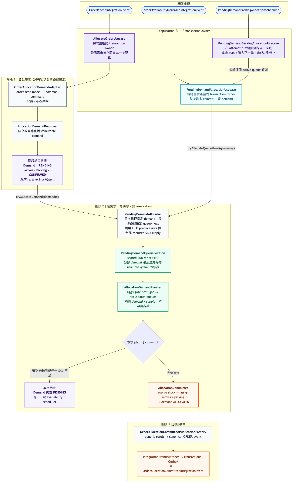
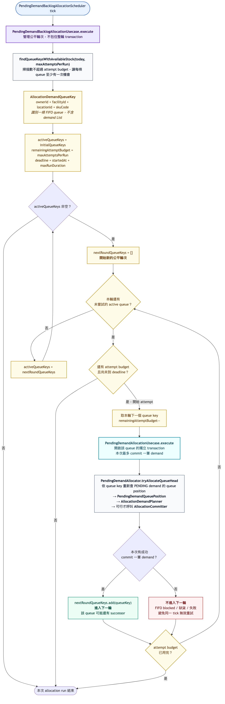
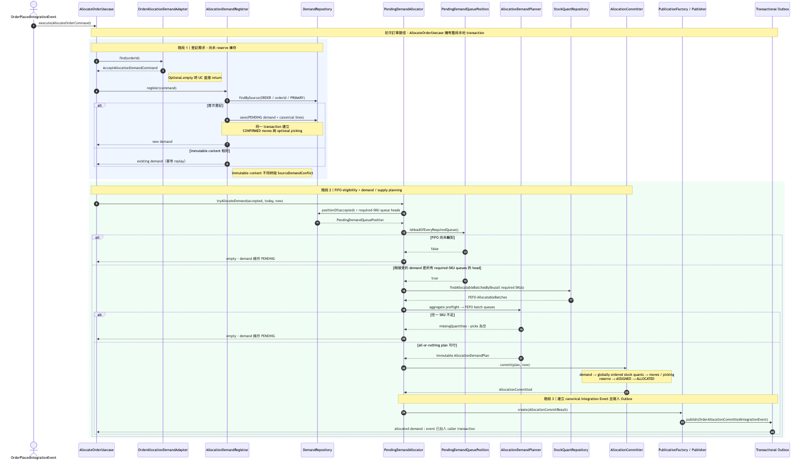

# Allocation demand：從入口看懂每個階段

## 先記住一句話

`AllocateOrderUsecase` 做的是：**接受一筆訂單需求，然後立刻嘗試配置一次**。

它不是背景 queue loop，也不保證這次一定會配到庫存。若 FIFO 尚未輪到，或任何一個 SKU
不足，需求會保留為 `PENDING`，等 availability event 或 reconciliation scheduler 再嘗試。

## 三個入口，從不同階段開始

| 入口 | 誰觸發 | 從哪個階段開始 | transaction 邊界 | 一次呼叫何時結束 |
| --- | --- | --- | --- | --- |
| `AllocateOrderUsecase` | `OrderPlaced` | 階段 1：接受需求 | acceptance、一次 allocation attempt、成功事件 Outbox 都在同一個 transaction | 接受後嘗試一次；成功或暫時無法配置都結束 |
| `PendingDemandAllocationUsecase` | availability consumer，或 reconciliation 委派 | 階段 2：嘗試配置 | 自己擁有一個 transaction | 最多 commit 一筆 demand；沒有可配需求也結束 |
| `PendingDemandBacklogAllocationUsecase` | scheduler | 先找 pending-demand queue keys，再從階段 2 開始 | 本身不包住整輪；每個 queue key 呼叫一次獨立的 `PendingDemandAllocationUsecase` | 在 attempt 與時間預算內以公平輪次推進；失敗 queue 留到下次 tick |

另外，`CancelAllocationDemandUsecase` 是獨立的取消／反向流程，不屬於下面這條配置主線。

## Use case 與階段總覽

[查看 Mermaid 原始檔](diagrams/allocation-order-activity.mmd)

讀圖時先看紫色入口，再沿著箭頭看它從哪個階段開始：

- `AllocateOrderUsecase` 會先走「接受需求」，再進入「嘗試配置」。
- 首次路徑只嘗試剛接受的 demand；若它不是每條 required-SKU queue 的 head，就留在
  `PENDING`，不會順便配置另一張訂單。
- availability event 直接呼叫 `PendingDemandAllocationUsecase`，不會再建立 demand。
- scheduler 先由 `PendingDemandBacklogAllocationUsecase` 找 `AllocationDemandQueueKey`；每個 key 只包含
  `ownerId / facilityId / locationId / skuCode`，不是 demand List。
- reconciliation 每輪讓每個 active queue key 最多獲得一次機會，呼叫獨立 transaction 的
  `PendingDemandAllocationUsecase`；實際 demand 會在 transaction 裡依 key 重新查詢。
- 一次 attempt 最多 commit 一筆 demand。成功的 queue key 進入下一輪，公平地再嘗試
  successor；沒有成功的 queue 不進入下一輪，避免同一個 scheduler tick 無效重試。
- scheduler 使用 60 秒 `fixedDelay`：本輪結束後才開始計時，因此同一 instance 不會重疊。
  單輪另受 `maxAttemptsPerRun` 與 45 秒時間預算保護；成功、無法配置與失敗都算一次 attempt。

## `PendingDemandBacklogAllocationUsecase` fair-round activity

[查看 Mermaid 原始檔](diagrams/pending-demand-backlog-allocation-activity.mmd)

這張圖的 `true` 不是「整條 queue 已配完」，而是「剛剛成功 commit 一筆 demand」。因此 queue key
會進入下一個公平輪次，之後重新查詢是否還有 successor；`false` 才表示這條 queue 在本次 tick
不應繼續重試。

## `AllocateOrderUsecase` 每個階段做什麼

| 階段 | 主要元件 | 輸入與讀取 | 寫入／狀態變化 | 本階段可能結果 |
| --- | --- | --- | --- | --- |
| 0. 進入 | `AllocateOrderUsecase` | 收到 `orderId` | 不直接寫 domain data | 開始同一個本地 transaction |
| 1. 轉接來源 | `OrderAllocationDemandAdapter` | 讀 order 提供給 allocation 的 read model | 不寫資料 | 找不到或已取消：整個 use case 直接結束；否則產生共用 command |
| 2. 接受需求 | `AllocationDemandRegistrar` | 依 `ORDER / orderId / PRIMARY` 查 demand、moves、picking | 首次建立 `PENDING` demand、canonical lines、`CONFIRMED` moves／picking；冪等重播不重建 | 新建成功、回傳既有 demand，或 immutable content 衝突而失敗 |
| 3. 指定首次候選 | `AllocateOrderUsecase` | 使用剛接受的 allocation demand | 不寫資料 | 呼叫 `tryAllocateDemand(accepted)`；只嘗試這筆 demand，不改去配置別張訂單 |
| 4. 檢查位置與規劃 | `PendingDemandAllocator`、`PendingDemandSelection`、`PendingDemandQueuePosition`、`AllocationDemandPlanner` | 讀 demand 每個 required SKU 當下可見的 queue head，以及所有 required SKU 的 FEFO stock batches | Queue position 與 Planner 都不寫資料庫 | FIFO 未輪到或任一 SKU 不足：維持 `PENDING`；全部可行：得到 immutable plan |
| 5. Commit 配置 | `AllocationCommitter` | 重新驗證 demand、moves、picking、stock pools 與 plan | reserve stock；moves／picking 變 `ASSIGNED`；demand 變 `ALLOCATED` | 成功產生 `AllocationCommitted`；任何 invariant／lock failure 使整個 transaction rollback |
| 6. 完成事件 | `PendingDemandAllocator`、`OrderAllocationCommittedPublicationFactory` | 接收 generic `AllocationCommitResult` | 建立單一 canonical `OrderAllocationCommittedIntegrationEvent`，寫入 transactional Outbox | Ordering 與選定的 fulfillment driver 各自消費同一 event ID |

## 最容易混淆的狀態時間線

| 時點 | Demand | Moves / Picking | StockQuant reservation | Outbox completion |
| --- | --- | --- | --- | --- |
| acceptance 前 | 不存在 | 不存在 | 無 | 無 |
| acceptance 完成後 | `PENDING` | `CONFIRMED` | **尚未 reserve** | 無 |
| FIFO blocked／缺貨後 | `PENDING` | `CONFIRMED` | **尚未 reserve** | 無 |
| allocation commit 後 | `ALLOCATED` | `ASSIGNED` | **已 reserve** | 已寫入 |

所以 `demandRegistrar.register(...)` 的 registration 是**系統已登記並保存需求**，不是「庫存已配置」。
FIFO 排隊位置由 `PendingDemandQueuePosition` 自己回答；真正的 demand／supply 演算在
`AllocationDemandPlanner`；真正扣住庫存則在 `AllocationCommitter`。

這裡的 FIFO 是「決策當下已提交且可見的 `PENDING` backlog 不得被超越」；尚未提交或延遲抵達的
demand 不在同一次資料庫 snapshot 內，因此不是跨所有 concurrent submissions 的全域序列化順序。

## `AllocateOrderUsecase` 單次交易循序圖

[查看 Mermaid 原始檔](diagrams/allocation-order-sequence.mmd)

這張圖只描述首次訂單路徑。兩個正常的提早結束點是：

1. shared-SKU strict FIFO 尚未輪到這筆 demand；
2. 任一 required SKU 的總供給不足。

兩者都不是 exception，也不會 partial allocation；資料會保留在 acceptance 完成後的狀態，等待下一次
`PendingDemandAllocationUsecase`。

## 演算法到底在哪裡

配置決策刻意拆成兩個領域物件：

1. `PendingDemandQueuePosition.isHeadOfEveryRequiredQueue`：demand 必須在每個 required SKU queue 都是
   最早的 pending demand。
2. `AllocationDemandPlanner.plan`：先以 SKU aggregate 計算完整的缺少數量；全部足夠後，才依
   canonical line sequence 與每個 SKU 各自的 FEFO batch queue 建立 picks。

任一 SKU 不足時，結果會記錄 `missingQuantities` 且 `picks` 為空，因此沒有 partial allocation。Coordinator
負責準備資料與編排，Planner 負責決策，Committer 負責寫入；三者的責任不要混在一起看。

## 建議的程式閱讀順序

1. [`AllocateOrderUsecase`](../backend/inventory-context/src/main/java/com/flowzati/archone/inventory/allocation/application/usecase/AllocateOrderUsecase.java)：看首次訂單入口與 transaction。
2. [`AllocationDemandRegistrar`](../backend/inventory-context/src/main/java/com/flowzati/archone/inventory/allocation/application/service/demand/AllocationDemandRegistrar.java)：看 demand registration 建立了什麼。
3. [`PendingDemandAllocator`](../backend/inventory-context/src/main/java/com/flowzati/archone/inventory/allocation/application/service/reservation/PendingDemandAllocator.java)：看決策需要哪些 repository 資料。
4. [`PendingDemandQueuePosition`](../backend/inventory-context/src/main/java/com/flowzati/archone/inventory/allocation/domain/valueobject/PendingDemandQueuePosition.java)：看 demand 在各 required-SKU queues 的位置與 blockers。
5. [`AllocationDemandPlanner`](../backend/inventory-context/src/main/java/com/flowzati/archone/inventory/allocation/domain/service/AllocationDemandPlanner.java)：只看 all-or-nothing 與 FEFO demand／supply planning；ready plan 建立時就會驗證每條 demand line 的 picks 總量。
6. [`AllocationCommitter`](../backend/inventory-context/src/main/java/com/flowzati/archone/inventory/allocation/application/service/reservation/AllocationCommitter.java)：依「load data → validate cross-model scope → reserve → assign moves → assign pickings → complete demand → fact」閱讀。`AllocationCommitData` 只保存資料；`AllocationCommitValidator` 只保留無法由 plan、DB constraint 或單一 aggregate 保證的跨模型檢查，兩者都不是另外的 use case。
7. [`OrderAllocationCommittedPublicationFactory`](../backend/inventory-context/src/main/java/com/flowzati/archone/inventory/allocation/application/event/OrderAllocationCommittedPublicationFactory.java)：看 generic result 如何轉成單一 canonical ORDER allocation event。
8. [`PendingDemandBacklogAllocationUsecase`](../backend/inventory-context/src/main/java/com/flowzati/archone/inventory/allocation/application/usecase/PendingDemandBacklogAllocationUsecase.java)：最後再看背景補配；它從階段 2 開始，不重做 acceptance。
