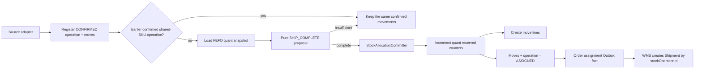

# Allocation：Source → Operation → Move → Batch execution

本文件是現行配貨主線的程式閱讀指南。Invariant 與 precedence 定義見
[Move-centric allocation policy](architecture/allocation-precedence-policy.md)。檔名保留舊連結；內容不再採用
`AllocationDemand / Allocation / AllocationSlice` 平行模型。

## 四層閱讀模型

```text
1. Source       Order / Transfer / Replenishment / Production / Manual
                     |
2. Operation    StockOperation (source unit + policy + queue + common route)
                     |
3. Quantity     StockMove[] (source line + SKU + required quantity + route)
                     |
4. Detail       StockMoveLine[] <-> StockQuant[]
                     |
                WMS Shipment / Wave / Task
```

前兩層回答「誰要求、哪些 move 是同一份工作」，第三層回答「要移多少」，第四層回答「實際用哪批」。
Selection、planner 與 transaction orchestration 只是把既有 move 從 confirmed 推進到 assigned 的過程。

## 三個入口，共用同一 pipeline

| 入口 | 起點 | 一次 transaction 的上限 |
| --- | --- | --- |
| `AllocateOrderUsecase` | order source adapter | 登記並嘗試一個 operation |
| `AllocationInventoryAvailabilityEventConsumer` | availability queue key | 最多喚醒一個 queue candidate |
| `StockOperationBacklogReconciliationScheduler` | bounded anti-entropy scan | 觸發有 work/time budget 的 reconciliation |

它們共用：

```text
StockOperationAssignmentCoordinator
  -> StockOperationAssignmentCandidateStore -> StockOperationDemand
  -> StockAllocationSupplyStore -> StockAllocationSupply
  -> MovementAssignmentPlanner.plan (pure) -> StockAllocationProposal
  -> StockAllocationCommitter.commit (transactional)
```

## 主流程



缺貨不建立 placeholder、slice 或第二個 lifecycle；confirmed move 本身就是等待中的 requirement。

## Allocation commit boundary

`StockAllocationCommitter` 依序：

1. lock operation；若已 assigned，從 retained move lines 重建相同結果；
2. lock ordered moves，載入 move lines 並組成不擁有 DB lock 的 `StockOperationComposite`，再重驗版本、policy、source 與
   exact proposal coverage；
3. 重驗 shared-SKU FIFO predecessor；
4. 依全域順序 lock quants，重驗 scope、SKU、expiry 與 ATP；
5. 用 `MoveQuantAllocationSet` 彙總 move-to-quant quantities；
6. 更新 quant counters、建立 `StockMoveLine` 並轉移 move/operation state；
7. 由 `StockOperationAssignmentResultFactory` 組裝結果，寫入帶 `stockOperationId + moveId + quant picks` 的 promising v3 Outbox fact。

所有步驟同一 transaction；publisher failure 也必須回復 counters、lines 與 states。

## Reversible 與 physical lifecycle

- `ReleaseStockOperationUsecase`：assigned detail snapshot → counter release → delete move lines → 同一 moves/operation
  回到 `CONFIRMED` → audit Outbox。
- `CancelStockOperationUsecase`：confirmed 可本地取消；assigned 必須先取得 WMS durable reversible decision，之後
  release 並取消 → audit Outbox。拒絕或不確定不改 Inventory。
- `CompleteStockOperationUsecase`：驗證 exact retained detail → consume on-hand/reserved → moves/operation `DONE`，保留
  move lines → audit Outbox。

## 建議閱讀順序

1. `OrderStockMovementStoreImpl`
2. `StockOperationRegistrar`
3. `StockOperationAssignmentCoordinator`
4. `StockOperationAssignmentCandidateStore`
5. `MovementAssignmentPlanner`
6. `StockAllocationCommitter` / `StockOperationComposite`
7. `ReleaseStockOperationUsecase` / `CancelStockOperationUsecase` / `CompleteStockOperationUsecase`
8. `StockOperationViewStore` / `StockOperationReconciliationStore`

若新程式需要 `allocationDemandId`、`allocationSliceId`、另一張 reservation history table，或在 assignment
時建立新的 move identity，先視為模型回退並重新檢查需求。
