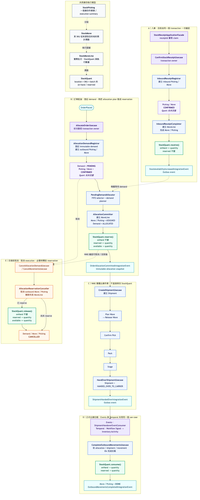

# 庫存異動模型：需求與執行分成兩層

> **現行邊界說明（2026-08-04）：** 本文件主要保留搬運模型形成時的設計脈絡。後續
> `refine-allocation-workflow-boundaries` 最終確認本系統的 `StockQuant` 是實體庫存 source of truth。
> 本地一段式收貨會建立並完成 inbound picking/move/move line，再由 move line 增加 `StockQuant`；
> 同交易寫 availability Outbox，Kafka 提交後快速觸發配貨，Scheduler 定期補漏。收貨不直接
> invoke outbound 配貨。
>
> **Package 命名更新（2026-08-19）：** 現行 Java namespace 已由
> `stock/{allocation,inventory,movement}` 整理為
> `inventory/{allocation,balance,movement,warehouse}`。下文的 `stock` 若出現在既有 change 名稱或
> 歷史決策中仍予保留；這次只整理內部 namespace，不改資料表與對外事件契約。

本文記錄一個跨越五個 change 的決定：**把庫存從「一個可被加減的數字」改成有來源與目的的
異動流水**，並把「貨主要什麼」與「倉庫做什麼」分成兩層。概念與命名對齊 Odoo 19。

## 現行庫存生命週期總覽

下圖用一張總覽串起 inbound receipt、allocation reservation、WMS outbound、正式扣帳與取消。
它只呈現跨元件 checkpoint；allocation 的 FIFO／FEFO 細節仍看既有活動圖與循序圖。



圖的 Mermaid 原始檔位於
[`diagrams/inventory-stock-lifecycle-overview.mmd`](diagrams/inventory-stock-lifecycle-overview.mmd)。目前 Events 與
Temporal 兩種 driver 都會進入 `CompleteOutboundMovementsUsecase`，由它完成 outbound movements 並正式扣減
`StockQuant`；兩種模式只改變流程協調方式，不改變庫存寫入邊界。

決定散落在五個 change 裡，但共用同一組前提。寫在這裡，各 change 的 design 才不必各自重述，
也才不會在第三個 change 時發現第一個的前提已經被改掉。

（原本規劃四個。第 2 個做完後浮現的流程重組被編為 2.5——**刻意不重新編號**，因為「第四個
change」在既有文件裡被引用了十幾處，指的一直是界線與命名那一個。）

---

## 前提

### 當時現況：庫存數字可以被直接寫，而搬運沒有資料表達

當時的補貨路徑直接把 `on_hand_quantity` 加上去，沒有任何異動紀錄。現行版本由
`ConfirmStockReceiptUsecase` 建立並完成 inbound execution，庫存數量不再接受裸數字寫入。

因此系統回答不了三個問題：

| 問題 | 現在的答案 |
| --- | --- |
| 這 100 件哪來的？ | 查不到 |
| 上週三為什麼少了 20 件？ | 查不到 |
| 出貨要走哪條路徑？ | **不存在**（R7 才有，而現在沒有可以接上去的結構） |

### 每次數量變動都是一筆有來源與目的的移動

位置包含**虛擬位置**（`supplier`／`customer`／`inventory`），於是：

```text
入庫      Vendors ──────────────> 北部倉/庫存
出庫      北部倉/庫存 ──────────> Customers
盤盈虧    Inventory adjustment ─> 北部倉/庫存
```

三種都是位置之間的移動，**全域總量因此守恆**。餘額由異動寫出來，沒有人直接改它。

### 為什麼值得

不是為了像 Odoo。是為了那個不變式：**庫存數字不可被任意寫**。少了它，任何一支拿得到
repository 的程式都能改庫存，而改錯了不會留下痕跡。

---

## 概念對應

| Odoo 19 | 本系統（改動後） | 說明 |
| --- | --- | --- |
| `sale.order` / `sale.order.line` | `orders` / `order_lines` | **需求層**。貨主送來的出庫指令 |
| `stock.warehouse` | `facilities` | 保留。倉的識別、代碼 |
| `stock.location` | `stock_locations` | **新增**。含虛擬位置 |
| `stock.picking.type` | `stock_picking_types` | **新增**。作業類型 |
| `stock.picking` | `stock_pickings` | **新增**。搬運單據 |
| `stock.move` | `stock_moves` | **新增**。一段搬運 |
| `stock.move.line` | `stock_move_lines` | **新增**，取代 `stock_reservations` |
| `stock.quant` | `stock_pools` | 不改名，改指位置 |
| `product.template` | `products` | 只確立對應，不改名 |
| `product.product` | `skus` | 同上 |
| `stock.lot` | **不做** | 見「不做的事」 |
| `stock.route` / `stock.rule` | **不做** | 見決定五 |
| — | `owner_facilities` | 3PL 特有，Odoo 無對應 |

---

## 決定一：`Order` 是需求，不是搬運單據

**`Order` ≠ `picking`。** 兩者是不同的實體，中間差一層。

```text
需求層（貨主給的，承諾在上游）
    orders ──*── order_lines
                      ↑ 被參照，不被讀
執行層（倉庫做的）      │
    stock_pickings ──*── stock_moves ──*── stock_move_lines
                                                  ↓ 寫入
                                             stock_pools
```

Odoo 的 `stock_move.sale_line_id` 就是那道參照——**move 指回需求行，兩者不是同一個東西**。

基數是 **一條 `order_line` → 1..N 個 `move`**：多段搬運每段一個、分批出貨每批一個。舊模型
表達不了這件事，因為它只有一層。

### `order` 與 `picking` 不是一對一

| 情境 | `orders` | `stock_pickings` |
| --- | --- | --- |
| 貨主的出庫指令（單步出貨） | 1 張 | 1 張 |
| **補貨入庫** | **沒有** | 1 張 |
| **盤點調整** | **沒有** | 1 張 |
| 分批出貨（R7） | 1 張 | N 張 |
| 兩步出貨（若日後做） | 1 張 | 2 張 |

**入庫是最有力的一條，而且不是假設性的未來情境**——補貨產生的 picking 沒有任何訂單在它背後，
那在第三個 change 就會發生。兩張表因此不可能合併：一張表的主鍵不能有一半是空的。

`order` 回答「貨主要什麼」，`picking` 回答「倉庫做了哪一趟搬運」。入庫沒有人要，但倉庫確實
搬了。

### `picking` 與 `move` 是兩種真相，不只是單頭與明細

| | `stock_pickings` | `stock_moves` |
| --- | --- | --- |
| 一句話 | 一張倉庫作業單 | 作業單中一個 SKU 的一段移動 |
| 是誰的真相 | **倉庫任務** | **庫存數量** |
| 有 SKU 與數量嗎 | 沒有 | 有 |
| 直接影響庫存嗎 | 否，透過底下的 move | **是** |
| 適合查什麼 | 今天要出的作業、某波次、某客戶的交貨 | SKU 缺貨、預留量、某訂單行、庫存流向 |
| 日後會長出什麼 | 作業員、波次、整單 backorder、列印簽收 | 批號、成本、報廢、上下游鏈 |

### 三者是三個獨立實體，不是一個聚合

這一點查證過 Odoo 19 的原始碼，五個判準全部指向同一個方向：

| 聚合根該有的性質 | Odoo 19 實況 |
| --- | --- |
| 子實體的外鍵 required | `move.picking_id` 與 `move_line.move_id` **都可空**，且盤點、報廢、製造、維修都會產生沒有單據的搬運 |
| 根持有並強制不變式 | `picking.state` 是 **stored computed**，由底下的搬運 fold 上來；picking **沒有任何 `@api.constrains`** |
| 所有變更經由根 | `_action_confirm` / `_action_assign` / `_action_done` / `_action_cancel` **全定義在 `stock.move`**；排程器、補貨規則、盤點、鏈式取消都直接對搬運操作 |
| 子實體不可跨根搬移 | 欠交單直接把未完成的搬運 `write({'picking_id': 新的})`——**搬運會在單據之間搬家** |
| 根是建立入口 | **相反**：先有搬運，才 `Picking.create()` 再把它們掛上去 |

原始碼的註解自己說了：`State of a picking depends on the state of its related stock.move`。

**因此持久化不照聚合切，照「誰有獨立的生命週期」切**：`StockMoveRepository`（搬運與它的明細
——本系統的明細 `move_id` 是 NOT NULL，沒有獨立生命週期）與 `StockPickingRepository`（單據）。

### ship-complete 是我們自己加的，Odoo 不保證

Odoo 用 `stock.picking.move_type = 'one'` 表達「全備妥才出」。查證的結果是**它在整棵 19.0
原始碼裡只被四個地方讀，而且沒有任何一處會拋錯**：兩處決定日期取 min 還是 max、一處決定合併
搬運時的日期、一處讓狀態收斂成 `confirmed`（畫面顯示 Waiting 而非 Ready）。

實際行為是：

- **預留照樣是部分的**——`_action_assign()` 逐 move 預留，完全不看 `move_type`
- **驗證鈕在未備妥時依然可按**（畫面上有兩顆，一顆就是給那個狀態用的）
- 真的部分出了，用**欠交單拆單**收尾，而不是拒絕

所以 Odoo 把 ship-complete 當成「衍生狀態的收斂規則 + 作業提示」。

**本系統把它當成硬性規則**：配不到就整張不配、充足的那個 SKU 一件都不預留，而
`AllocationService` 的整籃判斷會擋下違反的情形。**這不是偏離 Odoo，是比它嚴格**——寫下來
是因為下一個對照 Odoo 的人會以為這條規則可以放寬成「提示 + 拆單」。

這條分界管的是後面三個 change：change 2 決定兩張表各拿哪些欄位、change 3 的入庫 picking
靠它才說得清為什麼沒有訂單、change 4 的狀態歸屬（`BACKORDERED` 要去哪）也依賴它。

**`picking` 的狀態是由 moves 決定後物化，不是另一套獨立生命週期。** Odoo 的
`stock.picking.state` 也是 stored computed，由底下的 move 彙總。本系統目前沒有 ORM
computed field，因此由建立、配貨、完成與取消流程在修改 moves 的同一個 transaction 寫入：
`CONFIRMED`（等待庫存）→ `ASSIGNED`（可執行）→ `DONE`，或在完成前進 `CANCELLED`。

物化的讀者是 picking 作業列表的狀態篩選與排程；它同時帶 `version`，避免 availability
喚醒與取消併發時互相覆蓋。這份欄位仍是 moves 的摘要，不授權 Picking 發展出與 moves
矛盾的狀態轉換。

### 需求與執行的連結是兩層，不是一層

Odoo 19 的實際 schema：

```text
stock_picking.sale_id        訂單「單頭」的連結
stock_move.sale_line_id      訂單「行」的連結
stock_move                   —— 沒有 sale_id
```

本系統照這個形狀：`stock_pickings.order_id` 與 `stock_moves.order_line_id`，兩層都有。

> 本文原本寫的是「連結只在 move 上，picking 上沒有」，理由是 Odoo 的 `sale_id` 是捷徑、
> 可能與底下 move 指向的訂單不一致。**那個風險來自跨單合併，而本系統明確不合併**——一張出庫
> 單就是一張 picking，所以它是單據的身分而不是重複的參照。
>
> 而它是**必要的**：配貨要發帶 `orderId` 的結果事件，而 move 只有 `order_line_id`；從行推到
> 單要 join `order_lines`，那正是邊界規則禁止的。

**但分組不用它。** ship-complete 的整單判斷以 `picking_id` 分組。待配查詢另以
`picking.order_id IS NOT NULL` 排除 inbound 與 standalone move，避免它們占用以訂單張數計算的
上限；這個條件只是 eligibility，整籃分組鍵仍是 `picking_id`。

`picking_id` 本來就是更自然的分組鍵：picking 的意思就是「這些 move 是同一份工作」，而
ship-complete 判斷的正是一份工作能不能整個完成。用 `order_id` 分組會讓 picking 變成裝飾。

**兩者都不建外鍵指向 `orders`**：執行層的 schema 不依賴需求層的表。完整性由 move 的
`order_line_id` 外鍵保證——行存在就蘊含它的訂單存在。

**若日後真要跨單合併，`picking.order_id` 必須拿掉**，分組改由一個有自己身分的群組實體承擔。
屆時它才會退化成 Odoo 那種捷徑。

### 這推翻了本文先前的兩個決定

本文原本寫的是「`Order` 就是 `stock.picking`，`OrderLine` 就是 `stock.move`」，理由是三層
結構同構（`orders → order_lines → stock_reservations`）。**同構是真的，對應是錯的**——結構
一樣不代表語意一樣，而 `sale_line_id` 這個欄位證明 Odoo 自己把它們當兩個東西。

### 連帶：`BACKORDERED` 找到了歸屬

| 層 | 狀態 | 回答什麼 |
| --- | --- | --- |
| `orders.status` | 需求層 | 這張需求被承諾了沒 |
| `stock_pickings.state` / `stock_moves.state` | 執行層 | 貨搬到哪了 |

`BACKORDERED` 之所以一直顯得可疑，是因為它是**執行層的事實被記在需求層**。拆成兩層之後
它有了正確的位置。

兩處佐證，都在現有程式碼裡：

- `OrderLine.java:25` 自承 `status` 留著**只因為 REST 要逐行揭露**，值恆等於 header。Odoo 的
  `sale.order.line` 沒有 state——狀態屬於 move
- `Order.java:213-221` 的註解說「缺一條禁令：離倉後不得取消」，且「`OrderStatus` 還沒有
  `FULFILLED`，那個狀態隨 R7 到來」
- `OrderingSchemaIntegrationTest` 有一支測試釘住「`orders` 不應有 `fulfilled_at`」，理由是
  「它是 R7 才產生的輸出」。**這條測試本來就在守拆分後的邊界，不要刪**

> 附帶修正：`DevSeedDataInitializer.java:311` 的註解寫「補貨只處理 BACKORDERED」，**R4 之後
> 已不成立**（佇列改查 view 且不看 status）。

### 決定：`BACKORDERED` 與 `ALLOCATED` 都留為投影（不是合成）

本節原本的說法會誤導——「找到了正確的位置」聽起來像是要把 `BACKORDERED` 從 `orders` 拿掉。
搬運的表建好之後這個問題被重新問了一次，結論是**留**，但理由與範圍都要寫清楚。

**兩者是同一個問題，不可以只拆一半。** 「配到了」與「缺貨中」都是執行層的事實
（`MoveState.ASSIGNED` 與 `CONFIRMED`）。只拆掉 `BACKORDERED` 而留下 `ALLOCATED`，會得到一個
更糟的模型：一半的執行事實在需求層、一半在執行層，而且沒有規則說哪些歸哪邊。

曾經評估過的另一個方向是**讀取時合成**：`orders.status` 只留 `PENDING` / `CANCELLED`，履約
狀態由 `stock_moves.state` 彙總後經一個發布檢視（`demand_lines` 的反方向）給 ordering 讀，
REST 在讀取時組合。它的好處是真相只有一份，而且 R7 的 `FULFILLED` 不必新增任何東西。

**否決的理由是訂單列表查詢。** 那條路徑是使用者直接感受得到的，而合成會讓它變成一個對每張單
的搬運做 group by 的查詢。投影模式下它是單表讀取。這是唯一站得住的反對理由——不是「改動大」。

#### 選了投影，就要接受它的固定成本

**每多一個執行狀態，就要多一整條鏈**：狀態值 + 領域事件 + translator + ordering 的 handler +
守衛。R7 的 `FULFILLED` 因此**要**往 `OrderStatus` 塞（本節上面那句「不必塞」是合成方向下的
結論，在投影方向下不成立），而 `Order.cancel` 的「離倉後不得取消」也要靠它才守得住——現在
那個守衛（允許從 PENDING／ALLOCATED／BACKORDERED 取消）是替身。

#### 必須明寫真相的方向

投影**保證**會偶爾與真相不一致——取消的非同步窗口就是既有的例子（見
`docs/execution-roadmap.md`）。因此要有一條明文規則：

> 兩者不一致時，**搬運的狀態贏**。`orders.status` 是投影，不是第二個真相。

沒有這條，下一個人遇到不一致時會不知道該修哪一邊。

#### 與 A/B 無關、無論如何都要做的兩件事

1. **`order_lines.status` 刪掉。** 它連投影都不是——值恆等於 header，只為 REST 逐行揭露而
   存在，而 ship-complete 之下它永遠不可能不同。Odoo 的 `sale.order.line` 也沒有 state。
2. **`backordered_since` 檢討。** 「這張單等了多久」現在由 `stock_moves.created_at` 回答得更
   準，那是執行層自己寫的資料。

#### 重新評估的觸發點

投影的成本隨執行狀態數線性成長，合成的成本隨訂單列表的查詢量成長。**當鏈的長度成為比查詢
更大的負擔時**——具體地說，當第三個執行狀態（R7 的 `FULFILLED`）也要走完整條鏈之後——值得
重新量一次那個列表查詢，再決定要不要換。

---

## 決定二：需求與異動分離，不合併

`order_lines` **留著**，`stock_moves` 是新的一層，兩者以 `stock_moves.order_line_id` 相連。

本文原本採「統一」——`order_lines` 被 `stock_moves` 取代。**推翻它的是決定一**：既然 order
是需求而 picking 是執行，那需求行與搬運段就不可能是同一列。而且——

**route/rule 的工作正是「從需求生出搬運」。若 `order_lines` 本身就是 move，就沒有東西可以
被生成。** 即使本文決定不做 route/rule（見決定五），把生成的來源與結果壓成同一張表，也是
把日後能不能做那件事的選項提前關掉。

當初被否決的「雙軌」仍然否決：兩張表都是 move、`move_id` 要指哪一張沒有正確答案。現在的
形狀不是雙軌——只有一張 move 表，需求不是 move。

### 因此有兩個佇列，不是一個

| | 回答什麼 | 屬於誰 |
| --- | --- | --- |
| `demand_lines` view | 哪些行**還沒有 move**——還沒被執行層接手 | 跨界的投影 |
| `stock_moves.state = CONFIRMED` | 哪些搬運**還在等貨** | 執行層自己的資料 |

**view 不會因為 move 出現而廢除。** 執行層要知道一張新單有哪些行，只能讀——
`OrderPlacedIntegrationEvent` 只帶 `orderId`（`EventSeparationTest` 釘死了「事件是通知，不是
狀態傳輸」），而讓 ordering 反過來直接寫 `stock_moves` 是邊界的反面。

它的謂詞從「無有效預留」換成「無 move」。而檔頭那段「刻意不含 `ol.status`，因為 ordering 的
狀態落後於執行層的決策」的理由**消失了**——執行層讀的是自己寫的東西，沒有那個時間差。

---

## 決定三：Facility 與位置兩層都留，位置只活在執行層

| | 回答什麼 | 誰指它 |
| --- | --- | --- |
| Facility（`facilities`） | 哪個物流作業場站？貨主能使用哪些設施？ | `orders`、`owner_facilities`、`stock_locations` |
| 位置（`stock_locations`） | 貨具體在哪？這裡算不算庫存（`usage`）？ | `stock_pickings`、`stock_moves`、`stock_move_lines`、`stock_pools` |

**`orders` 只帶 Facility，不帶位置。** 下單只決定負責履約的物流場站，位置由作業類型決定。
它目前對應 Odoo 的 `sale.order.warehouse_id`，而 `stock.picking.location_id` 是另一層。

這同時解掉一個曾經卡住的問題：`orders` 上有一條複合外鍵

```sql
FOREIGN KEY (owner_id, facility_id) REFERENCES owner_facilities(owner_id, facility_id)
```

它讓「設施存在，但這個貨主沒有使用權」由資料庫擋下。**位置不帶貨主，接不上這條外鍵，而外鍵
不能跨兩跳。** 曾經考慮在 `orders` 上同時放 Facility 與位置、用第二條複合外鍵綁死一致——決定一之後
不必了：**`orders` 根本不該有位置。**

曾考慮把 `facilities` 併進 `stock_locations`。**否決**，理由是 `owner_facilities`：「這個
貨主能使用哪些設施」是**商業關係，屬於 Facility 層**，且在任何貨進場之前就成立。一個 Facility
有多個位置時，那張
表要掛五筆還是只掛庫存區？兩個答案都不對。

### `stock_locations.facility_id` 是實體欄位

不是查詢時沿樹算。**Odoo 19 的 `stock.location.warehouse_id` 是 computed 且 `store=True`**，
子樹查詢則靠 `parent_path` 物化路徑加 `LIKE` 前綴，不是遞迴 CTE。我們不做樹，所以連
`parent_path` 都不需要——`facility_id` 直接就是答案。

**一個不要照抄的坑**：Odoo 的 `_compute_warehouse_id` 沒有標 `recursive=True`（同檔的
`complete_name` 有標）。把子樹搬到別的倉底下時，子孫的 `facility_id` 不會重算。我們日後若
加樹，這個一致性責任要自己補。

---

## 決定四：Product / Sku 只確立概念對應，不改 schema

`products`（PK `(owner_id, product_code)`）對應 `product.template`；`skus`（PK
`(owner_id, sku_code)`，含 `spec_name`）對應 `product.product`。`spec_name` 正是 Odoo 用
attribute 區分 variant 的那個維度。

**庫存與異動一律指 variant**——`stock_pools`、`stock_moves`、`stock_move_lines` 都帶
`sku_code` 而非 `product_code`。這一點現況已經是對的。

**不引入 Odoo 的 variant 機制**（attribute 三表、由屬性組合生成變體）。那套是為**可配置商品**
設計的；本系統的 SKU 是貨主給的主檔——不生成、不組合、也不能改。引進之後會需要「從既有 SKU
反推屬性」，而 `spec_name` 是自由文字，那個反推沒有正確答案。

**不改名為 `product_templates` / `product_variants`。** `product` 與 `sku` 在 3PL 業界是通用
詞，改名動到對外契約與前端而語意不增加。

---

## 決定五：不做 route/rule，用 `picking_type`

**每一筆 move 明確帶 `from_location_id`、`to_location_id` 與 `state`。路徑寫在資料裡，不由
規則推導。**

### 為什麼不做 route/rule：分界線落在「誰來建單」

**Odoo 需要 route/rule，是因為它的單據由需求自動生成。** 銷售訂單確認時，沒有任何應用程式碼
知道該建幾張單、起訖在哪，只能去查 rule——`stock.rule.run()` 找不到 rule 就直接
`raise UserError('No rule has been found to replenish ...')`，**沒有 fallback**。這就是為什麼
Odoo 一裝好就內建整套 route。

**本系統的單據由自家收單建立，等於應用程式碼已經在扮演 rule engine。**

而 Odoo 19 的 `stock.move._compute_picking_type_id` 證明了一件事：**只要單是自己建的，
`picking_type` 就會自然往下流到 move，一條 rule 都不需要**。

所以真正的問題不是「`picking_type` 夠不夠」，而是——**流程差異要放在資料裡還是程式碼裡？**
在流程種類少、且生單由自己掌控的階段，放程式碼裡是正確的。route/rule 的收益要等到
**「流程差異需要營運人員在後台改，而不是發版」** 的那一刻才出現。

次要理由：規則查找是三層巢狀（位置沿樹往上爬 × route 四級來源優先序 × sequence 排序），
**在沒有位置樹、單段出貨下，大部分查找仍退化成常數**；而代價是兩張表、四張掛載用的 m2m、
倉上六個 route/rule 欄位，以及「改變步數時把該 route 底下所有 rule 先封存再復活」那整套邏輯。

### 但 `picking_type` 要做

擔心的問題是真的：**每種新流程都要改 Java 加狀態值**——既有系統的 `out_type` 長到 18 種、
狀態欄位長到 28 個值，就是這樣累積的。

那個病因是**流程種類被編碼成 enum 值**，而 `picking_type` 正是解藥：

| | 買到什麼 | 成本 |
| --- | --- | --- |
| **`picking_type`**（做） | 流程種類從 Java enum 變成**資料表的一列**。每種作業帶自己的 `code` 與預設起訖位置。新增一種流程 = 新增一筆資料 | 一張表 |
| **route/rule**（不做） | 連「哪個作業接在哪個之後」也變成資料 | 上述全部 |

**但要說清楚它治哪一半。** 「每種新流程都要改 Java」其實是兩種不同的變更，`picking_type`
只接得住其中一種：

| 變更類型 | 例子 | `picking_type` 接得住嗎 |
| --- | --- | --- |
| 新增一種**作業類型** | 越庫、退貨重出、樣品出、跨倉調撥 | ✅ 新增一筆資料 |
| 現有流程**多一個步驟** | 出貨前加一道品檢 | ❌ **一段變兩段，串接順序是 Java** |

`out_type` 長到 18 種是前者——那是作業類型被編碼成 enum 值，`picking_type` 正是它的解藥。
「多一道品檢」是後者，`picking_type` 治不了。

**這個區分不能含糊**：`picking_type` 上沒有任何「下一個作業類型是誰」的欄位（Odoo 19 逐欄
確認，型別之間唯一的關聯是 `return_picking_type_id`）。串接完全住在 `stock.rule`。

`picking_type` 上明確**表達得了**的（Odoo 19 逐欄確認，全部不需要任何 rule）：

| 能力 | 欄位 |
| --- | --- |
| 每種作業自己的單號序列 | `sequence_code` / `sequence_id` |
| 每種作業自己的預設起訖位置 | `default_location_src_id` / `default_location_dest_id`（**兩者皆 required**） |
| 每種作業自己的**預留時機** | `reservation_method` ∈ `at_confirm` / `manual` / `by_date` |
| 缺量、出貨、批號、包裝政策 | `create_backorder`、`move_type`、`use_*_lots` 等 |
| 倉別隔離、退貨對應 | `facility_id`、`return_picking_type_id` |

**`reservation_method` 值得單獨標記**——它正是這整串討論最開頭那個問題（「補庫存時該不該自動
去完成 backorder」）在 Odoo 裡的落腳處。它是**作業類型的設定，不是寫死在補貨流程裡的行為**。

`picking_type` **表達不了**的（這些一定要 rule）：串接下一段（型別之間沒有任何「下一個是誰」
的欄位，唯一的型別間關聯是 `return_picking_type_id`）、由需求自動生單、MTS/MTO 的選擇、
依產品或品類切換流程、前置時間、跨倉補貨。

**一句話的分界**：`picking_type` 描述「**一段作業長什麼樣**」，`stock.rule` 描述「**在什麼需求
下、會有哪幾段、順序如何**」。

### 三層，不是兩層

中間還有一層，本階段同樣不做，但它是具名的下一步：

| 層 | 治什麼 | 本階段 |
| --- | --- | --- |
| **`picking_type`** | 位置參數與作業類型的硬編碼 | **做** |
| **流程模板** | 「一條流程有幾段、順序如何」的硬編碼 | 不做，具名的下一步 |
| **route/rule** | 需求反向傳遞與動態供應圖 | 不做，**另開階段** |

流程模板的形狀（不含遞迴、不含 fallback）：

```text
fulfillment_flow(id, code, version, owner_id?, facility_id, service_level?,
                 effective_from, effective_to, status)
fulfillment_flow_step(flow_id, sequence, picking_type_id, from_location_id,
                      to_location_id, reservation_policy)
```

收單時以**明確且非遞迴的優先序**選一個 flow（`owner+倉+服務等級` → `owner+倉` → 倉的預設），
一次展開整條 move chain，並在 move 上存 `flow_id` 與 `flow_version`——**流程改版不影響已建立
的單**。

它擋得掉：增減固定品檢步驟、一步／兩步／三步收發貨、固定跨倉 transit、固定退貨重出、
貨主專屬的 pack／label 暫存區。而它**不需要**位置父階層 fallback、route 適用性聯集、
pull 遞迴、push 串接、MTO 需求傳遞、重疊規則的衝突解析。

**現在不做的理由跟砍掉 route/rule 是同一條**：目前只有一條流程、一個步驟。一張只有一列、
那一列只有一步的模板表是純負擔。而 `stock_moves` 帶明確的 `from/to`，日後疊上模板**不必改
move 的結構**。

### 拆成兩段 move 的門檻：中間點必須是真正的庫存責任點

**這條要先於上面所有討論。** 「多一道品檢」聽起來是流程多一段，但它是不是**兩段 move**，
取決於一個更基本的問題：

> 第一段完成後，貨物是否真的離開了原本的庫存責任區，進入另一個**可盤點、可短少、可被另一
> 團隊接管**的位置？

| 答案 | 該怎麼做 |
| --- | --- |
| 是（有真正的中繼位置，例如 Output 暫存區） | 兩段 move |
| 否（揀貨、複核、裝箱只是同一批貨的不同作業階段） | **一段 move**，作業階段是 picking 底下的 task 或狀態關卡 |

**這對本系統現在特別重要**：一個 Facility 已可有多個 `internal` 位置，但位置數量本身不等於
多段流程。只有當兩個位置真的是不同庫存責任點，`庫存區 → 暫存區 → 客戶` 才應拆成兩段 move；
若只是 UI 上多一個作業步驟，仍不該製造沒有實體語意的庫存過帳。

判斷「該不該拆」還有兩個附帶問題：**兩段是否由不同工作站執行且需要正式交接**（否則只是 UI
分頁），以及**第一段短少時第二段能否先處理已完成的部分**（若不需要，一個 move 配多筆
move_line 就夠）。

### 升級的判準：五個問題，不是「第三種流程出現」

「等第三種流程出現才划算」是經驗口訣，不是架構判準——流程數量本身不決定任何事。改用：

| # | 問題 | 成立則需要 |
| --- | --- | --- |
| 1 | 流程差異改變**位置圖**嗎？ | 流程模板 |
| 2 | 需要**不改版**就讓營運人員配置嗎？ | 流程模板 |
| 3 | 規則會依 owner／倉／SKU 類別**動態選擇**嗎？ | 流程模板 |
| 4 | 有**需求反向傳遞**嗎（客戶 → Output → Pack → Stock → 另一倉／採購）？ | **route/rule** |
| 5 | 流程頻繁改版，且舊單必須繼續走舊版？ | 版本化 |

**第 4 項是 route/rule 的真正門檻**，其餘四項流程模板就夠。而做一個「能配置、卻無法解釋
為什麼選到某條規則」的引擎，比寫死更危險。

### route/rule 要另開階段

**不在本文的四個 change 之內。** 它的前提是上面第 4 項成立——需求由目的端反向逐段傳遞、
有貨無貨會改走不同供應方式、跨倉／採購／組套要串進同一條 procurement chain。那些能力現在
一項都不需要。

要做時是一個**獨立的階段**，而不是在第四個 change 尾巴加一段。而在開那個階段之前，有三件事
必須先做對，否則規則引擎一加進來就會卡住：

| # | 先備條件 | 為什麼 |
| --- | --- | --- |
| 1 | **穩定的需求契約**——單一的「供應請求」型別（owner、倉、SKU、數量、需求位置、期限、服務等級、來源參照、下游 move） | 訂單、補貨、調撥都只能透過同一個契約要求供應，否則規則引擎要面對三種不同的輸入 |
| 2 | **move 之間的依賴能表達 DAG**，且 flow 版本不可變 | 見下 |
| 3 | **規則選擇器可測試、可解釋** | 必須輸出「選了哪條、候選有哪些、為何淘汰、產生了哪些 move、為何終止」，並具備環偵測、最大展開深度、owner 隔離、dry-run。**做一個能配置卻無法解釋為什麼選到某條規則的引擎，比寫死更危險** |

### 一個要避開的陷阱：`previous_move_id`

move 之間的串接**不要用單一的 `previous_move_id`**。它只表達得了線性鏈，遇到「一筆補貨
支撐多個下游」「多個來源匯入一個下游」「拆分／合併」「部分完成與 backorder」就會卡住。

正確的形狀是一張方向明確的關聯表：

```text
stock_move_dependencies(predecessor_move_id, successor_move_id, dependency_type, required_qty?)
PK (predecessor_move_id, successor_move_id)
```

對外可映射成 Odoo 的 `move_orig_ids`（前驅）與 `move_dest_ids`（後繼），但不必像 ORM 那樣真的
存兩份 m2m。

**但這張表現在也不建。** change 2 只有單段出庫，一條 `order_line` 對一個 move，沒有任何 move
需要串接——一張沒有讀者的關聯表跟一張只有一列的流程模板表是同一種負擔。

change 2 要守的是**另一件事**：**不要為了「以後好接」而先加 `previous_move_id` 那一欄。**
它看起來便宜，但會把線性假設鎖進 schema，而拆分／合併／部分完成一出現就得把所有既有的鏈
重建。串接真的出現時，直接建關聯表。

### 一個 `picking_type` 解決不了、route/rule 也解決不了的問題

**Odoo 的 route 掛載軸線沒有貨主。** 可掛的地方是 product、product category、warehouse、
packaging、SO line、reordering rule——沒有 partner／owner。

而 3PL 的流程差異正是**按貨主分**的。所以「服務多貨主 → 需要 route/rule」這個推論，Odoo 沒有
提供那條連結。若貨主之間真的出現流程差異，那需要一個 Odoo 沒有的東西，本系統得自己設計——
**做不做 route/rule 對這一塊零影響。**

---

## 決定六：context 界線與那道跨界參照

| Context | 擁有 |
| --- | --- |
| `ordering` | **需求**：`orders`、`order_lines`、收單、取消 |
| `allocation` → 更名 `stock`（已完成） | **執行與庫存**：`stock_locations`、`stock_picking_types`、`stock_pickings`、`stock_moves`、`stock_move_lines`、`stock_pools` |

`stock_moves.order_line_id` 跨過這條線。**這道參照的紀律是：執行層持有需求行的 id，但不讀
它的任何其他欄位。**

現有的 `InventoryBoundaryArchitectureTest` 禁止 `inventory` 的原始碼出現 `order_lines` 字面
字串（連 SQL 都掃），而新的外鍵必然要提到它。**危險不在測試變紅，在它被「加一個例外」修掉**
——那支測試的註解寫著「這條規則不需要為讀取開任何例外」，開了第一個例外它就從硬性約束退化
成裝飾。

**要換的是一條新護欄**，表達「只准持有 id，不准讀欄位」，而不是在舊的上面開洞。

---

## 樂觀鎖與 FIFO 保證不受影響

這是整件事可行的關鍵，必須寫下來，否則下一個人會以為「餘額改由異動推導」等於每次要
`SUM(moves)`。

**`stock.quant` 是物化餘額**，不是即時彙總。move 驗證時把量寫進 quant，quant 保留實體的
數量欄位。

因此 `version` 欄位原封不動，`docs/dom-promising-scope.md` 的「決定二」——補貨與喚醒共用同一
批庫存列的樂觀鎖，這是 FIFO 的實作機制而非效能取捨——**完全不受影響**。

**護欄**：`AllocationFifoGuaranteeScopeIntegrationTest` 與
`AllocationHotSkuConcurrencyIntegrationTest` 必須全程綠且不修改斷言。

### 「延後決策」有邊界，而邊界正是既有設計在守的東西

「越晚決定用哪一批貨，越有機會配得到」大致正確，但**不是所有決策都該延後**。延後到最後
一刻、又一次搜尋大量候選批次，會讓大量交易同時競爭相同的列。

必要條件有四項，而**這四項這個 repo 已經全部具備**：

| 條件 | 現況 |
| --- | --- |
| 候選批次有穩定排序 | `idx_stock_pools_fefo` 的三層排序鍵（效期 → 入庫日 → id） |
| 所有交易以相同順序鎖列 | `WRITE_ORDER` 的寫入排序 |
| 交易保持短小 | 每個 transaction 最多配置一筆 demand；availability 做首輪、Scheduler 在單輪預算內做後續 reconciliation |
| 樂觀鎖衝突有 local retry | opt-in `OptimisticLockingDecorator`＋Allocation observer |

**這四項在後續 change 裡都不得被優化掉。** 它們看起來像效能措施，實際上是正確性措施——
`docs/dom-promising-scope.md` 已經論證過為什麼喚醒上限是正確性問題而非吞吐問題。

同理，決策該分層而不是一律延後：**承運倉與承諾時間**在收單時定、**流程與必要步驟**在接單
或 release 前定、**實際儲位與批號**才留到預留時定。若在承諾時還不知道要走哪條流程，就算不出
可信的出貨日——`picking_type.reservation_method` 存在的理由正是讓「何時鎖庫存」成為作業類型
的設定，而不是一條寫死的規則。

---

## 不做的事

| 不做 | 理由 |
| --- | --- |
| **`stock.route` / `stock.rule`** | 見決定五 |
| **位置樹**（`parent_id`、`parent_path`） | 一倉一位置，沒有查詢會沿樹走。日後要加時 `orders` 已指倉、`stock_pools` 已指位置，兩者都不用動 |
| **`stock_lot`** | `lot_number` 早已延後。批次身分由 `(in_date, expiry_date)` 承擔且夠用。**代價**：`stock_move_lines` 必須直接外鍵指 `stock_pools`，不能像 Odoo 那樣靠 (product, location, lot) 隱式配對 |
| **variant 機制** | 見決定四 |
| **出庫實際發生**（`internal → customer` 的 `done`） | 屬於 R7。但 `usage='customer'` 的位置在第一個 change 就建好 |
| **`availableToPromise` 更名** | ATP 是全業界標準術語，描述的是一個計算而非承諾行為 |
| **`stock_pools` 改名 `stock_quants`** | `pool`（一群可互換的單位）與 `quant` 說的是同一件事，改名換不到精確度 |
| **在虛擬位置上記庫存** | 見下 |

### 只記內部側，因此驗不了總量守恆

Odoo 的 quant 會在供應商位置留下**負數**，全域總量因此守恆——那是雙式簿記的完整形式。我們不
會：`stock_pools` 有 `CHECK (location_usage = 'INTERNAL')`（第一個 change 定的），所以入庫是
**純粹的加**，而 Odoo 是一減一加。

理由不是遺漏：3PL 不擁有貨，記錄供應商手上還有多少沒有意義；虛擬位置存在只是為了讓搬運的
兩端都說得出來。

**但代價要寫清楚：我們驗不了「總量守恆」這條不變式。** 能驗的是較弱的一條——

> 在庫量的每一次變動，都有一條 `stock_move_lines` 對得上。

而那一條是由型別保證的：`StockQuant` 上沒有任何以數量增加在庫量的方法，只有
`receive(StockMoveLine)`。`StockQuantTest` 有一支用反射守著這件事。

### 三處刻意偏離 Odoo 的命名與結構

| | 我們 | Odoo 19 | 理由 |
| --- | --- | --- | --- |
| move 的起訖欄位 | `from_location_id` / `to_location_id` | `location_id` / `location_dest_id` | Odoo 那組裡「來源」是沒有後綴的那個，要靠記憶；這組對稱且自明 |
| move_line 如何指定批次 | 外鍵直指 `stock_pools` | 靠 (product, location, lot, package, owner) 隱式配對 | 我們沒有 `stock_lot`，批次身分在 `(in_date, expiry)` 裡，必須指名 |
| 庫存列的唯一性 | `UNIQUE (owner, location, sku, in_date, expiry)` | **`stock.quant` 沒有 unique index**，唯一性靠事後 `_merge_quants` 的 `GROUP BY` 合併 | 我們的補貨是「命中既有列就加量，否則新開一列」，那條 unique 是它的前提。事後合併等於容忍一段期間的重複列，而那段期間 ATP 會被低估 |

### 貨主隔離：我們比 Odoo 強得多，這條線不該去 Odoo 找答案

Odoo 19 的事實（已在 19.0 原始碼查證）：

- `stock.quant.owner_id` 存在，但**一般預留路徑不傳它**（`_update_reserved_quantity` 以
  `strict=False` 且不帶 owner 呼叫）→ 標準預留會撈到任何貨主、含無主的貨
- `stock.move.restrict_partner_id` 在預留期**從未被讀取**，docstring 承諾的限制沒有實作
- `stock.picking.type` 的 49 個欄位裡**沒有任何 partner／owner 欄位**
- stock 模組的 15 條 `ir.rule` **全部 company-based，沒有一條 partner-based**
- **不存在任何「這個貨主可以用哪些倉」的模型**

本系統的 `owner_facilities`、五維鍵含 owner、跨貨主不可調用且由外鍵擋——**在 Odoo 查無對應物**。
若日後需要「某貨主的貨只能走某條流程」，`picking_type` 表達不了，**route/rule 也給不了現成
答案**，那是要自建的維度。

### 因此 owner 必須進入六個地方，而 Odoo 只有部分

19.0 的 `stock.move._key_assign_picking()` 把 move 併成 picking 的鍵是
`(reference_ids, 起點, 終點, picking_type)`——**沒有 owner**。照抄會讓兩個貨主的 move 併進
同一張 picking。

本系統的 owner 必須出現在：

| # | 位置 | 現況 |
| --- | --- | --- |
| 1 | 庫存的唯一索引 | ✅ `uq_stock_pools_batch` 五維含 owner |
| 2 | 配貨查詢 | ✅ `findAllocatableBatchesInFefoOrder(ownerId, ...)` |
| 3 | 預留的鍵 | ✅ 經 `order_line_id` → `stock_pool_id` 隱含 |
| 4 | 鎖定順序 | ✅ `WRITE_ORDER` 以庫存列 id 排序，而 id 已按 owner 隔離 |
| 5 | 冪等鍵 | ✅ `uq_orders_owner_external_no` |
| 6 | **picking 的分組鍵** | **change 2 要加**——Odoo 沒有，不能照抄 |

前五項現況已經具備。第六項是 change 2 建 `stock_pickings` 時的必辦事項。

---

## 五個 change 的順序

| # | change | 內容 | 依賴 |
| --- | --- | --- | --- |
| 1 | ✅ **位置模型**（已交付：`hold-stock-in-locations`，後續已擴充） | 建 `stock_locations`（每個 Facility 可有多個 `internal`，另有 `supplier`／`customer`／`inventory` 虛擬位置）；`stock_pools.facility_id` → `location_id` | — |
| 2 | ✅ **搬運單據與異動**（已交付：`record-every-movement`） | 建 `stock_picking_types`、`stock_pickings`、`stock_moves`、`stock_move_lines`；`stock_reservations` 遷入 move_lines；`demand_lines` view 改寫；換掉邊界護欄 | 1 |
| 2.5 | ✅ **依搬運的動作重組流程**（已交付：`separate-the-movement-actions`） | 三支 usecase 退回真正的 usecase；`OrderAllocationCoordinator` 消失。**不改任何行為、不動 schema、不動對外契約** | 2 |
| 3 | ⚠️ **入庫走 move**（曾交付，後由 `refine-allocation-workflow-boundaries` 取代） | 曾把外部可用庫存事件展開成 inbound picking + move；現行邊界已移除這條偽造的執行紀錄 | 2.5 |
| 4 | ✅ **界線與命名**（已交付：`settle-the-stock-context`） | `ordering` / `stock` 界線落實；**刪 `order_lines.status`**；對外契約更新 | 3 |

**不可合併成一個 change。** 每一個都比 `allocate-multi-sku-orders-as-one-basket` 大；而第 3 個
的「封閉直接寫入」是整串的目的，它必須在一個能被單獨驗證的邊界上發生。

### 決定七：流程照「搬運的動作」切，不照「usecase / coordinator / service」切

第 2 個 change 做完之後，`AllocateOrderUsecase` 有十個依賴，其中四個只為「建立搬運」存在；
`OrderAllocationCoordinator` 有四個方法，其中 `releaseMoves` 完全不碰 `allocationService`；而
取批查詢在收單與補貨兩條入口各寫了一次。這不是「參數太多」的計數問題——是**搬運的四個動作
散在三個不同的層**。

Odoo 19 把它們全放在 `stock.move` 上：`_action_confirm` / `_action_assign` / `_action_done` /
`_action_cancel`。照同一組動作切：

| 動作 | Odoo | 元件 | 內容 |
| --- | --- | --- | --- |
| ① 建立 | `_action_confirm` | `InboundReceiptRegistrar`／`AllocationDemandRegistrar` | inbound 登記收貨 execution；outbound 登記 demand 與 `CONFIRMED` execution |
| ② 鎖定 | `_action_assign` | `AllocationCommitter` | 套用完整 allocation plan、reserve Quant、建立明細並轉 `ASSIGNED` |
| ③ 完成 | `_action_done` | `InboundReceiptCompleter` | 建 move line、完成 inbound move，並由 line 增加實體庫存 |
| ④ 取消 | `_action_cancel` | `AllocationReservationCanceller` | 找 picking → 濾掉 `DONE` → 還量 → 取消 → 刪明細 |

垂直切片後不再把這些 application component 全塞進同一個 package，而是依「誰擁有 use case」放置：
建立 inbound execution 的 `InboundReceiptRegistrar` 在 `inventory/movement/application/`；建立 outbound
demand/execution 的 `AllocationDemandRegistrar` 在 `inventory/allocation/application/service/demand/`；完成收貨並增加庫存的
`InboundReceiptCompleter` 在 `inventory/balance/application/`；釋放配貨與取消 outbound execution 的
`AllocationReservationCanceller` 在 `inventory/allocation/application/service/cancellation/`。供需規劃與庫存保留的
`PendingDemandAllocator`、`AllocationCommitter` 則集中在 `application/service/reservation/`。底層的 `StockMove`、`StockPicking` 與 repository
仍集中在 `inventory/movement/domain/`。這樣依賴方向保持為 `allocation → balance → movement`。

本系統已擁有簡化的一段式 inbound execution。若未來接外部 WMS，應讓 Kafka handler 與
Temporal Activity 呼叫同一個「完成收貨」transactional use case，或明確切換 source of truth；
不能同時保留兩條可各自增加 `StockQuant` 的寫入路徑。

收貨完成只發布 `StockAvailabilityIncreasedIntegrationEvent`；Kafka handler 直接呼叫
`PendingDemandAllocationUsecase`，而 `PendingDemandBacklogAllocationScheduler` 經由
`PendingDemandBacklogAllocationUsecase` 逐一呼叫同一個 use case。因此 inbound rollback 不受 outbound
待配需求失敗影響，事件與排程重疊時仍由同一套 movement state、庫存鎖與配貨政策收斂。

**`AllocationService` 一個字都不動。** 它已經是純決策、不碰 IO，切法改變的是誰去呼叫它。

**結果事件留在 flow owner 而不進 ②**：初次或後續嘗試配不到時，Demand 保持 `PENDING` 且不發布結果
事件；成功提交時才由 publication factory 建立唯一的 `OrderAllocationCommittedIntegrationEvent`。

### picking 是流程政策，不是 move 的全域強制容器

| 情境 | picking 政策 |
| --- | --- |
| 訂單 outbound | 必要；一張訂單恰好一張 picking，該單全部 move 共用 |
| 目前 inbound | 必要；當次收貨以一張 picking 分組，但沒有 `order_id` |
| 通用 `StockMove` | 可選；`picking_id` 可為 null，move 仍是完整的數量異動 |
| 待配佇列 | 只接受有 `order_id` 的 outbound picking；standalone 與 inbound 不占上限 |

因此現在不建 `StockMoveFactory` / `StockPickingFactory` / `InboundOperationCreator` /
`OutboundOperationCreator`。`InboundReceiptRegistrar` 已是「依具體流程建作業」的元件；再加一層只會
把同一個決定分散。

**`WRITE_ORDER` 要從私有欄位抽成共用的具名常數。** 防死鎖的全序是全系統的規則，②④ 都要用，
R7 的 ③ 還會有第三個。它現在只有 `OrderAllocationCoordinator` 知道，而抄錯不會有測試紅。

---

## 動手前要先補的一支測試

`demand_lines` view 的三個謂詞裡，**兩個沒有任何測試保護**：

- `WHERE o.cancelled_at IS NULL` —— 完全沒有測試
- `NOT EXISTS ... status IN ('ACTIVE','CONSUMED')` —— 只被 `InboundCommandTransactionIntegrationTest` 間接釘住
- `CONSUMED` 分支從未被產生過，而 `V4` 的註解自己就寫了「漏掉會讓已出貨的訂單重新出現在待配佇列，而**當下沒有任何測試會發現**」

而 change 2 要把「已滿足」的判準從「有 ACTIVE 預留」換成「有某些 state 的 move」——**這個對應
不是一對一**。

`OrderPersistenceIntegrationTest.java:110-112` 的註解承諾過一支 `DemandRepository` 的 SIT，
**那支測試從未被建立**。它是 change 2 的前置條件。
