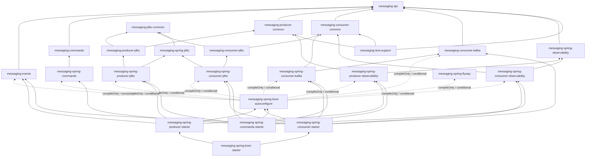

# Eventuate Tram 風格 Messaging 模組重構 Roadmap

> 狀態：Gate A～Gate E（ES0～ES4）已完成；下一步為 Gate F Tram handler DSL + Kafka subscription runtime
> Gate A 證據：[eventuate-tram-aligned-messaging-gate-a-baseline.md](eventuate-tram-aligned-messaging-gate-a-baseline.md)
> 更新日期：2026-08-10
> 適用範圍：`messaging/*` 與使用這些模組的 application entrypoint／use case

## 1. 目的

本次重構參考 Eventuate Tram 的 artifact 分層方式，將 messaging 拆成：

1. framework-neutral contract／core；
2. framework-neutral JDBC producer／consumer implementation；
3. Spring JDBC 與 Spring Kafka integration；
4. Spring Boot auto-configuration；
5. 依 producer／consumer 使用情境選擇的 starter；
6. 可選、低耦合的 metrics／tracing integration；
7. 可脫離 Saga 獨立使用的 Command／async reply 與 correlation layer。

這不是要複製 Eventuate Tram 的全部產品能力或追求 binary compatibility；但在本輪選定的
messaging 範圍內，**class model、API shape 與責任切分預設盡量照 Tram**。只有既有
bounded-context 語意、stable wire contract 或已驗證的 Kafka operational policy 要求不同時才偏離，
而且差異必須在本文件明列：

- domain／application use case 不依賴 Spring messaging infrastructure；
- producer 與 consumer 可以分開使用；
- Outbox 寫入和 consumer 去重都受明確的資料庫交易控制；
- framework-neutral contract 不知道 Spring、JPA、Kafka listener 或 Debezium；
- 基礎 `Message` 是通用 envelope，不把 Integration Event 專屬欄位硬編碼成所有訊息都必填；
- pure JDBC implementation 透過 framework-neutral JDBC／transaction ports 執行 SQL；
- Spring integration 負責 JDBC／transaction ports、Kafka container lifecycle 與 bean wiring；
- application 宣告 subscription 與 operational policy，不再重複撰寫 `@KafkaListener` glue code；
- Command／async reply 建立在 generic `Message`、Outbox／Inbox 與 programmatic subscription 上，不依賴 Saga runtime；
- starter 只組合依賴，不承載業務邏輯。

### 1.1 參考 Eventuate Tram 的方式

本文件參考的是 Eventuate Tram 已驗證的 abstraction 與依賴方向，不追求 binary compatibility：

```text
Message(payload, headers)
  ├─ MessageProducerImpl
  │    → ChannelMapping
  │    → MessageInterceptor send lifecycle
  │    → MessageProducerImplementation
  └─ MessageConsumerImpl
       → ChannelMapping
       → MessageConsumerImplementation
       → ordered MessageHandlerDecorator chain

Integration Event layer
  → 在通用 Message 上加入 event-type／aggregate-type／aggregate-id 等 headers
  → IntegrationEventHandlersBuilder／IntegrationEventHandlers
  → IntegrationEventDispatcherFactory.make(subscriberId, handlers)
  → MessageConsumer.subscribe(subscriberId, destinations, dispatcher)
```

本專案刻意保留的差異：

- `Message` 採不可變值物件；interceptor 若需補 header，回傳新 message，不共享可變狀態；
- producer implementation 寫入 PostgreSQL Outbox，由 Debezium relay 到 Kafka；
- 跨 bounded context contract 保留 `IntegrationEvent` 名稱，不把它改稱內部 `DomainEvent`；
- Tram 的 `forAggregateType(...)` 在本專案對應為 `forDestination(...)`，routing 使用 logical destination；
- external event name 使用既有 stable event type + version，不採 Java FQCN；
- 只提供 PostgreSQL／Kafka／Spring implementation，但 SPI 不綁死這三者；
- retry／DLT／concurrency 使用 Spring Kafka policy；
- physical tables 繼續使用 `event_outbox`／`event_inbox`；
- request/reply Command 預設一個 terminal Reply；fire-and-forget 使用明確的 notification API，不把 progress stream／多 Reply 混入第一版。

## 2. 本輪範圍與延後能力

### 2.1 本輪要完成

- 通用、不可變 `Message` envelope、標準 headers 與 `MessageBuilder`；
- `ChannelMapping`、`MessageProducerImplementation`、`MessageConsumerImplementation`；
- Tram 風格 `MessageInterceptor` lifecycle 與 ordered consumer decorator chain；
- Tram 風格 typed event envelope、handler collection／builder、name mapping 與 dispatcher factory；
- JDBC Outbox／Inbox、programmatic Kafka subscription 與 Spring integration；
- Outbox headers persistence、Debezium header relay 與 Kafka mapping；
- producer／consumer starters、可選 schema migration 與最小 implementation contract tests；
- idempotency、retry／DLT、lifecycle 與 observability；
- 獨立的 Command／async reply contracts、dispatcher、reply correlation 與 Spring wiring；不連帶建立 Saga。

### 2.2 本次不做的事情

- 不製作 Eventuate Tram binary-compatible API。
- 不實作第二種 broker；目前仍以 Kafka 為唯一 transport implementation。
- 不在 runtime 動態產生帶有 `@KafkaListener` 的 Java method；改用程式化建立 Kafka listener container。
- 不為正常 business event publishing 自行實作 Kafka producer；producer path 維持 Outbox → Debezium → Kafka。
- DLT recovery 是 consumer transport 的例外路徑，可以使用 Spring Kafka `KafkaOperations`，不得被當成一般 producer API。
- 不自行實作 CDC poller 或 message relay。
- 不因模組重構而更名 `event_outbox`、`event_inbox` 資料表。
- 不做破壞性的 Integration Event type／payload／partition-key 改版；新增通用 headers 是向後相容的 envelope 擴充。
- 不照搬 Eventuate Kafka runtime 的 concurrency／retry／DLT 預設；保留本專案已驗證的 Spring Kafka operational semantics。
- 不建立 Reactive artifacts；目前 application、JDBC transaction 與 Kafka runtime 都是 imperative，只有未來出現端到端 WebFlux／R2DBC consumer 才重新評估。
- 不建立 generic optimistic-lock retry decorator。既有 allocation optimistic-lock retry 保留為 bounded-context policy，但 Gate E 必須讓它包住完整的 transactional idempotency attempt，確保每次 application retry 都使用新 transaction；Spring Kafka retry／DLT 則繼續處理整次 application attempt 最終失敗後的 broker redelivery。
- 不建立 non-blocking retry topics；目前先保留 partition-blocking retry／DLT 語意，只有實際證明長 backoff 阻塞 partition throughput 時才另開設計。
- 不在同一個 commit 同時做模組搬移、交易語意改造與 event contract 改版；同一 Gate 內若有相依步驟也必須分 commit 驗證。
- 不預先建立沒有實際責任的 pass-through module。
- 不實作 Saga instance、Saga DSL、補償流程或 Saga lock；Command／Reply correlation 不以此為前置。

### 2.3 保留 SPI、延後 implementation

| 能力 | 目前狀況 | 本輪處理 |
|---|---|---|
| Command／async reply | 專案目前沒有 | 本輪在 generic messaging 穩定後，以獨立 Gate 建立 contracts、dispatcher、reply correlation 與 Spring wiring。 |
| Saga framework | 專案目前沒有 | 不實作；未來若有跨服務補償需求，再建立在 Command／async reply 之上的 orchestration layer。 |
| 第二種 broker | 專案目前沒有 | 保留 generic producer／consumer implementation SPI，只做 Kafka consumer。 |
| Reactive messaging | 專案目前沒有 | 不建立 reactive artifact。 |
| 自製 CDC／一般 Kafka producer | 專案目前沒有 | 不實作；維持 Debezium relay。 |
| Generic optimistic-lock retry | 專案目前沒有 framework abstraction；allocation 已有 application-specific retry | 不抽成 messaging 共用 decorator；既有 allocation retry 必須位於 transactional idempotency attempt 外層。 |
| Non-blocking retry topics | 專案目前沒有 | 延後到 partition-blocking 成為實際問題時評估。 |
| 自動 Inbox／Outbox cleanup scheduler | 尚未有完整機制 | 本輪定義 retention ownership 與 runbook，不建立自動 scheduler。 |
| 發佈用 BOM | 專案尚未對外發布 artifacts | 等 artifacts 需要獨立發布與版本對齊時再建立。 |

## 3. 已確立的核心決策

| 決策 | 結論 | 說明 |
|---|---|---|
| 基礎 message model | 通用、不可變 envelope | `Message` 只承載 ID、payload 與 headers；event metadata 位於 events layer。 |
| Header model | typed constants + `Map<String, String>` | framework headers 與 event headers 分組定義；保留擴充性。 |
| Channel mapping | 本輪建立 | application 使用 logical channel；producer 與 consumer common 統一轉換 physical destination。 |
| Producer 與 idempotent consumer 是否綁定 | 否 | 兩者可獨立引入；同一服務同時收送事件時才同時使用。 |
| Producer 實作 | Outbox + DB + Debezium | `MessageProducer` 不直接呼叫 Kafka。 |
| Producer orchestration | `MessageProducerImpl` + implementation SPI | common 負責 mapping／interceptor；JDBC artifact 負責 persistence。 |
| Consumer 去重實作 | Inbox table + database unique constraint | subscriber scope 與 message ID 共同決定唯一性。 |
| Consumer orchestration | 單一 ordered decorator chain | transaction、idempotency、observation 等 cross-cutting behavior 不建立互相競爭的第二套 processor pipeline。 |
| Integration Event contract | 純 Java interface／type | 不繼承 Spring class，也不帶 Spring annotation。 |
| Typed event handler API | 仿 Tram handler collection + builder | 以 `IntegrationEventHandlersBuilder.forDestination(...).onEvent(...).build()` 建立明確 handler group；不把「每個 handler class 實作一個 public interface」當成最終 API。 |
| Event handler callback | `Consumer<IntegrationEventEnvelope<E>>` | 仿 Tram `DomainEventEnvelope<E>`；envelope 提供 message／event identity、aggregate metadata 與 typed event，但 subscriber／Kafka metadata不進 use case。 |
| External event type mapping | 明確 `IntegrationEventNameMapping` | 仿 Tram `DomainEventNameMapping`，由 stable wire type + version 對應 Java class；不得退回 FQCN 或 class simple name。 |
| Event dispatcher ownership | 每個 stable subscriber 一個 dispatcher | `IntegrationEventDispatcherFactory.make(subscriberId, handlers)` 建立 dispatcher 並透過 generic `MessageConsumer` 訂閱；handler group 與 subscriber ownership 必須顯式可見。 |
| Handler discovery | application 顯式提供 handler group | 不全域掃描並混合所有 `IntegrationEventHandler<?>` beans；Spring 只組裝 target、factory 與 dispatcher beans。 |
| Pure JDBC artifacts | 建立 | 分別建立 `messaging-producer-jdbc` 與 `messaging-consumer-jdbc`。 |
| Kafka subscription API | 優先複製 Tram 形狀 | 基本 API 保留 `MessageConsumer.subscribe(subscriberId, channels, handler)`；Archone 只以 options／overload 加上獨立 `consumerGroupId`、policy 與 lifecycle handle。application 不寫 `@KafkaListener`。 |
| Kafka listener lifecycle | `messaging-spring-consumer-kafka` | 程式化建立、啟停 Spring Kafka listener containers。 |
| 未處理事件 | shared event channel 預設 `IGNORE_WITH_METRIC` | 不讓新增的無關事件毒化舊 consumer；缺 header、已知事件反序列化失敗仍為 failure。 |
| Subscriber 與 Kafka group | 分開建模、預設同值 | `subscriberId` 是 Inbox idempotency scope；`consumerGroupId` 是 broker delivery identity。 |
| Concurrency／retry／DLT | Spring Kafka + application override | shared module 提供機制與安全預設；bounded context 提供 exception classification 與 subscription policy。 |
| Spring transaction 所屬 | Spring transaction bridge | pure JDBC consumer 透過 `MessagingTransactionTemplate` port 開啟交易，不使用 `@Transactional`。 |
| Use case 是否必須移除 `@Transactional` | 不必一刀切 | Kafka 外層交易可讓 `REQUIRED` use case 加入；REST 呼叫時 use case 仍可自行開交易。 |
| Outbox headers | 本輪持久化與 relay | 以向後相容 migration 增加 serialized headers，供 correlation／causation／trace 與未來 message type 使用。 |
| Observability | 正式納入 | pure modules 提供 decorator／interceptor SPI；Spring module 接 Micrometer Observation。 |
| DB schema 是否跟著改名 | 否 | artifact 名稱與 physical table 名稱是兩個問題。 |
| Command／Reply 與 Saga 是否綁定 | 否 | Command／async reply 可單獨使用；Saga 只是未來可選的上層 orchestration。 |
| Reply correlation key | 原 Command message ID | Reply 明確攜帶 `reply-to-message-id`；不能用 business ID、Kafka key 或泛用 `correlation-id` 猜測。 |
| Inbox 去重 key | Reply 自己的 message ID | `correlation-id`／`reply-to-message-id` 只描述關係，不得取代每則訊息自己的 idempotency identity。 |
| Reply payload contract | generic `Message` + reply headers | 參考 Tram，不強迫所有 reply 實作共同 marker；由 `reply-type`／`reply-outcome` 表達語意。 |

## 4. Gate D 完成後的結構與剩餘問題

```text
messaging
├── messaging-api
├── messaging-events
├── messaging-producer-common
├── messaging-consumer-common
├── messaging-jdbc-common
├── messaging-producer-jdbc
├── messaging-consumer-jdbc
├── messaging-producer-outbox        # legacy migration bridge；Gate I 移除
├── messaging-consumer-inbox         # legacy application API／JPA fallback；Gate I 移除
├── messaging-consumer-kafka
├── messaging-spring-jdbc
├── messaging-spring-producer-jdbc
├── messaging-spring-consumer-jdbc
├── messaging-spring-flyway          # opt-in；不自動 migrate
├── messaging-spring-boot-autoconfigure
└── messaging-spring-boot-starter
```

目前可工作的流程如下：

```text
Producer
Use case transaction
  → IntegrationEventPublisher
  → MessageProducerImpl
  → CallerTransactionRequiredMessageProducerImplementation
  → JdbcOutboxMessageProducerImplementation
  → transaction-aware JdbcOperations
  → event_outbox
  → Debezium
  → Kafka

Consumer
Application @KafkaListener
  → KafkaIntegrationEventDispatcher
  → IntegrationEventHandler
  → InboundCommand
  → Use case
  → InboxRepo compatibility bridge
  → SqlTableBasedDuplicateMessageDetector
  → atomic event_inbox INSERT ... ON CONFLICT DO NOTHING
  → business changes / possible Outbox changes
```

`TransactionalIdempotencyMessageHandlerDecorator` 與 Spring transaction composition 已建立並
通過 contract／PostgreSQL tests，但 Gate D 刻意尚未接到實際 Kafka handler chain；transaction
ownership 仍由既有 use case 的 `@Transactional` 負責，待 Gate E 一次完成邊界遷移。

Gate D 後的剩餘結構問題：

1. `messaging-producer-outbox` 的 JPA types 只剩 rolling migration／既有測試相容用途，需依 I8 移除。
2. `messaging-consumer-inbox` 只剩 use case signature 與 rolling fallback 相容用途，需在 Gate E
   搬出 application dependency，並依 Gate I 移除 legacy JPA types。
3. application use case 仍直接知道 `InboundCommand` 與 `InboxRepo`，transport metadata 和業務操作耦合。
4. REST entrypoint 仍會建立假的 inbound metadata 才能呼叫 use case，顯示 idempotency 邊界放得太深。
5. 單一 starter 仍讓只需要 producer 的服務帶入 consumer/Kafka，反之亦然。
6. consumer runtime 仍由 application `@KafkaListener` 擁有，programmatic subscription 留給 Gate F。
7. `KafkaIntegrationEventDispatcher` 的舊 FQCN 仍是 temporary compatibility bridge，正式 generic chain 尚未接入。
8. `subscriberId`、Kafka consumer group 與 listener identity 雖已分開建模，實際 application subscription 尚未遷移。
9. allocation handlers 目前以 `AllocationRetryExecutor` 包住 transactional use case；Gate E 移動 transaction owner 時，不能讓 transactional decorator 反過來包住 retry，否則多次 optimistic-lock attempt 會共用同一筆已失敗的 transaction。
10. `StockReceiptController` 的 `receiptId` 雖被包成 message metadata，實際上是 HTTP idempotency key；移除 fabricated `InboundCommand` 前必須先建立非 messaging 的 request idempotency owner。

## 5. 目標 artifact

```text
messaging
├── messaging-api
├── messaging-events
├── messaging-commands
├── messaging-producer-common
├── messaging-consumer-common
├── messaging-jdbc-common
├── messaging-producer-jdbc
├── messaging-consumer-jdbc
├── messaging-consumer-kafka
├── messaging-spring-jdbc
├── messaging-spring-producer-jdbc
├── messaging-spring-consumer-jdbc
├── messaging-spring-consumer-kafka
├── messaging-spring-observability
├── messaging-spring-producer-observability
├── messaging-spring-consumer-observability
├── messaging-spring-commands
├── messaging-spring-flyway
├── messaging-spring-boot-autoconfigure
├── messaging-spring-producer-starter
├── messaging-spring-consumer-starter
├── messaging-spring-commands-starter
├── messaging-spring-boot-starter
└── messaging-test-support
```

### 5.1 每個 artifact 的責任

| Artifact | Spring | 主要責任 | 不應包含 |
|---|:---:|---|---|
| `messaging-api` | 否 | immutable `Message`、standard `MessageHeaders`、`MessageBuilder`、`MessageIdGenerator` port、transport-neutral `MessageContext`、`ChannelMapping`、`MessageInterceptor`、producer／consumer／handler／subscription 最小 API | Event contract、SQL、Kafka、Spring |
| `messaging-events` | 否 | `IntegrationEvent`、`EventMessageHeaders`、publisher、typed dispatcher、handler、serializer contract 與 Jackson serde | `ConsumerRecord`、Spring wiring、Inbox／Outbox persistence |
| `messaging-commands` | 否 | `Command`、command/reply headers、name mapping、codec port、`CommandProducer`、`CommandDispatcher`、handlers builder 與 reply producer；以 generic `Message` 實作 async request/reply | Saga state、補償、Spring、Kafka types、events dependency |
| `messaging-producer-common` | 否 | `MessageProducerImpl`、`MessageProducerImplementation`、send interceptor orchestration 與 message ID／header normalization | Outbox model、SQL、JPA、Spring transaction |
| `messaging-consumer-common` | 否 | `MessageConsumerImpl`、唯一 generic `MessageConsumerImplementation` SPI、ordered handler decorator chain、subscriber model 與 processing outcome | SQL、Spring transaction、Kafka record／listener |
| `messaging-jdbc-common` | 否 | `JdbcStatementExecutor`、`MessagingTransactionTemplate`、`MessagingSqlDialect`、`MessagingSchema`、`MessagingTableNames` 等 framework-neutral JDBC／transaction ports | `JdbcTemplate`、`PlatformTransactionManager` |
| `messaging-producer-jdbc` | 否 | Outbox persistence model、serialized headers、`JdbcOutboxMessageProducerImplementation` 與 PostgreSQL insert behavior | Spring、Kafka producer、Debezium runtime |
| `messaging-consumer-jdbc` | 否 | `SqlTableBasedDuplicateMessageDetector` 與 transactional idempotency decorator implementation | Spring、Kafka listener、bounded-context handler |
| `messaging-consumer-kafka` | 否 | `ConsumerRecord` → generic `Message` 的 `KafkaMessageMapper`、Kafka header／key conventions | typed Integration Event dispatch、Spring Kafka、`@KafkaListener`、error handler |
| `messaging-spring-jdbc` | 是 | 以 `JdbcTemplate`／`PlatformTransactionManager` 實作 pure JDBC ports | Producer／consumer 業務語意 |
| `messaging-spring-producer-jdbc` | 是 | Outbox producer bean wiring、caller transaction enforcement | Debezium、一般 Kafka producer、業務 event mapping |
| `messaging-spring-consumer-jdbc` | 是 | JDBC duplicate detector／transactional idempotency decorator wiring | Kafka listener、bounded-context handler |
| `messaging-spring-consumer-kafka` | 是 | `SpringKafkaMessageConsumerImplementation`、程式化 listener container、subscription lifecycle、concurrency、retry、DLT、ack 與 transport observation hooks | Integration Event typed dispatch |
| `messaging-spring-observability` | 是 | 共用 Micrometer naming／convention／context helpers；不得依賴 producer-common 或 consumer-common | producer／consumer adapters、Spring Kafka、Exporter |
| `messaging-spring-producer-observability` | 是 | 將 `MessageInterceptor` send lifecycle 接到 `ObservationRegistry` | consumer common、Spring Kafka |
| `messaging-spring-consumer-observability` | 是 | 將 `MessageHandlerDecorator` 接到 `ObservationRegistry` | producer common、Spring Kafka |
| `messaging-spring-commands` | 是 | Command codec／name mapping defaults、dispatcher factory 與 conditional wiring；複用 generic producer／consumer runtime | Saga manager、業務 command classes、另一套 Kafka listener runtime |
| `messaging-spring-flyway` | 是 | 提供 namespaced、opt-in Inbox／Outbox schema migrations 與 schema validation | 預設自動執行、application migration history 接管 |
| `messaging-spring-boot-autoconfigure` | 是 | conditional bean wiring 與 properties | 業務 policy、schema migration ownership |
| `messaging-spring-producer-starter` | 是 | producer common／JDBC、producer observation 與 auto-config dependency bundle | consumer/Kafka dependency |
| `messaging-spring-consumer-starter` | 是 | consumer common、JDBC idempotency、Kafka subscription、consumer observation 與 auto-config bundle | producer Outbox dependency |
| `messaging-spring-commands-starter` | 是 | commands、Spring commands wiring 與 generic producer + consumer runtime bundle；直接組合底層 implementations，不經 events starters | Saga framework、`messaging-events`、業務 command/reply contracts |
| `messaging-spring-boot-starter` | 是 | producer + consumer all-in-one convenience bundle | implementation logic |
| `messaging-test-support` | 否 | producer／consumer implementation TCK、message fixtures、duplicate/concurrency contracts | production auto-configuration、業務 fixtures |

### 5.2 與 Eventuate Tram artifact 的對照

Eventuate Tram 不是「全部 Spring」也不是「全部 pure Java」；它把 messaging core／JDBC／Kafka implementation 與 Spring integration 拆成不同 artifacts。本專案沿用這個切分方向，但保留 `messaging-*` 命名與自身的 Outbox → Debezium delivery model。

| 本專案 artifact | 對照的 Eventuate Tram 分層 | Spring | 調整理由 |
|---|---|:---:|---|
| `messaging-api` | base messaging API／messaging common | 否 | 放最小 generic `Message`、headers、`ChannelMapping`、producer／consumer contracts。 |
| `messaging-events` | events API／serde | 否 | Integration Event contract 與 transport runtime 分離。 |
| `messaging-commands` | `eventuate-tram-commands` | 否 | 和 Tram 一樣讓 command producer、dispatcher、handler 與 reply correlation 建立在 generic messaging 上；不依賴 Saga。 |
| `messaging-producer-common` | `messaging-producer-common` | 否 | 保存 `MessageProducerImpl`、interceptor 與 implementation SPI；不放 Outbox model。 |
| `messaging-consumer-common` | `messaging-consumer-common` | 否 | 保存 consumer orchestration、decorator 與 duplicate-detection contract。 |
| `messaging-producer-jdbc` | `messaging-producer-jdbc` | 否 | 實作 Outbox persistence 與 `MessageProducerImplementation`；正常 publish 不加入 Kafka producer。 |
| `messaging-consumer-jdbc` | `messaging-consumer-jdbc` | 否 | 實作 SQL duplicate detector 與 transactional callback orchestration。 |
| `messaging-consumer-kafka` | `messaging-consumer-kafka` | 否 | 只保留 Kafka protocol／record mapping；generic implementation SPI 位於 consumer-common。 |
| `messaging-spring-jdbc` | Tram Spring JDBC integrations 的共用部分 | 是 | 本專案額外抽出共同的 `JdbcTemplate`／transaction bridge，避免 producer／consumer 重複。 |
| `messaging-spring-producer-jdbc` | `spring-producer-jdbc` | 是 | 組裝 Outbox producer 與 Spring transaction-aware JDBC。 |
| `messaging-spring-consumer-jdbc` | `spring-consumer-jdbc` | 是 | 組裝 Inbox detector 與 Spring transaction boundary。 |
| `messaging-spring-consumer-kafka` | `spring-consumer-kafka` | 是 | 以 Spring Kafka 程式化建立 listener containers，承接 retry／DLT／concurrency。 |
| observation artifacts | 本專案擴充 | 是 | 共用 helper 與 producer／consumer adapters 分離，避免窄 starter 互相拉入對方依賴。 |
| `messaging-spring-commands` | `eventuate-tram-spring-commands` | 是 | 提供 codec defaults 與 Spring bean wiring，不承載 command business type。 |
| `messaging-spring-flyway` | Tram Spring Flyway support | 是 | library 可提供 schema，但由 application 明確 opt in。 |
| `messaging-test-support` | Tram testing support | 否 | 在搬移 application 前驗證各 implementation 遵守相同 SPI contract。 |
| `messaging-spring-commands-starter` | `eventuate-tram-spring-commands-starter` | 是 | 將 commands 與 generic producer/consumer runtime 組合成可直接使用的功能；不拉入 Saga。 |
| auto-config／其他 starters | Spring Boot integration artifacts | 是 | 只負責條件式 wiring 與依賴組合。 |

因此「照 Tram」是指依賴方向與責任切分，不是每個 artifact 必須逐字同名，也不是把所有 pure interfaces 搬進 Spring starter。

Tram 另有 `eventuate-tram-spring-commands-common`，主要服務它自己的多種 Spring／reactive 組合。本專案目前只有 imperative Spring runtime；在沒有第二個實際 consumer 前，不建立空的 `messaging-spring-commands-common`。若未來 command Spring wiring 出現兩個以上 implementation 共用責任，再從 `messaging-spring-commands` 萃取。

### 5.3 Pure JDBC 與 Spring JDBC 的分界

本專案決定比第一版 roadmap 更接近 Eventuate Tram，同時建立 pure JDBC 與 Spring JDBC artifacts：

```text
messaging-producer-jdbc
  → Outbox model + SQL insert + serialized headers
  → implements MessageProducerImplementation
  → depends on JdbcStatementExecutor port

messaging-consumer-jdbc
  → SQL duplicate detection
  → transactional idempotency decorator
  → depends on JdbcStatementExecutor + MessagingTransactionTemplate ports

messaging-spring-jdbc
  → ports backed by JdbcTemplate + PlatformTransactionManager
```

pure JDBC modules 不能直接呼叫 `DataSource.getConnection()` 後假設它會加入 Spring transaction；必須透過 Spring-backed JDBC port 取得同一筆 thread-bound connection。Inbox、business repositories 與 chained Outbox 也必須使用同一個 `DataSource` 和 `PlatformTransactionManager`。

pure 的意思是「沒有 Spring dependency」，不是「沒有 JDBC／SQL」。如果這些 modules 最後只剩 re-export，表示分界實作錯誤，不能以 artifact 名稱取代真正的 port／adapter。

### 5.4 Message、headers 與 Outbox relay contract

通用 envelope 的概念形狀如下；roadmap 不鎖死 accessor 命名，但鎖定不可變性與責任：

```java
public interface Message {
  UUID id();
  String payload();
  Map<String, String> headers();
  Optional<String> header(String name);
  String requiredHeader(String name);
}
```

第一版固定使用 `UUID` message identity，以符合現有 Java contract、`event_outbox.id UUID`、`event_inbox.event_id UUID` 與 Debezium `id` header；不在這次重構中順便改成任意字串 ID。wire header 仍使用 UUID 的 canonical string representation。`id()` 是 required `message-id` header 的 typed convenience accessor，不維護第二份可分岔狀態；header 缺失或不是合法 UUID 時 fail fast。`MessageBuilder` 建立 immutable implementation。

第一版 payload transport 固定為 JSON text，並設定 `content-type = application/json`，以符合現有 `event_outbox.payload JSONB NOT NULL`。base API 保留 payload string 形狀，但 JDBC Outbox append 前必須驗證其為合法 JSON；binary／Avro／Protobuf 或任意非 JSON payload 不在本輪假設支援。基礎 API 只定義所有訊息共用的 headers，例如：

```text
message-id
message-type                 # generic wire payload type；physical Outbox type 的來源
logical-channel
destination        # mapped physical destination
partition-id
message-date
correlation-id
causation-id
traceparent / tracestate
content-type
```

`MessageContext` 只提供本次 delivery 的 transport-neutral context，例如 `subscriberId`、logical channel 與 processing attempt；event type 仍從 `EventMessageHeaders` 讀取，Kafka topic／partition／offset 則留在 transport diagnostic extension，不成為 application use case contract。

`message-type` 是所有 persisted messages 的 generic payload type。protocol layer 必須同步設定自己的 semantic type，且值要一致：Integration Event 使用 `message-type = event-type`、Command 使用 `message-type = command-type`、Reply 使用 `message-type = reply-type`。JDBC Outbox 的 physical `type` 欄只讀 `message-type`；若 semantic headers 同時出現且值互相衝突，producer／mapper 必須 fail fast。legacy Integration Event 沒有 `message-type` 時，compatibility mapper 可由既有 `eventType`／`event-type` 補上。

`MessageInterceptor` 參考 Tram 的 `preSend`／`postSend`／`preReceive`／`preHandle`／`postHandle`／`postReceive` lifecycle。producer common 直接執行 send hooks；consumer common 將 receive／handle hooks包成一個有固定 order 的 decorator。與 Tram 不同的是 `preSend` 不可原地 mutate message，若需加入 header 必須回傳新的 immutable `Message`。

producer common 在 `ChannelMapping` 後寫入 `logical-channel` 與 mapped `destination`；JDBC Outbox 的 `route` 使用 mapped destination。consumer 不信任外部 logical-channel 來選 handler，而是以本地 subscription context 為準並驗證 header（若存在）一致。為避免反向 mapping 歧義，同一 application 內多個 logical channels 映射到同一 physical destination 預設啟動失敗。

`messaging-events` 另外定義：

```text
event-type
event-aggregate-type
event-aggregate-id
event-contract-version
```

`messaging-commands` 另外定義 Tram 風格的 command/reply headers；名稱延續本專案 kebab-case convention，不追求 Eventuate binary compatibility：

```text
command-type
command-contract-version
command-reply-to            # request/reply required；notification 不帶
command-resource             # optional；只有需要 resource-scoped routing／locking 時使用
reply-type
reply-contract-version
reply-outcome                # SUCCESS／FAILURE；技術例外不得偽裝成 business FAILURE reply
reply-to-message-id          # required；直接指向原 Command message-id
```

correlation 規則固定如下：

```text
Command
  message-id       = 這筆 Command 的唯一 ID
  correlation-id   = caller 提供的 conversation ID；若無則使用 Command message-id
  causation-id     = optional，表示觸發這筆 Command 的直接前因
  command-reply-to = Reply logical channel

Reply
  message-id          = 這筆 Reply 自己的新唯一 ID
  reply-to-message-id = 原 Command message-id
  correlation-id      = 繼承原 Command correlation-id
  causation-id        = 原 Command message-id
```

`reply-to-message-id` 是 request/reply protocol 的直接 correlation key；`correlation-id` 是整段 conversation／trace lineage，兩者不能互相取代。Inbox 對 Command 與 Reply 都只使用各自的 `message-id` 去重，否則同一 conversation 的第二則訊息會被誤判為 duplicate。

API 將 request/reply 與 fire-and-forget 分開：`send(...)` 必須提供 reply logical channel 並期望一個 terminal Reply；`sendNotification(...)` 明確不帶 `command-reply-to`，handler 不得回覆。第一版不支援 progress／streaming replies；若需要長時間進度，優先發布 Integration Event 或另建 workflow/read model，而不是讓 correlation layer 變成隱性流程引擎。

參考 Tram，只有 `Command` 需要 marker contract；Reply 是帶有 `reply-type`、`reply-outcome` 與 `reply-to-message-id` 的 generic `Message`。typed reply payload 仍可由 application 定義 record/class，但 framework 不強迫共同繼承 `Reply` base type。

`command-type`／`reply-type` 是 wire-level stable name，不是允許外部輸入直接交給 `Class.forName(...)` 的 Java FQCN。dispatcher 只能從 application 明確註冊的 handler/type registry 取得目標 class，再交給 codec 反序列化。contract version 預設從 `1` 開始；已知 type 但不支援的 version 是 contract failure，必須依 dedicated subscription policy retry／DLT，不能當成 unknown message 忽略。

現有 Integration Event publisher 以 `IntegrationEvent.eventId` 設定 `message-id`，維持 Inbox 與 payload contract validation 使用同一個 identity；generic non-event message 若未提供 ID，才由 producer common 的 ID generator 補上。

需要在 `send(...)` 回傳 ID 的上層 protocol（例如 Command）必須在呼叫 generic `MessageProducer` 前，透過 `messaging-api` 的 `MessageIdGenerator` 建立 message ID；producer common 只驗證並保留既有 ID，不得再次替換。如此不必讓 commands module 依賴 producer implementation，也不必修改 generic `MessageProducer.send(...)` 的既有 `void` signature。

`event-contract-version` 採 additive policy：既有未帶版本的訊息視為 `1`，新 publisher 明確寫入 `1`；event type 已知但版本不支援屬於 contract failure，不得當成 unrelated unknown event 忽略。未來需要 v2 時先定義 handler compatibility，再決定同 event type 加版本或建立新 event type。

現有 `eventType` Kafka header 在相容期保留；mapper 將它轉成 canonical `event-type`。reserved transport headers 與 serialized header map 若值不一致，必須 fail fast，不可靜默覆寫。

header merge precedence 固定如下，不能由各 adapter 自行選擇覆寫順序：

1. physical envelope 的 `id`、`type`、`route`、`partition_key` 與 timestamp 是 persisted transport fact；mapper 先轉成 canonical reserved headers。
2. serialized `messageHeaders` 再合併 application／protocol headers。它若重複 reserved key，只有值與 physical fact 完全一致才接受；不一致立即視為 contract failure。
3. legacy `eventType` 只在沒有 `command-type`／`reply-type` 且缺少 canonical `event-type` 時提供相容補值；不得覆寫任何 canonical semantic type。
4. Kafka topic／partition／offset 等 delivery diagnostics 由 consumer context 加入，不接受 serialized headers 冒充或覆寫。

producer 端也使用相同規則：caller 不得藉由 custom headers 覆寫 producer normalization 產生的 `message-id`、`message-type`、destination 或 partition identity；相同值可接受，衝突一律 fail fast。

為了在不自行實作 CDC／SMT 的前提下傳遞任意 headers，Outbox 採以下相容演進：

```text
event_outbox
  + headers TEXT NOT NULL DEFAULT '{}'

Debezium EventRouter
  → 既有 id header 保留
  → 既有 type:header:eventType 保留
  → headers:header:messageHeaders

KafkaMessageMapper
  → decode messageHeaders JSON object
  → merge reserved Kafka metadata
  → build generic immutable Message
```

使用單一 serialized `messageHeaders` transport header，是為了讓 Debezium EventRouter 可 relay 任意 logical headers，同時維持既有 raw event payload 與 `eventType` consumers 相容。必須加入 header size limit、合法 key/value、JSON decode failure 與 reserved-key collision tests。

Gate J 啟用 Command／Reply 前必須處理現有 physical schema 的語意落差：`event_outbox.aggregatetype`／`aggregateid` 目前為 `NOT NULL`，但 generic Command／Reply 不保證具有 Aggregate identity。保留 `event_outbox` 表名的前提下，採 application-owned migration 將這兩欄改為 nullable；`messaging-events` 仍在 contract／mapper 層強制 Integration Event 必須提供兩者，不能因 DB 放寬而降低 event contract。

```text
Integration Event row
  aggregatetype / aggregateid = required domain aggregate identity
  type                        = message-type = event-type

Command row
  aggregatetype / aggregateid = optional；有真實 target resource identity 才填
  type                        = message-type = command-type

Reply row
  aggregatetype / aggregateid = optional
  type                        = message-type = reply-type
```

不得寫入 `"Message"`、`"N/A"`、command ID 等假 aggregate 值來滿足舊 constraint。若 SIT 證明 Debezium EventRouter 在目前設定下仍硬性要求 aggregate columns，Gate J 必須停止並 review 新增 generic `message_outbox` table／connector pipeline；不能把 transport 限制洩漏回 Command contract。

現有 connector 會將 physical `type` 另外 relay 成 legacy `eventType` Kafka header，因此 generic mapper 必須依 serialized semantic headers 判別：有 `command-type`／`reply-type` 時不得把 legacy `eventType` 再 canonicalize 成 `event-type`；只有 Integration Event 或沒有新 headers 的 legacy event 才做相容 mapping。Gate J 必須加入這個 collision／classification golden test，避免 Command 被 event dispatcher 誤認。

Schema abstraction 本輪建立 `MessagingSqlDialect`、`MessagingSchema`、`MessagingTableNames`，只提供 PostgreSQL implementation。`messaging-spring-flyway` 提供 opt-in migrations；目前已有 application-owned Flyway history 的 `order-promising` 仍以新的 application migration 加欄位，不能同時讓 library migration 重複接管。

### 5.5 目標依賴方向



依賴規則：

- pure module 可以依賴 pure module。
- Spring module 可以依賴 pure module。
- pure module 不得反向依賴 Spring module。
- pure JDBC module 不得 import `JdbcTemplate`、`PlatformTransactionManager` 或 `@Transactional`。
- `messaging-spring-consumer-kafka` 可以依賴 Spring Kafka，`messaging-consumer-kafka` 不可以。
- `messaging-consumer-kafka` 不得依賴 `messaging-events`；Kafka record mapping 與 Integration Event typed dispatch 是兩層責任。
- Kafka container、retry 與 DLT 的 observation hook 留在 `messaging-spring-consumer-kafka`；共用 observation artifact 不得為此引入 Spring Kafka。
- producer／consumer observation adapters 必須分開，producer starter 不得透過 observability transitively 引入 consumer common，反之亦然。
- producer starter 不得引入 consumer Inbox、Kafka client 或 Spring Kafka。
- consumer starter 不得引入 producer Outbox。
- all-in-one starter 只聚合兩個窄 starter。
- `messaging-commands` 只依賴 generic messaging API，不得依賴 `messaging-events` 或任何 Saga module。
- Command caller 需要送 Command 並收 Reply，participant 需要收 Command 並送 Reply；因此 `messaging-spring-commands-starter` 組合完整 generic producer + consumer runtime 是刻意設計，不視為窄 starter dependency leakage。它不得依賴 all-in-one／events starters，避免讓 Command capability transitively 帶入 `messaging-events`。
- notification-only producer／consumer 若確實需要更窄 dependency，可直接組合 `messaging-commands`、`messaging-spring-commands` 與所需的 generic producer／consumer implementation artifacts；現有 producer／consumer starters仍包含 events layer，不能拿來宣稱 commands-only dependency tree。在出現重複組合需求前，不另外建立 pass-through command-producer／command-consumer starters。

## 6. 目標執行流程

### 6.1 Producer

```text
Use case @Transactional
  → IntegrationEventPublisher
      → event → generic Message + EventMessageHeaders
  → MessageProducer.send(logicalChannel, message)
  → MessageProducerImpl                    [producer-common]
      → ChannelMapping.transform(logicalChannel)
      → ordered MessageInterceptor send lifecycle
      → normalize message ID／date／destination headers
  → MessageProducerImplementation          [producer-common SPI]
  → JdbcOutboxMessageProducerImplementation [producer-jdbc]
      → Outbox row + serialized headers
  → Spring JdbcStatementExecutor           [spring-jdbc]
  → event_outbox                           [same DB transaction]
  → commit
  → Debezium EventRouter
      → raw payload + id／eventType／messageHeaders
  → Kafka
```

關鍵不變量：business mutation 與 Outbox insert 必須同一筆 DB transaction；若沒有 caller transaction，Outbox adapter 應立即失敗。

### 6.2 Consumer

```text
Application dispatcher/subscription bean
  → IntegrationEventDispatcherFactory.make(subscriberId, handlers[, options])
      subscriberId                          [Inbox scope]
      handlers.destinations                 [logical channels]
      options.consumerGroupId               [optional Kafka delivery identity; default = subscriberId]
  → MessageConsumer.subscribe(subscriberId, logicalChannels, dispatcher[, options])
  → MessageConsumerImpl                    [consumer-common]
      → ChannelMapping.transform(logicalChannels)
      → MessageConsumerImplementation      [single generic SPI]
  → programmatic Spring Kafka container     [spring-consumer-kafka]
  → KafkaMessageMapper                     [consumer-kafka]
      → ConsumerRecord → generic immutable Message
      → validate/decode id／eventType／messageHeaders／record key
  → fixed ordered MessageHandlerDecorator chain [consumer-common]
      1. receive interceptor / semantic observation
      2. transactional idempotency decorator [consumer-jdbc]
         → MessagingTransactionTemplate     [jdbc-common port]
         → Spring TransactionTemplate       [spring-jdbc]
         → DuplicateMessageDetector.claimIfNew(subscriberId, message.id)
      3. IntegrationEventDispatcher         [messaging-events]
         → use this subscriber's explicit IntegrationEventHandlers registry
         → resolve destination + external event type/version through IntegrationEventNameMapping
         → deserialize and validate typed contract
         → construct IntegrationEventEnvelope<E>
         → unknown shared-channel event: IGNORE_WITH_METRIC
         → known event: invoke registered Consumer<IntegrationEventEnvelope<E>>
             → map envelope.event() to command
             → usecase.execute(command)
             → business changes / optional Outbox append
      transaction commit
```

如果 handler 或 use case 拋出 exception：

```text
handler failure
  → Inbox claim rollback
  → business changes rollback
  → Outbox append rollback
  → exception propagates to Spring Kafka container
  → configured retry / DLT policy decides next action
```

這個流程不能只靠 package 搬移完成；它會改變 consumer transaction ownership，必須獨立成高風險 Gate。

`@Transactional` 不是建立 transaction 的唯一方法。transactional idempotency decorator 透過 `MessagingTransactionTemplate.execute(...)` 執行 chain callback；Spring implementation 再委派給 Spring `TransactionTemplate`。因此不需要在 message handler 上標註 `@Transactional`，仍可讓 Inbox claim、business updates 與 chained Outbox 同時 commit／rollback。

固定 decorator ordering 是 contract，不由 Spring bean discovery 的偶然順序決定。built-in order constants 必須保證 observation 包住 transaction outcome，而 Inbox claim 與 handler 位於同一 transaction；application decorator 只能插入明確保留的 outer attempt range 或 inner custom range。outer attempt range 只保留 insertion point，不代表 messaging framework 提供 generic retry implementation。

第一版 built-in execution order 明確固定為：

```text
Spring Kafka delivery callback
  → optional bounded-context attempt policy
      例如 allocation optimistic-lock retry；每次 attempt 都重新進入下列 chain
    → Observation begin
      → Transactional idempotency decorator opens a new DB transaction
        → atomic Inbox claim
        → typed dispatcher
        → typed handler
        → application use case
        → optional chained Outbox append
      → DB commit / rollback
    → Observation records this attempt outcome
```

`Inbox claim` 不是另一個可任意排序的 public decorator，而是 transactional idempotency decorator 交易 callback 的第一個動作。這裡要區分兩種 retry：

- application optimistic-lock retry 是短週期 concurrency policy；若某 subscriber 需要，必須包住整個 transactional idempotency chain。失敗 attempt 會連同 Inbox claim rollback，下一次 attempt 才能在新 transaction 重新 claim。
- Spring Kafka retry／DLT 是 broker delivery policy，位於整次 application handling 外層；只有 application attempt policy 最終仍失敗、exception 原樣傳出後才介入。

Gate E 不因此新增 generic optimistic-lock retry decorator；只固定上述 transaction ordering invariant。若未來多個 bounded context 都需要相同語意，再抽出共用 implementation。

### 6.3 Application 使用方式

application 使用者不應直接操作 `TransactionTemplate`、Inbox SQL 或 Kafka container。handler
宣告方式刻意仿 Tram 的 `DomainEventHandlersBuilder`：一個 bounded-context target 提供一組
`IntegrationEventHandlers`，以 method reference 註冊 typed callback，而不是每個事件都實作一個
帶 `destination()`／`eventType()`／`eventClass()`／`handleTyped()` 的 interface。

目標 handler target：

```java
final class AllocationIntegrationEventConsumer {

  private final AllocateOrderUsecase allocateOrderUsecase;
  private final CancelMovementsUsecase cancelMovementsUsecase;
  private final AllocateWaitingDemandUsecase allocateWaitingDemandUsecase;

  IntegrationEventHandlers integrationEventHandlers() {
    return IntegrationEventHandlersBuilder
        .forDestination(OrderingEventTopics.ORDER_EVENTS)
        .onEvent(OrderPlacedIntegrationEvent.class, this::onOrderPlaced)
        .onEvent(OrderCancelledIntegrationEvent.class, this::onOrderCancelled)
        .andForDestination(InventoryEventTopics.STOCK_EVENTS)
        .onEvent(
            StockAvailabilityIncreasedIntegrationEvent.class,
            this::onStockAvailabilityIncreased)
        .build();
  }

  private void onOrderPlaced(
      IntegrationEventEnvelope<OrderPlacedIntegrationEvent> envelope
  ) {
    allocateOrderUsecase.execute(new AllocateOrderCommand(envelope.event().getOrderId()));
  }

  // 其餘 methods 同樣只做 envelope.event() → command → usecase.execute(command)。
}
```

目標 Spring composition：

```java
@Bean
IntegrationEventDispatcher allocationEventDispatcher(
    IntegrationEventDispatcherFactory factory,
    AllocationIntegrationEventConsumer target
) {
  return factory.make(
      "stock-allocation",
      target.integrationEventHandlers());
}
```

`make(subscriberId, handlers)` 是刻意保留的 Tram-compatible 基本形狀。需要把 Kafka
`consumerGroupId` 與 Inbox `subscriberId` 分開時，使用 factory overload 或 subscriber-specific
options／properties；預設兩者同值。前者改名會改變 Inbox scope、可能重新處理歷史訊息；後者
改名會建立新的 Kafka group、可能依 offset reset policy 重放。兩者都不得使用每次啟動不同的
UUID，改名必須有 migration／replay runbook。

同一 logical subscription 的所有 instances 必須使用相同 `subscriberId` 與 `consumerGroupId`。不同 subscriber 不得在重疊 topics 共用同一 consumer group，否則 Kafka 會把 partitions 分給不同 handler sets，造成訊息未被預期 handler 看見；auto-configuration 必須在可觀察範圍內 fail fast。

Factory 從 `IntegrationEventHandlers` 的 destinations 建立 subscription，`ChannelMapping` 再解析
physical Kafka topics。typed dispatcher 不知道 Kafka `ConsumerRecord`；Kafka mapper 也不知道
Integration Event handler types。factory／dispatcher 不得從 Spring context 全域收集所有 handler
beans，避免不同 subscriber 的 handler set 被意外混在一起。

typed handler 只負責 event → command：

```java
private void onOrderPlaced(IntegrationEventEnvelope<OrderPlacedIntegrationEvent> envelope) {
  allocateOrderUsecase.execute(toCommand(envelope.event()));
}
```

use case 不知道 Inbox、subscriber ID、event ID 或 Kafka：

```java
public void execute(AllocateOrderCommand command) {
  // allocation business behavior
}
```

一般 application 開發者只需：

```text
加入 starter
  → 提供 event handlers
  → 建立 dispatcher/subscription bean
  → 設定 DataSource 與 Kafka connection
```

不再需要：

```text
@KafkaListener
InboxRepo.claimIfNew(...)
TransactionTemplate
Kafka ConsumerRecord parsing
container start/stop
```

shared event topic 的未處理事件預設行為：

```text
unknown event type
  → processing outcome = IGNORED_UNHANDLED
  → metric + structured log
  → commit Inbox claim as consumed for this subscriber
  → no retry / no DLT

known event but invalid payload / missing required header
  → throw contract or mapping exception
  → subscription failure classifier decides retry / DLT
```

Gate J 建立 dedicated command channel 時預設採 strict `FAIL`；Command 是定向要求，不得像 shared event channel 一樣靜默忽略未知 type。

`IGNORED_UNHANDLED` 使用同一個 subscriber 重新投遞時會成為 duplicate；若日後新增 handler 並需要補處理歷史事件，必須建立明確的 replay／backfill subscriber ID，而不是悄悄清除 Inbox。

### 6.4 Command／async reply（不含 Saga）

Command／Reply 直接複用 generic Outbox、Inbox、channel mapping 與 subscription runtime，不建立第二套 transport：

```text
Requester local transaction
  → CommandProducer.send(commandChannel, command, replyChannel)
      → Command → generic Message + command headers
      → MessageProducer → event_outbox
      → return command message-id
  → commit
  → Debezium → Kafka command channel

Participant command subscription
  → Inbox claim(command.message-id)
  → CommandDispatcher → typed CommandHandler
      → application use case
      → CommandReplyProducer
          → Reply generic Message
          → reply-to-message-id = command.message-id
          → correlation-id = command.correlation-id
          → causation-id = command.message-id
          → event_outbox
  → Inbox + business mutation + Reply Outbox commit together
  → Debezium → Kafka reply channel

Requester reply subscription
  → Inbox claim(reply.message-id)
  → validate reply-to-message-id
  → typed ReplyHandler
      → application-specific state update／notification
```

`CommandProducer.send(...)` 回傳 Command message ID，caller 可把它存入自身 business request record；framework 不建立通用 pending-command table，也不以 `CompletableFuture`、thread blocking 或 process-local map 等待 Reply。若 application 需要 timeout、長期狀態或多步補償，應由 application state 或未來 Saga layer 負責，不塞進 correlation layer。

回傳 message ID 不代表 broker 已送達；若 caller 要保存 pending request，該 record 必須和 Command Outbox append 位於同一 local transaction。transaction rollback 後，該 ID 對應的 Command 不應存在。

失敗語意必須分開：

```text
expected business rejection
  → handler 建立 FAILURE Reply
  → business decision + Reply Outbox 正常 commit

technical exception
  → exception 原樣拋出
  → Inbox／business／Reply Outbox rollback
  → Spring Kafka retry／DLT policy 接手
```

Command／Reply correlation 只能提供「這個 Reply 回哪個 Command」，不會自動決定下一步、timeout、補償或 Saga completion。

### 6.5 Concurrency、retry 與 DLT

Tram 風格只用於 subscription／decorator／idempotency，不照搬其 Kafka operational defaults。本專案繼續使用 Spring Kafka：

| 能力 | 擁有者 |
|---|---|
| container、ack、programmatic subscription | `messaging-spring-consumer-kafka` |
| concurrency mechanism | `messaging-spring-consumer-kafka` |
| retry／backoff／DLT mechanism | `messaging-spring-consumer-kafka` |
| subscriber-specific concurrency 與 exception classification | bounded-context application override |
| business event publishing | Outbox → Debezium，不能改走 `KafkaTemplate` |
| DLT recovery publishing | consumer transport exception path，可使用 `KafkaOperations` |

現有 `AllocationKafkaErrorHandlingConfiguration` 行為必須保留：

```text
AllocationConcurrencyExhaustedException
  → exponential retry 1s → 2s → 4s → 8s
  → exhausted then <topic>-dlt

other exceptions
  → no unnecessary retry
  → directly <topic>-dlt
```

它可以演進為 subscriber-specific `KafkaSubscriptionPolicy`／`CommonErrorHandler` override，但不可在移除 `@KafkaListener` 時一併遺失。程式化建立的 container 必須由同一個 `ConcurrentKafkaListenerContainerFactory` 套用 `DefaultErrorHandler` 與 `DeadLetterPublishingRecoverer`。

### 6.6 建議設定面

底層連線與 Kafka client properties 繼續沿用 Spring Boot：

```properties
spring.datasource.url=...
spring.kafka.bootstrap-servers=...
```

messaging capabilities 使用彼此獨立的開關；名稱在 Gate H 實作時以 configuration metadata test 固定：

```yaml
archone:
  messaging:
    channels:
      ordering-events: orders.events.v1
    producer:
      jdbc:
        enabled: true
    consumer:
      jdbc:
        enabled: true
      kafka:
        enabled: true
        subscriptions:
          stock-allocation:
            consumer-group-id: stock-allocation
            unhandled-event-policy: IGNORE_WITH_METRIC
    observation:
      enabled: true
      kafka: true
      consumer: true
      producer: true
```

`subscriberId` 與 handlers 優先由 type-safe dispatcher bean 宣告；channel mapping、`consumerGroupId`、concurrency 等部署相關數值可以由 properties 提供預設。exception classification／recoverer 等行為使用 `KafkaSubscriptionPolicy`、`MessageFailureClassifier` 或 Spring bean override，避免在 YAML 放 Java class names。

`ChannelMapping` 對 producer／consumer 必須使用同一套 logical names，但各 application 可映射到不同環境的 physical topics。缺少 mapping 時預設 identity mapping；同一 application 的重複 physical mapping 預設 fail fast，不能靜默覆蓋。

## 7. 類別移動／演進對照

| 現有類別 | 目標位置或替代方案 | 類型 |
|---|---|---|
| `Message` | `messaging-api`，改為 immutable payload + headers generic envelope | contract 演進 |
| `MessageMetadata` | 過渡成 `MessageContext`／header accessor；不再把 event metadata 固定在 base API | contract 演進 |
| `MessageProducer` | `messaging-api`，維持 `send(logicalDestination, message)` | 保留 signature |
| 尚無 `MessageBuilder`／`MessageHeaders`／`MessageIdGenerator` | 新增於 `messaging-api` | 新 contract |
| 尚無 `ChannelMapping` | 新增於 `messaging-api`，由 producer／consumer common 共用 | 新 contract |
| `InboundCommand<C>` | 過渡期保留，Gate E 後由 use case signature 移除 | 行為重構 |
| `IntegrationEvent*` contracts | `messaging-events`，保留 | 不變 |
| 尚無 `EventMessageHeaders` | 新增於 `messaging-events` | 新 contract |
| 現有 public `IntegrationEventHandler<E>` interface | Gate F 以 package-internal registration model 取代；application 改用 `IntegrationEventHandlersBuilder.onEvent(...)` 註冊 method reference | Tram API 對齊／移除重複 metadata methods |
| 尚無 `IntegrationEventEnvelope<E>` | Gate F 新增於 `messaging-events`，仿 Tram `DomainEventEnvelope<E>` | 新 contract |
| 尚無 `IntegrationEventHandlers`／`IntegrationEventHandlersBuilder` | Gate F 新增於 `messaging-events`；提供 `forDestination`、`andForDestination`、`onEvent`、`build` | Tram handler DSL 對齊 |
| 尚無 `IntegrationEventNameMapping` | Gate F 新增於 `messaging-events`；stable wire type／version 與 Java event class 雙向映射 | Tram name mapping 對齊 |
| 尚無 `IntegrationEventDispatcherFactory` | Gate F 新增；基本 factory API 為 `make(subscriberId, handlers)`，需要時以 options overload 擴充 group／policy | Tram dispatcher composition 對齊 |
| `JacksonIntegrationEventSerde` | 暫留 `messaging-events` | 不為單一 codec 過度拆模組 |
| 尚無 `Command`／`CommandMessageHeaders` | Gate J 新增於 `messaging-commands` | 新 contract |
| 尚無 `CommandProducer`／`CommandDispatcher`／`CommandReplyProducer` | Gate J 新增於 `messaging-commands`，複用 generic producer／consumer | 新 orchestration layer |
| 尚無 Reply correlation | Gate J 以 `reply-to-message-id` 對應原 Command，另保留 correlation／causation lineage | 新 protocol contract |
| 尚無 Saga types | 不在本輪建立 | 明確延後 |
| `Outbox` | `messaging-producer-jdbc`，加入 serialized headers | persistence contract 演進 |
| `OutboxRepo` | 由 `JdbcOutboxMessageProducerImplementation` 的內部 persistence port／implementation 取代 | persistence 改造 |
| `OutboxMessageProducer` | 由 common `MessageProducerImpl` + JDBC `MessageProducerImplementation` 取代 | orchestration 拆分 |
| `JpaOutboxRepository`／`OutboxEntity`／`OutboxRepoImpl` | 由 pure JDBC implementation + Spring JDBC ports 取代 | persistence 改造 |
| `InboxRepo` | 過渡成 `DuplicateMessageDetector` | contract 演進 |
| `JpaEventInboxRepository`／`InboxEntity`／`InboxRepoImpl` | 由 pure `SqlTableBasedDuplicateMessageDetector` + Spring JDBC ports 取代 | persistence 改造 |
| `KafkaIntegrationEventDispatcher` | 拆成 `KafkaMessageMapper`（consumer-kafka）與 `IntegrationEventDispatcher`（events） | 邊界重構 |
| `OrderingKafkaIntegrationEventConsumer` | 由 ordering dispatcher/subscription bean 取代 | 移除 `@KafkaListener` glue code |
| `AllocationKafkaIntegrationEventConsumer` | 由 allocation dispatcher/subscription bean 取代 | 移除 `@KafkaListener` glue code |
| `AllocationKafkaErrorHandlingConfiguration` | 保留行為，演進成 `KafkaSubscriptionPolicy` 或 Spring Kafka override | operational policy 搬移 |
| `IntegrationEventHandler<?>` implementations | Gate I 收斂成 bounded-context target classes，其 methods 由 `IntegrationEventHandlersBuilder` 顯式註冊 | application adapter 重組 |
| `StockReceiptController` fabricated `InboundCommand` | 直接呼叫 transactional REST application facade | entrypoint 修正 |

package 名稱原則：若 package 本身仍能準確表意，優先只移 module、不立即改 Java package，避免在交易改造前製造大量無價值 import churn。

### 7.1 Gate E 明確涵蓋的 application use cases

本文件所稱「consumer-side use case」特別指目前同時依賴 `InboundCommand`／`InboxRepo` 的六個 application-layer classes：

1. `AllocateOrderUsecase`
2. `AllocateWaitingDemandUsecase`
3. `CancelMovementsUsecase`
4. `ConfirmStockReceiptUsecase`
5. `RecordOrderAllocationUsecase`
6. `RecordOrderBackorderUsecase`

`PlaceOrderUsecase` 與 `CancelOrderUsecase` 雖然也位於 application layer，但它們是 producer-side transaction boundary，需要原子地保存 aggregate 與 Outbox，不屬於「移除 consumer Inbox concern」的範圍。

### 7.2 Gate E caller／transaction ownership matrix

Gate E 的實際遷移單位不是單一 class，而是一條完整 entrypoint path。下表固定 Gate D 後現況與 Gate E 目標；同一 use case 有 Kafka 與 scheduler 兩種 caller 時，兩邊都必須保有明確 transaction owner。

| Entrypoint／subscriber | Typed handler | Use case | Gate D 後 transaction／idempotency owner | Gate E 目標 |
|---|---|---|---|---|
| `AllocationKafkaIntegrationEventConsumer.consumeOrderingEvent`／`ORDER_LIFECYCLE` | `OrderPlacedIntegrationEventHandler` | `AllocateOrderUsecase` | handler 的 `AllocationRetryExecutor` 包住 use case；use case `@Transactional` 並以 `InboxRepo` claim | application retry 包住完整 ordered chain；decorator transaction claim Inbox，handler 只 map command 後呼叫 `execute` |
| 同上 | `OrderCancelledIntegrationEventHandler` | `CancelMovementsUsecase` | 同上 | 同上 |
| `AllocationKafkaIntegrationEventConsumer.consumeInventoryEvent`／`INVENTORY_AVAILABILITY` | `StockAvailabilityIncreasedIntegrationEventHandler` | `AllocateWaitingDemandUsecase` | handler 的 `AllocationRetryExecutor` 包住 use case；use case `@Transactional` 並以 `InboxRepo` claim | application retry 包住完整 ordered chain；decorator transaction claim Inbox，handler 呼叫純 command API |
| `OrderingKafkaIntegrationEventConsumer.consumeAllocationEvent`／`ALLOCATION_RESULTS` | `OrderAllocatedIntegrationEventHandler` | `RecordOrderAllocationUsecase` | use case `@Transactional` 並以 `InboxRepo` claim；沒有 application optimistic-lock retry | ordered chain 直接建立 transaction／claim，handler 呼叫 `execute`；Spring Kafka policy 仍處理向外傳出的 failure |
| 同上 | `BackorderCreatedIntegrationEventHandler` | `RecordOrderBackorderUsecase` | 同上 | 同上 |
| `StockReceiptController.confirm`／HTTP `receiptId` | 無 messaging handler | `ConfirmStockReceiptUsecase` | controller 把 `receiptId` fabricated 成 `MessageMetadata`；use case `@Transactional` 並以 messaging Inbox claim | transactional application facade 以正式 receipt request identity／unique persistence 去重，再呼叫純 command API；不使用 Kafka Inbox metadata |
| `AllocationReconciliationScheduler` | 無 messaging handler | `AllocateWaitingDemandUsecase` | 直接呼叫 transport-neutral overload；use case `@Transactional`，不 claim Inbox；optimistic conflict 留待下次 scheduler scan | 呼叫同一個 `execute` 並保留 use case transaction；不套用 message Inbox，也不把 scheduler reconciliation 偽裝成 delivery retry |

固定 metadata boundary：Kafka mapper／dispatcher、entrypoint policy 與 typed handler 可以讀取 `Message`／`MessageContext` 進行 routing、diagnostics 或建立 retry context；application command 與 use case signature 不攜帶 subscriber ID、message ID、Kafka header 或 Inbox concern。

## 8. Gate 與 tasks

每個 Gate 必須獨立可驗證。前一 Gate 驗收完成後才進下一 Gate；若停止條件成立，先修正或回退，不得靠下一 Gate 掩蓋問題。

### Gate A — 固定現況與安全網

目的：在改結構前，先把現有 delivery、transaction、deduplication 行為變成可回歸的 baseline。

- [x] A1. 記錄目前所有 messaging module dependency graph。
- [x] A2. 確認 producer 成功時 business row 與 `event_outbox` row 同時 commit。
- [x] A3. 確認 producer 失敗時 business row 與 `event_outbox` row 同時 rollback。
- [x] A4. 確認同一 `(subscriber_id, event_id)` 只執行一次 business handler。
- [x] A5. 確認 handler 失敗時 Inbox claim、business mutation、Outbox append 全部 rollback。
- [x] A6. 確認 retry 後仍可重新 claim 並成功處理。
- [x] A7. 確認不同 subscriber 可各自處理同一 event ID。
- [x] A8. 固定 event JSON、Kafka headers、destination 與 partition key golden tests。
- [x] A9. 固定未知 event、缺 header、event ID 不一致時的失敗行為。
- [x] A10. 記錄 application-owned Kafka retry、DLT、ack mode、concurrency 現況。
- [x] A11. 固定目前 `event_outbox`／`event_inbox` DDL、Debezium EventRouter configuration 與 Kafka record golden fixture。
- [x] A12. 列出所有現有 subscriber ID、`spring.kafka.consumer.group-id`、listener ID 與 physical topic mapping，找出目前隱含相等或不相等之處。
- [x] A13. 固定既有 producer／consumer starter dependency tree，作為窄 starter 不得交叉引入的 baseline。
- [x] A14. 完成 Debezium generic headers relay feasibility test：確認 `headers:header:messageHeaders` 能把 JSON object 當作單一 Kafka header 傳遞，並固定 empty／custom／reserved collision fixture；不得等到 Gate C migration 後才發現 connector contract 不成立。
- [x] A15. 完成 mixed JPA + JDBC transaction feasibility test：以目前 primary `PlatformTransactionManager` 證明 JPA business write、`JdbcTemplate` Inbox insert 與 JDBC Outbox insert 能一起 commit／rollback，且沒有第二條 unmanaged connection。
- [x] A16. 完成 programmatic Kafka container feasibility test：由現有 `ConcurrentKafkaListenerContainerFactory` 建立 container，確認既有 ack mode、`DefaultErrorHandler`、retry／DLT、concurrency、start／stop lifecycle 仍能套用；此 Gate 不移除任何 `@KafkaListener`。

驗收條件：

- messaging unit tests、`order-promising:test` 與 `order-promising:sit` baseline 全部通過。
- 若已有無關失敗，需先明確記錄，不能把它誤算成重構造成。
- A14～A16 各自留下可重複執行的 test／fixture 與 PASS／FAIL 結論；Gate A 不建立目標 production modules，也不改 application runtime wiring。

停止條件：

- 無法證明 Inbox claim 和 business handler 位於同一 transaction。
- 無法證明 Outbox insert 與 business mutation 位於同一 transaction。
- Debezium 無法在不自製 CDC／SMT 的前提下可靠 relay serialized headers。
- programmatic container 無法重現目前 ack、retry／DLT 或 lifecycle 語意。

### Gate B — 建立 pure producer／consumer common

目的：依 Tram abstraction 建立 generic message core、common orchestration 與可測試 SPI；先以相容 adapter 維持現有執行語意。

- [x] B1. 在 `settings.gradle` 加入 `messaging-producer-common`。
- [x] B2. 在 `settings.gradle` 加入 `messaging-consumer-common`。
- [x] B3. 在 `settings.gradle` 加入 `messaging-jdbc-common`。
- [x] B4. 將 `Message` 演進為 immutable payload + headers envelope；建立 `MessageBuilder`、standard `MessageHeaders` 與 required-header validation。
- [x] B5. 保留既有 event ID／type／aggregate／partition semantics：由 `messaging-events` 的 mapper 使用 `EventMessageHeaders` 建立 generic `Message`，並同步設定 `message-type = event-type`；缺少 `event-contract-version` 視為 `1`，新 message 明確設定 `1`。
- [x] B6. 在 `messaging-api` 定義 `ChannelMapping` 與 identity／map-backed implementations；logical destination 不得再由 JDBC adapter 自行解讀。
- [x] B7. 在 `messaging-api` 建立 Tram 風格 `MessageInterceptor` lifecycle 與 `MessageIdGenerator` port；因 `Message` immutable，`preSend` 若補 header 必須回傳新 message。producer-common 建立 `MessageProducerImpl`、唯一 `MessageProducerImplementation` SPI，並提供 default message ID generator implementation。
- [x] B8. `MessageProducerImpl` 負責 channel mapping、reserved header normalization 與 interceptor lifecycle；common 不得包含 `Outbox`／SQL types。
- [x] B9. 在 `messaging-api` 定義 `MessageConsumer`、`MessageHandler`、`MessageSubscription` 與明確分離的 `subscriberId`／`consumerGroupId` subscription model。
- [x] B10. 在 `messaging-consumer-common` 建立 `MessageConsumerImpl` 與唯一 generic `MessageConsumerImplementation` SPI；不得另外建立 Kafka-specific implementation SPI。
- [x] B11. 建立 `MessageHandlerDecorator`、`MessageHandlerDecoratorChain`、built-in order constants 與 outcome：`PROCESSED`、`DUPLICATE`、`IGNORED_UNHANDLED`。
- [x] B12. 建立最小 `DuplicateMessageDetector` contract；transactional orchestration 由 decorator chain 承接，不另公開第二套 `InboundMessageProcessor` pipeline。
- [x] B13. 定義 `JdbcStatementExecutor`、`MessagingTransactionTemplate`、`MessagingSqlDialect`、`MessagingSchema`、`MessagingTableNames` 等 framework-neutral ports，只實作 PostgreSQL dialect。
- [x] B14. 建立 `messaging-test-support`，提供 `MessageProducerImplementation`、`MessageConsumerImplementation`、`ChannelMapping` 與 decorator ordering 的最小 contract tests/TCK。
- [x] B15. 暫時保留舊 producer／consumer 相容路徑，不在此 Gate 搬移 persistence 或 transaction ownership。
- [x] B16. 加入 architecture test，禁止 pure modules import Spring、JPA、Spring Data、Spring Kafka。
- [x] B17. 驗證 `messaging-consumer-kafka` 只依賴 Kafka client 與 `messaging-api`，不得依賴 Spring Kafka、`messaging-events` 或 consumer-common。

Gate B 必須按以下 commit slices 交付；這些名稱是 commit 邊界，不取代上面的 task 編號：

| Commit slice | 內容 | 必須先通過 |
|---|---|---|
| B/1 API contracts | `messaging-api` 的 immutable `Message`、UUID identity、JSON content contract、headers、builder、channel mapping 與最小 producer／consumer API | API unit tests；既有 event adapter compatibility tests |
| B/2 Producer common | `messaging-producer-common`、producer implementation SPI、normalization 與 interceptor lifecycle | producer common TCK；production classpath 無 Spring／Outbox types |
| B/3 Consumer common | `messaging-consumer-common`、subscription、implementation SPI、outcomes 與單一 ordered decorator chain | consumer common TCK；decorator ordering tests |
| B/4 JDBC common + boundaries | `messaging-jdbc-common` ports、`messaging-test-support` 與 architecture/dependency tests | JDBC port tests；pure module dependency rules |

module 必須和第一批有實際責任的 source／tests 一起建立，不先提交空 artifact。每個 slice 都要保持舊 runtime 可編譯、可測；transaction ownership、JPA persistence 搬移與 application use case signature 仍留給後續 Gate。

驗收條件：

- pure modules 的 production compile classpath 不含 Spring。
- base `Message` 不再要求 event-only fields；Integration Event mapper 仍能產生與現況等價的 payload／ID／type／aggregate／partition metadata。
- producer／consumer 各只有一個 generic implementation SPI，`ChannelMapping` 由兩邊 common orchestration 共用。
- decorator chain order 由 constants 與 TCK 固定，不依賴 Spring bean discovery 順序。
- JDBC ports 能表達 statement execution、transaction callback、schema/table naming 與 caller-transaction requirement，不洩漏 Spring type。
- 現有 producer／consumer 行為完全不變。
- application source 不需要為了 module 搬移而同時改交易邏輯。

停止條件：

- 為完成拆模組而在 pure common 新增 Spring annotation。
- 新 module 只有一個沒有語意的 re-export，且沒有短期 migration 用途。

Gate B 驗證結果（2026-08-09）：

- B/1～B/4 依序以獨立 commit slice 交付；舊 JPA Outbox、JPA Inbox 與 application-owned `@KafkaListener` runtime 仍維持可用。
- 全部 messaging module tests 與 architecture tests 通過；pure production source／compile dependencies 未引入 Spring 或 JPA。
- `messaging-consumer-kafka` production compile classpath 只有 `messaging-api` 與 Kafka client；typed dispatcher 已移至 `messaging-events`，舊 application API 由 Spring 組裝層的 temporary compatibility bridge 維持。
- 完整 `order-promising:sit` 通過；`order-promising:test` 仍只有 Gate A 已記錄的同一個既有 stock unit test failure，沒有新增失敗。

### Gate C — Producer pure JDBC 與 Spring bridge

目的：以 Tram 風格拆開 common producer orchestration 與 Outbox JDBC implementation，並以向後相容 migration 讓 generic headers 經 Debezium 傳遞。

- [x] C1. 建立 pure `messaging-producer-jdbc`。
- [x] C2. 建立 `messaging-spring-jdbc`，以 `JdbcOperations`（目前 runtime 為 `JdbcTemplate`）與 `PlatformTransactionManager` 實作 JDBC ports；pure dialect 採 positional parameters，因此不強行包成 `NamedParameterJdbcTemplate`。
- [x] C3. 建立 `messaging-spring-producer-jdbc`，負責 bean wiring 與 caller transaction enforcement。
- [x] C4. 將 Outbox persistence model 放入 `messaging-producer-jdbc`，實作 `JdbcOutboxMessageProducerImplementation`；不得將 Outbox types 搬入 producer-common。
- [x] C5. pure producer JDBC code 的 JDBC I/O 只經 `messaging-jdbc-common` ports，不得 import Spring。
- [x] C6. Spring producer adapter enforce caller transaction，例如等價於 `Propagation.MANDATORY` 的語意。
- [x] C7. `JpaOutboxRepository`、`OutboxEntity`、`OutboxRepoImpl` 僅保留為明確的 migration bridge；新 runtime 不再使用 `OutboxMessageProducer`，依 I8 於 Gate I 移除。
- [x] C8. 實作 deterministic `MessageHeadersCodec`，只接受合法的 string key/value，拒絕 reserved-key collision、過大 header map 與無法序列化的值。
- [x] C9. 為 `order-promising` 增加 application-owned Flyway migration：`event_outbox.headers TEXT NOT NULL DEFAULT '{}'`；不得修改既有 migration。
- [x] C10. 建立 opt-in `messaging-spring-flyway`，提供新 application 可用的 namespaced Inbox／Outbox schema；預設不自動執行，也不得與 application-owned history 重複建表。
- [x] C11. 同步更新 SIT 與 `e2e/perf` 的 Debezium EventRouter config，保留 `type:header:eventType`，新增 `headers:header:messageHeaders`。
- [x] C12. 加入 duplicate message ID、rollback、timestamp、payload、partition key、empty/custom/correlation/trace headers integration tests。
- [x] C13. 用既有 Debezium test 驗證 raw event payload、`id`、`eventType` 與 record key 完全相容，且 `messageHeaders` 可被還原。
- [x] C14. 驗證舊 row 的 `{}` default、rolling deployment 的新 producer／舊 consumer與舊 producer／新 consumer相容性。

驗收條件：

- producer-common 仍為 pure Java。
- `messaging-producer-jdbc` 與 `messaging-jdbc-common` production classpath 不含 Spring。
- `messaging-spring-producer-jdbc` 不直接依賴 Kafka producer API。
- 沒有 caller transaction 時 Outbox append 明確失敗。
- generic headers 可由 Outbox 經 Debezium 到 Kafka mapper 還原；現有 event payload／event type／key 不變。
- schema migration 有明確 owner，Flyway support 必須 opt in。

停止條件：

- 只是把 JPA class 搬進名為 `*-jdbc` 的 module，卻宣稱已完成 JDBC split。
- pure JDBC implementation 自己呼叫新的 unmanaged connection，導致無法加入 application transaction。
- header relay 需要 custom CDC／custom SMT 或破壞 raw event payload 才能完成時，停止並重新 review transport encoding。

Gate C 驗證結果（2026-08-09）：

- C/1 `5a13251` 建立 pure JDBC producer；C/2 `4865c60` 建立 Spring JDBC 與 caller-transaction bridge；C/3 `7c91127` 完成 runtime 切換、migration、generic headers 與 CDC 相容性。
- production producer 已切成 `MessageProducerImpl → caller transaction guard → JdbcOutboxMessageProducerImplementation`；JPA Outbox classes 只保留至 I8，且已有 bridge README 明確標示。
- `messaging-spring-flyway` 使用獨立 location、named schema 與 history table，只建立 factory、不自動呼叫 `migrate()`；既有 `order-promising` 繼續由 application-owned V8 管理。
- 全部 messaging module unit／architecture tests 通過；`messaging-producer-jdbc` production classpath 無 Spring，Spring producer module 無 Kafka producer API。
- PostgreSQL integration tests證明 caller transaction requirement、duplicate ID rollback、JPA business + JDBC Outbox atomicity，以及 payload／timestamp／partition key／correlation／causation／trace headers persistence。
- Debezium CDC test 通過，raw payload、`id`、`eventType`、record key 不變，`messageHeaders` 可由 `KafkaMessageMapper` 還原；舊 `{}` row、缺少新 header 的舊 connector與忽略新 header 的舊 consumer皆有相容測試。
- 完整 `order-promising:sit` 148 tests 通過；`order-promising:test` 仍只有 Gate A 已記錄的同一個 stock unit test failure，沒有新增失敗。

### Gate D — Consumer pure JDBC 與 Spring bridge

目的：建立 Tram 風格的 SQL duplicate detector 與 transactional idempotency decorator，但暫時不更動 use case transaction ownership。

- [x] D1. 定義 `DuplicateMessageDetector`，輸入至少包含 stable subscriber ID 與 message ID。
- [x] D2. 定義 transactional idempotency `MessageHandlerDecorator`，負責「同一交易內 claim 成功後才繼續 decorator chain」；不再建立平行的 public processor abstraction。
- [x] D3. 建立 pure `messaging-consumer-jdbc`。
- [x] D4. 建立 `messaging-spring-consumer-jdbc`，組合 pure implementation 與 `messaging-spring-jdbc` ports。
- [x] D5. 在 pure module 以 atomic SQL insert 實作 `SqlTableBasedDuplicateMessageDetector`。
- [x] D6. decorator 透過 `MessagingTransactionTemplate` 包住 Inbox claim 與後續 chain callback。
- [x] D7. 延用 `event_inbox` table 與既有 `(subscriber_id, event_id)` composite uniqueness。
- [x] D8. PostgreSQL 採 `INSERT ... ON CONFLICT DO NOTHING` 或等價 atomic claim，不使用 read-before-write。
- [x] D9. 建立舊 `InboxRepo` 到新 detector 的短期 bridge，讓 Gate D 本身不改所有 use case。
- [x] D10. 測試 same subscriber duplicate、different subscriber same event、concurrent duplicate race。
- [x] D11. 標記 `InboxRepo` 與舊 JPA adapter 的移除 Gate，不立即同時刪除。
- [x] D12. 以 `messaging-test-support` 固定 decorator order、duplicate outcome、exception propagation 與 transaction callback contract。
- [x] D13. 驗證自訂 `MessagingSchema`／`MessagingTableNames` 會安全產生 SQL；identifier 不得直接接受未驗證的 runtime input。

驗收條件：

- duplicate detector contract 與 decorator orchestration 位於 pure modules。
- SQL implementation 位於 pure consumer JDBC；Spring transaction type 只存在 Spring modules。
- pure SQL implementation 只看見 framework-neutral JDBC／transaction ports。
- concurrent duplicate 由 DB constraint 保證，不只靠 `exists` 再 `insert`。
- consumer cross-cutting behavior 只有一條 ordered decorator chain。

停止條件：

- duplicate 判斷採用 non-atomic read-before-write。
- Inbox claim 使用獨立 `REQUIRES_NEW` 或先於 handler commit。
- 在此 Gate 順便移除所有 use case 的 `InboundCommand`，導致無法判斷 regression 來源。

Gate D 驗證結果（2026-08-09）：

- `messaging-consumer-jdbc` 只依賴 pure consumer common／JDBC ports；SQL claim 是單一
  `INSERT ... ON CONFLICT (subscriber_id, event_id) DO NOTHING`，沒有 `exists` 再 `insert`。
- `messaging-spring-consumer-jdbc` 只組裝 transaction-aware JDBC ports、SQL detector 與
  transactional decorator，不建立 Kafka listener，也不接管 application handler；預設 SQL
  detector 標記為 Spring fallback，application 可提供自訂 `DuplicateMessageDetector` SPI。
- 舊 `InboxRepo` 預設經 `DuplicateMessageDetectorInboxRepo` 呼叫新 detector，仍要求既有 use
  case transaction；舊 Spring Data JPA implementation 僅在 JDBC consumer 關閉時作 fallback。
- `messaging-test-support` 固定 transaction → claim → handler ordering、duplicate outcome、原始
  exception propagation 與 rollback callback；PostgreSQL SIT 驗證同 subscriber race 只有一個
  winner、不同 subscriber 可分別 claim，以及 handler failure 會 rollback Inbox claim。
- custom schema／table SQL 與惡意 identifier rejection tests 通過；pure module architecture test
  已納入 `messaging-consumer-jdbc`。
- 全部 messaging module tests 與完整 `order-promising:sit` 150 tests 通過；
  `order-promising:test` 289 tests 仍只有 Gate A 已記錄的同一個 stock unit test failure，沒有
  新增失敗。

### Gate E — Consumer transaction ownership（高風險，完成）

目的：將 idempotency 從業務 use case 移到 inbound message boundary，同時維持 REST 與 Kafka 交易正確性。

下列 E1～E18 是完成條件，不是安全的程式修改順序。Gate E 必須依後面的 ES0～ES4（execution slices）執行；尤其「實際啟用 transactional decorator」、「handler 改呼叫純 use case」與「移除該路徑的 use case Inbox claim」必須在同一個可部署切換中完成，不能讓兩層同時 claim 同一則 message。

- [x] E1. 將 transactional idempotency decorator 接到實際 inbound handler chain；不得再新增 `TransactionalInboundMessageProcessor` 作為第二個 orchestration owner。
- [x] E2. decorator transaction 內依序執行 Inbox claim → downstream handler → use case → optional Outbox append。
- [x] E3. duplicate 時不呼叫 handler，正常結束而非丟出 retryable exception。
- [x] E4. handler exception 必須原樣向外傳遞，並 rollback Inbox／business／Outbox。
- [x] E5. 過渡期 Kafka entrypoint 先 map generic `Message`，再由 ordered decorator chain 包住 `IntegrationEventDispatcher` typed handler。
- [x] E6. 將 bounded-context handler 改成 event → command mapping 後呼叫純業務 use case。
- [x] E7. 將 `AllocateOrderUsecase` 從 `handle(InboundCommand<...>)` 演進為 `execute(AllocateOrderCommand)`。
- [x] E8. 同樣遷移 `AllocateWaitingDemandUsecase`、`CancelMovementsUsecase`、`ConfirmStockReceiptUsecase`。
- [x] E9. 同樣遷移 `RecordOrderAllocationUsecase`、`RecordOrderBackorderUsecase`。
- [x] E10. 從上述 use cases 移除 `InboxRepo` dependency。
- [x] E11. REST entrypoint 透過 transactional application facade 呼叫 business command，不再製造假的 `InboundCommand`／message metadata；`receiptId` 的 HTTP retry idempotency 必須由明確的 application／business identity 或專用 request idempotency adapter 保留。
- [x] E12. 第一階段保留 use case 的 `@Transactional(REQUIRED)`，驗證 Kafka 呼叫會加入 transactional decorator 的外層 transaction。
- [x] E13. 本階段保留 consumer use case 的 `@Transactional(REQUIRED)`；REST 另由 transactional facade 擁有 request claim + business transaction，scheduler 繼續安全地直接呼叫 annotated use case，未發現 CLI caller。
- [x] E14. `PlaceOrderUsecase`、`CancelOrderUsecase` 等 producer-side use cases 繼續保有 aggregate + Outbox transaction boundary。
- [x] E15. 刪除不再使用的 `InboundCommand`，或只在真正需要 envelope 的 application boundary 保留並重新命名。
- [x] E16. 更新 unit tests：use case test 不再 mock `InboxRepo`；idempotency 改由 decorator integration test 覆蓋。
- [x] E17. 更新 end-to-end tests，覆蓋 success、duplicate、handler failure、application optimistic-lock retry、Kafka redelivery 與 Outbox chaining；兩種 retry 不得混為同一個測試情境。
- [x] E18. 以 integration test 驗證實際 primary transaction manager（目前預期為 `JpaTransactionManager`）能讓 JPA business repositories、`JdbcTemplate` Inbox claim 與 JDBC Outbox append 共用同一筆 transaction；任一環節失敗時三者必須一起 rollback。allocation optimistic-lock retry 還必須驗證每次 attempt 的 transaction ID 不同，且前次 Inbox claim 已 rollback。

#### ES0 — 先固定邊界與 regression safety net（完成）

- [x] ES0-1. 建立 caller matrix：逐一列出兩個 Kafka consumers、五個 Kafka handlers、REST 與 scheduler 對六個 consumer-side use cases 的呼叫路徑與 transaction owner。
- [x] ES0-2. 以 characterization integration test 固定 allocation retry contract：每次 optimistic-lock attempt 都有不同 DB transaction，失敗 attempt 的 Inbox／business／Outbox 全部 rollback。
- [x] ES0-3. 固定三層相對順序：Spring Kafka retry／DLT → optional bounded-context retry → transactional idempotency chain。
- [x] ES0-4. 決定 HTTP receipt idempotency owner。預設把 `receiptId` 視為正式 application／business request identity，以同一 transaction 的 unique persistence 保證重送安全；若不能成為業務 identity，再使用專用 REST request idempotency adapter，不沿用 Kafka message metadata。
- [x] ES0-5. 固定 metadata boundary：`Message`／`MessageContext` 可留在 entrypoint／handler 作 dispatch、diagnostics 與 retry context，但不得再進入 use case signature。

ES0 驗證證據（2026-08-09）：

- `AllocationConcurrencyEndToEndIntegrationTest` 的 retry-exhausted path 從實際 `AllocationKafkaIntegrationEventConsumer` 進入，驗證三次 `MovementAssigner` invocation 位於三筆不同 PostgreSQL transaction，且最終 Inbox、StockPool reservation、picking／moves／move lines 與 Outbox 均無失敗殘留。
- `AllocationRetryTransactionIntegrationTest` 另固定 `AllocationRetryExecutor` 的三次 attempt／三筆 transaction contract，以及耗盡時每次 Inbox probe write 都 rollback。
- targeted `./gradlew :order-promising:sit --tests com.flowzati.archone.stock.entrypoint.kafka.AllocationConcurrencyEndToEndIntegrationTest` 通過。

#### ES1 — 準備純 application API，尚不切換 production path（完成）

- [x] ES1-1. 為六個 use cases 建立或統一 `execute(Command)`；先保留舊 `handle(InboundCommand<...>)` compatibility wrapper 與原有 Inbox claim。
- [x] ES1-2. unit tests 直接測試 `execute(Command)` 的業務行為；compatibility tests 暫時保留舊入口的 deduplication baseline。
- [x] ES1-3. 保留 use case 的 `@Transactional(REQUIRED)`；scheduler 改呼叫 transport-neutral API 時仍需擁有完整 transaction。
- [x] ES1-4. producer-side `PlaceOrderUsecase`、`CancelOrderUsecase` 與 aggregate + Outbox transaction boundary 不變。

ES1 驗證證據（2026-08-09）：

- 六個 consumer-side use cases 都提供 `execute(Command)`，legacy Kafka／REST callers 仍走 `handle(InboundCommand)`；沒有提早切換 Inbox ownership。
- `AllocationReconciliationScheduler` 已改呼叫 `AllocateWaitingDemandUsecase.execute`，use case 的 transaction annotation 保留。
- main／unit／SIT source sets 全部 compile；六個 use case 與 scheduler 的 ES1 targeted unit tests 21 tests 通過。
- `InboundEntrypointTransactionIntegrationTest`（ES4 前原名 `InboundCommandTransactionIntegrationTest`）與 `AllocationConcurrencyEndToEndIntegrationTest` 通過，證明 compatibility path 的 Inbox／transaction／retry baseline 未變。
- 完整 targeted unit 組仍可重現 Gate A 已記錄的單一既有 failure：mocked `StockOperationRecorder` 的 location-validation test；不是本次 API preparation 新增的 regression。

#### ES2 — 組好 inbound attempt chain，但不與舊 claim path 同時啟用（完成）

- [x] ES2-1. 在 temporary Kafka bridge 組好 `ConsumerRecord` → generic `Message` → ordered decorator chain → typed dispatcher 的單一 orchestration path。
- [x] ES2-2. allocation 的 `AllocationRetryExecutor` 必須包住完整 chain invocation；ordering path 不需要 application optimistic-lock retry 時直接進入 chain。
- [x] ES2-3. 保留既有 `@KafkaListener`、Spring Kafka error handler、backoff 與 DLT policy；Gate E 不提前執行 Gate F 的 programmatic subscription migration。
- [x] ES2-4. 在 production listener 切換前，以 integration test 證明 duplicate、exception propagation、三者同 transaction，以及 allocation 每次 retry 會建立新 transaction。

ES2 驗證證據（2026-08-09）：

- `KafkaIntegrationEventDispatcher` 可接受 ordered decorators，建立 `MessageHandlerInvocation` 後只經一條 chain 進入 typed dispatcher；`PROCESSED`／`DUPLICATE` outcome 與 decorator ordering tests 通過。
- consumer-common 新增 `APPLICATION_ATTEMPT_MIN..MAX` insertion range；`AllocationRetryMessageHandlerDecorator` 位於 transaction 之前，只對 `ORDER_LIFECYCLE`／`INVENTORY_AVAILABILITY` subscribers 生效。messaging common 沒有新增 generic optimistic-lock retry implementation。
- `AllocationTransactionalMessageChainIntegrationTest` 以真實 `JpaTransactionManager`／PostgreSQL 驗證前兩次 conflict rollback、第三次提交、三次 transaction ID 不同，以及 retry 耗盡時 Inbox、JPA business 與 JDBC Outbox 全部為零。
- messaging chain／dispatcher unit tests、allocation retry decorator unit test與上述 SIT 通過。
- auto-configuration 此時仍使用沒有 decorators 的 compatibility constructor；新 chain 尚未套到 legacy handlers，避免 ES2 中間狀態造成 decorator 與 use case double claim。ES3 必須在 handlers／Inbox ownership 同一切換中啟用。

#### ES3 — 依 subscriber 原子切換 Kafka consumer ownership（完成）

- [x] ES3-1. allocation 的 `ORDER_LIFECYCLE`／`INVENTORY_AVAILABILITY` subscribers 依可部署單位切換：啟用 chain、三個 handlers 改成 event → command → `execute`、移除對應 use case 的 `InboxRepo`／舊 inbound wrapper，並把 application retry 移到 transaction 外層。
- [x] ES3-2. ordering 的 `ALLOCATION_RESULTS` subscriber 同一切換內完成：啟用 chain、兩個 handlers 改成 event → command → `execute`，並移除對應 use case 的 `InboxRepo`／舊 inbound wrapper。
- [x] ES3-3. 每個 subscriber 切換後執行 actual-entrypoint success／duplicate／failure／Outbox tests；不得只測手動呼叫 decorator 或 use case。
- [x] ES3-4. 若要分 commit，只能在不形成 double claim 或 no claim 的 deployable boundary 分割；不能單獨部署「chain 已 claim、use case 也 claim」的中間狀態。

ES3 驗證證據（2026-08-09）：

- `ArchoneMessagingAutoConfiguration` 現在把 Spring context 中的 decorators 交給 temporary dispatcher；同一條 chain 依 order 執行 allocation retry → transactional Inbox → typed dispatcher。
- allocation 三個 handlers 與 ordering 兩個 handlers 只做 event → command mapping 後呼叫 `execute`；五個 Kafka consumer use cases 已移除 `InboundCommand`／`InboxRepo` constructor dependency 與 legacy claim wrapper。
- `AllocationBoundaryArchitectureTest` 新增 source-level rule，禁止上述五個 use cases 再引入 messaging envelope 或 Inbox repository。
- `InboundEntrypointTransactionIntegrationTest` 的 Kafka 部分已改從真實 `AllocationKafkaIntegrationEventConsumer` 進入，不再直接呼叫 use case；success、business failure rollback、cancel failure rollback 均通過。
- 完整 `order-promising:sit` 152 tests 通過，涵蓋 allocation／ordering subscribers、duplicate、FIFO、availability、hot-SKU、optimistic retry、Outbox 與 Kafka/DLT。
- 完整 `order-promising:test` 288 tests 仍只有 Gate A 已記錄的同一個 mocked location-validation baseline failure，沒有新增 ES3 regression；ES3 targeted unit／auto-config tests 全部通過。

#### ES4 — 非 Kafka entrypoint 與 cleanup（完成）

- [x] ES4-1. 建立 stock receipt transactional application facade，保留 `receiptId` retry safety，再讓 REST controller 呼叫 transport-neutral command；同一切換移除 `ConfirmStockReceiptUsecase` 的 messaging Inbox dependency。
- [x] ES4-2. 確認 scheduler／CLI 等非 message callers 仍透過 use case annotation 或明確 transaction facade 取得 transaction。
- [x] ES4-3. 所有 callers 遷移後才刪除或重新命名 `InboundCommand`；不要為了 Gate E 同時大改 generic `IntegrationEventHandler` contract。
- [x] ES4-4. 完成 E1～E18 acceptance matrix，確認沒有任何 entrypoint 失去 transaction 或 idempotency owner。

ES4 驗證證據（2026-08-09）：

- `StockReceiptApplicationFacade` 以同一個 Spring transaction 依序執行 request claim 與 `ConfirmStockReceiptUsecase.execute`；後者的 `@Transactional(REQUIRED)` 保留，因此 inbound picking／move／move line、StockPool 與 availability Outbox 仍在同一筆 transaction。
- `receiptId` 現在是正式的 application request identity，不再偽裝成 Kafka message ID。V9 建立 `stock_receipt_requests`，以完整收貨 command 欄位作 request fingerprint；JDBC adapter 使用 `INSERT ... ON CONFLICT DO NOTHING` 原子 claim。
- 同 ID、同內容重送回傳成功但不重做庫存與 Outbox；同 ID、不同內容拋出 `StockReceiptRequestConflictException` 並由 REST 映射為 HTTP 409；業務失敗時 request claim、business mutation 與 Outbox 一起 rollback。
- `ConfirmStockReceiptUsecase` 已移除 messaging／Inbox dependency；`StockReceiptController` 不再建立 fabricated metadata。所有 application callers 遷移後，temporary `InboundCommand` 已從 `messaging-api` 刪除，整合測試更名為 `InboundEntrypointTransactionIntegrationTest`。
- scheduler 仍呼叫 annotated `AllocateWaitingDemandUsecase.execute`，因此非 message caller 沒有失去 transaction owner；目前沒有 CLI caller。generic `IntegrationEventHandler` contract 留待後續 Gate，不在 ES4 擴張修改範圍。
- messaging API／consumer common／events／Spring Boot auto-configuration tests 通過；完整 `order-promising:test` 290 tests 與 `order-promising:sit` 154 tests 全數通過。

#### Gate E task 對照

| 安全實作切片 | 對應原完成條件 | 說明 |
|---|---|---|
| ES0 | E4、E11、E12、E13、E17、E18 的前置決策 | 先把 retry transaction 與 HTTP idempotency 的隱含契約變成測試。 |
| ES1 | E7～E9、E12、E14、E16（部分） | 只增加純 API 與測試，不改 production ownership。 |
| ES2 | E2～E5、E17、E18（chain 準備） | 組好並驗證新路徑，但避免與 legacy Inbox claim 同時生效。 |
| ES3 | E1～E10、E12、E16～E18（Kafka cutover） | 以 subscriber 為切換單位，同時搬移 claim 與 handler call。 |
| ES4 | E11、E13～E16 | 處理 REST／scheduler transaction 與最後 cleanup。 |

建議實作形狀：

```java
public interface MessageHandlerDecorator {
  int order();
  ProcessingOutcome handle(
      SubscriberIdAndMessage input,
      MessageHandlerDecoratorChain chain
  );
}
```

Spring bridge 的交易建立方式應等價於：

```java
transactionTemplate.execute(status -> {
  if (!duplicateMessageDetector.claimIfNew(input.subscriberId(), input.message().id())) {
    return ProcessingOutcome.DUPLICATE;
  }
  return chain.invokeNext(input);
});
```

上式只是責任示意，不在 roadmap 階段鎖定最終 Java signature。實作時應評估：

- 是否需要 checked-exception-capable callback；
- 是否要回傳 outcome，或 duplicate 僅作為內部細節；
- tracing／metrics context 由 outer observation decorator 管理，不塞入 duplicate detector；
- handler 是否需要回傳結果。

驗收條件：

- use case 不知道 subscriber ID、message ID、Kafka 或 Inbox。
- Kafka handler exception 會讓 Inbox claim rollback，retry 可再次處理。
- duplicate 不重做業務、不重寫 Outbox，也不進入 retry／DLT。
- REST 流程不依賴 fabricated messaging metadata。
- Inbox、business repositories 與 chained Outbox 使用同一個 `DataSource`／transaction manager。
- existing domain transaction semantics 不因移除 Inbox code 而縮小或消失。

停止條件：

- decorator transaction 在 downstream handler 呼叫前已 commit。
- duplicate claim 使用獨立 `REQUIRES_NEW`，導致 handler 失敗後訊息永遠被視為已處理。
- 為模仿 Tram 而直接移除 use case transaction，卻沒有保護 REST 等非 message caller。

### Gate F — Tram handler DSL 與 Kafka subscription runtime

目的：先建立盡量貼近 Eventuate Tram 的 typed handler／dispatcher／`MessageConsumer.subscribe(...)`
API，再由 shared Spring Kafka adapter 程式化管理 listener containers。Gate F 建立可重用 runtime 與
compatibility tests；`order-promising` production handler／listener 的正式切換仍屬 Gate I，避免在
runtime 尚未穩定時同時移除 rollback path。

刻意照 Tram 的 class model：

```text
IntegrationEventHandlersBuilder
  → IntegrationEventHandlers
  → IntegrationEventDispatcherFactory.make(subscriberId, handlers)
  → IntegrationEventDispatcher
  → MessageConsumer.subscribe(subscriberId, destinations, dispatcher)
```

Archone 只保留四個必要差異：名稱使用 `IntegrationEvent` 而非 context 內部 `DomainEvent`；
`forDestination(...)` 取代 `forAggregateType(...)`；stable external type 不使用 FQCN；Kafka
`consumerGroupId`、operational policy 與 lifecycle 以 options／overload 擴充，不污染基本 API。

| Eventuate Tram | Archone 目標 | 對齊方式 |
|---|---|---|
| `DomainEventEnvelope<E>` | `IntegrationEventEnvelope<E>` | 責任與 callback 形狀照搬，只做語意命名調整。 |
| package-internal `DomainEventHandler` registration | package-internal Integration Event registration | application 不直接 implements。 |
| `DomainEventHandlers` | `IntegrationEventHandlers` | immutable handler collection。 |
| `DomainEventHandlersBuilder.forAggregateType(...).onEvent(...)` | `IntegrationEventHandlersBuilder.forDestination(...).onEvent(...)` | DSL 與 method reference 形狀照搬；routing dimension 改為本專案 logical destination。 |
| `DomainEventNameMapping` | `IntegrationEventNameMapping` | 保留 stable external type／Java class mapping，另納入既有 contract version。 |
| `DomainEventDispatcherFactory.make(id, handlers)` | `IntegrationEventDispatcherFactory.make(subscriberId, handlers)` | 基本 factory signature 照搬；額外 policy 走 overload/options。 |
| `MessageConsumer.subscribe(subscriberId, channels, handler)` | 同名基本 API | 保留可辨識形狀；回傳 lifecycle handle與 group override 是 additive extension。 |

- [ ] F1. 先建立 Tram API parity characterization：固定 `DomainEventEnvelope`、`DomainEventHandlersBuilder`、`DomainEventDispatcherFactory.make(...)` 與 `MessageConsumer.subscribe(...)` 對應到本專案的命名／責任表，避免實作過程再次發明另一套形狀。
- [ ] F2. 在 `messaging-events` 定義 immutable `IntegrationEventEnvelope<E>`，至少承載 typed event、message/event ID、aggregate type／ID 與必要 generic headers；不得暴露 Kafka types，subscriber metadata 不得進 use case。
- [ ] F3. 將目前 public `IntegrationEventHandler<E>` interface 演進成 Tram 式 registration model：package-internal handler registration + public immutable `IntegrationEventHandlers` collection。
- [ ] F4. 建立 `IntegrationEventHandlersBuilder`，提供 `forDestination(...)`、`andForDestination(...)`、`onEvent(Class<E>, Consumer<IntegrationEventEnvelope<E>>)` 與 `build()`；builder 建立時即拒絕重複 `(destination, event class)`。
- [ ] F5. 建立 `IntegrationEventNameMapping`，以 stable external event type + contract version 雙向映射 Java event class；既有 `EVENT_TYPE` wire value保持相容，不得使用 FQCN／simple class name 作隱含 protocol。
- [ ] F6. 重構 broker-neutral `IntegrationEventDispatcher`：只依賴 `IntegrationEventHandlers`、name mapping 與 deserializer，建立 envelope 後呼叫 method-reference handler；不得依賴 Kafka 或全域 Spring bean discovery。
- [ ] F7. 建立 `IntegrationEventDispatcherFactory.make(subscriberId, handlers)` 的 Tram-compatible 基本 API；另以 options／overload 支援獨立 `consumerGroupId`、unhandled policy 與 subscription policy，不以另一個完全不同的 factory signature 取代基本形狀。
- [ ] F8. factory 從該 dispatcher 的 `IntegrationEventHandlers` 推導 destinations 並呼叫 generic `MessageConsumer.subscribe(...)`；不得從 ApplicationContext 全域收集所有 handler beans。
- [ ] F9. 定義 Tram 形狀的 `MessageConsumer.subscribe(subscriberId, channels, handler)`；若回傳 `MessageSubscription` lifecycle handle，呼叫端仍可像 Tram 一樣直接以 statement 訂閱。提供 options overload 分開 `consumerGroupId` 與 operational policy。
- [ ] F10. 沿用 consumer-common 的唯一 generic `MessageConsumerImplementation` SPI；不建立 Kafka-specific consumer SPI。
- [ ] F11. 將現有 `KafkaIntegrationEventDispatcher` 完整拆成 `KafkaMessageMapper` 與 broker-neutral dispatcher；compatibility bridge 可暫時委派新 API，但不得繼續擁有 handler catalog。
- [ ] F12. `messaging-consumer-kafka` 只負責 `ConsumerRecord` → generic `Message`、Kafka key／timestamp／headers mapping；不得引用 events layer或 Spring。
- [ ] F13. 建立 `messaging-spring-consumer-kafka`，由 `SpringKafkaMessageConsumerImplementation` 提供 programmatic subscription 與 container lifecycle。
- [ ] F14. 透過 `ConcurrentKafkaListenerContainerFactory` 程式化建立 containers；不得 runtime 產生 annotated method。
- [ ] F15. `ChannelMapping` 在 consumer common 將 logical destinations 轉成 physical topics；Kafka implementation 不自行維護第二份 mapping。
- [ ] F16. `subscriberId` 與 `consumerGroupId` 預設同值但可分開設定；listener/container ID 由兩者穩定導出並做 collision validation。不同 subscriber 若以重疊 topics 共用同一 group 必須 fail fast。
- [ ] F17. shared event channel 預設 `UnhandledEventPolicy.IGNORE_WITH_METRIC`；`FAIL` 可供 future dedicated channel 使用。ignored event 不得進 retry／DLT。
- [ ] F18. 定義 exception taxonomy：mapping／contract／handler／infrastructure failure，並以 `MessageFailureClassifier` 接到 retry／DLT policy；不得靠 class-name YAML 設定。
- [ ] F19. 定義 subscriber-specific `KafkaSubscriptionPolicy` 或等價 customizer，支援 concurrency、ack、retry、backoff、DLT；程式化 containers 必須套用 `DefaultErrorHandler` 與 `DeadLetterPublishingRecoverer`。
- [ ] F20. 建立 compatibility policy adapter，證明 `AllocationKafkaErrorHandlingConfiguration` 的 exception classification／exponential backoff／direct DLT 行為能由新 runtime 等價表達；Gate F 不先刪除舊 listener。
- [ ] F21. 明確區分正常 producer path（Outbox）與 DLT recovery path（允許 `KafkaOperations`）；DLT record 保留 original message ID、key、event type、logical/physical destination、serialized headers、original topic／partition／offset 與 failure metadata。
- [ ] F22. lifecycle 支援 start failure fail-fast、readiness、idempotent unsubscribe／close、graceful shutdown 與 partial-subscription cleanup；另定義 subscriber／group rename與 original-ID replay runbook。
- [ ] F23. pure events tests 覆蓋 builder chaining、multiple destinations、duplicate registration、name mapping、envelope、unknown event、header mismatch、unsupported version、handler exception propagation，並提供 Tram-style handler unit-test fixture。
- [ ] F24. generic／Spring Kafka tests 覆蓋 decorator outcome、subscription lifecycle、collision、concurrency、retry exhaustion、non-retryable direct DLT、DLT publish/replay failure、readiness 與 graceful shutdown。

#### Gate F 安全實作切片

| 切片 | 內容 | 可部署邊界 |
|---|---|---|
| FS0 | Tram parity matrix、現有 wire／retry／DLT characterization | 只增文件與測試，不切 production path。 |
| FS1 | Envelope、name mapping、handler collection／builder、broker-neutral dispatcher／factory | pure `messaging-events` API 可獨立測試；舊 interface 仍可由 compatibility adapter 使用。 |
| FS2 | Tram-shaped `MessageConsumer`、single implementation SPI、ChannelMapping | generic consumer runtime 完整，但尚不建立 application production subscription。 |
| FS3 | Spring Kafka programmatic containers、policy、DLT、lifecycle | 以 test subscriber 驗證，不刪現有 `@KafkaListener`。 |
| FS4 | compatibility bridge 與 production-equivalence SIT | 證明 Gate I 可以依 subscriber 原子切換；本 Gate 不形成雙重 consumer。 |

驗收條件：

- `messaging-consumer-kafka` production code 無 Spring import。
- `messaging-consumer-kafka` 不依賴 `messaging-events`；typed dispatcher 不依賴 Kafka client。
- application handler target 能以 `IntegrationEventHandlersBuilder` 集中註冊多個 destinations／events，不必實作重複 metadata methods。
- `IntegrationEventDispatcherFactory.make(subscriberId, handlers)` 與 `MessageConsumer.subscribe(subscriberId, channels, handler)` 保留 Tram 可辨識的基本形狀。
- 每個 dispatcher 只看自己明確取得的 handler group；auto-configuration 不全域混合 handler beans。
- `messaging-spring-consumer-kafka` 擁有 container lifecycle，但 application 仍能以 bean／properties override operational policy。
- Gate F test subscriber 不需 `@KafkaListener`，且能清楚看見 subscriber ID、consumer group、logical destinations 與 handlers；production application 的移除留在 Gate I。
- compatibility tests 證明未來移除 listener classes 前後，retry／backoff／DLT／ack 可保持等價。
- unknown shared-channel event 不毒化 consumer；known invalid message 仍依 failure policy 進 retry／DLT。

停止條件：

- 在既有 retry／DLT 行為還沒有等價測試或替代實作前，就宣稱 Gate I 可移除 production `@KafkaListener`。
- builder／dispatcher 又要求每個 application handler 重複宣告 `destination()`、`eventType()` 與 `eventClass()`。
- event type mapping 退回 FQCN、class simple name 或不受控 reflection。
- dispatcher factory 從 ApplicationContext 全域掃描 handlers，導致 subscriber ownership 不可見。
- shared module 把所有 bounded contexts 強制成同一種 exception classification。
- 同一 subscriber 被重複註冊而產生非預期 competing consumers。
- subscriber/group rename 沒有 migration plan，或 DLT replay 改寫 original message ID。

### Gate G — Messaging observability

目的：讓 transport、Inbox transaction 與 typed handler 可觀測，同時保持 pure modules 不依賴 Micrometer。

- [ ] G1. 在 `messaging-consumer-common` 完成 `MessageHandlerDecorator`／processing context SPI。
- [ ] G2. 完成 `MessageInterceptor` send lifecycle／publication context；consumer receive hooks 由 consumer-common adapter 成為 ordered decorator，不建立第二條 chain。
- [ ] G3. 建立 `messaging-spring-observability`。
- [ ] G4. 建立 `messaging-spring-producer-observability` 與 `messaging-spring-consumer-observability`；共用 module 只放 naming／convention／context helpers。
- [ ] G5. producer adapter 以 `ObservationRegistry` 實作 producer interceptor；consumer adapter 實作 handler decorator，不在 pure module import Micrometer。
- [ ] G6. 在 `messaging-spring-consumer-kafka` 啟用 Spring Kafka container observation，並避免與 legacy Micrometer timers 重複計量。
- [ ] G7. 提供 consumer `processed`、`duplicate`、`ignored_unhandled`、`failed`、`processing duration` semantic measurements。
- [ ] G8. 提供 consumer `retry`、`dlt` measurements；由 `messaging-spring-consumer-kafka` 的 policy／recoverer hook 記錄。
- [ ] G9. 提供 producer `outbox.appended`、`outbox.failed` measurements。
- [ ] G10. low-cardinality tags 限定 subscriber、logical destination、event type、outcome、exception type。
- [ ] G11. message ID、aggregate ID、order ID、partition key、correlation ID 只能進 trace/log，不得成為 metric tags。
- [ ] G12. 使用 Outbox persisted `traceparent`／`tracestate` 建立 producer-to-consumer trace propagation；缺 header 時仍建立獨立 consumer trace。
- [ ] G13. auto-config 以 `ObservationRegistry` presence 與 property 條件啟用，允許 application override convention／decorator。
- [ ] G14. starter 不強迫選擇 Prometheus、OTLP 或其他 exporter。
- [ ] G15. 驗證 `order-promising` 現有 Actuator、OpenTelemetry、OTLP 與 Prometheus dependencies 可直接接入。
- [ ] G16. 加入 dependency／architecture test，確認共用 observation module 不依賴 producer／consumer common，producer starter 不引入 consumer/Spring Kafka，consumer starter不引入 producer Outbox。

建議觀測分層：

```text
spring.kafka.listener
  → container／transport latency and failures

archone.messaging.consumer
  → duplicate／transaction／typed handler outcome

archone.messaging.producer
  → Outbox append outcome
```

驗收條件：

- 未引入 Micrometer 時 pure messaging 與 JDBC modules 仍可編譯、執行。
- 有 `ObservationRegistry` 時產生 metrics／traces；沒有時不影響 message behavior。
- duplicate、retry、DLT、failure 的 metric outcome 與實際處理結果一致。
- metrics 無 unbounded-cardinality tags。

### Gate H — Auto-configuration 與 starters

目的：讓服務依使用情境選擇依賴，而不是被 all-in-one starter 綁定。

- [ ] H1. 將 auto-configuration 拆成 `MessagingCoreAutoConfiguration`。
- [ ] H2. 建立 `MessagingJdbcAutoConfiguration`。
- [ ] H3. 建立 `MessagingProducerJdbcAutoConfiguration`。
- [ ] H4. 建立 `MessagingConsumerJdbcAutoConfiguration`。
- [ ] H5. 建立 `MessagingKafkaConsumerAutoConfiguration`／dispatcher configuration。
- [ ] H6. 建立 common、producer 與 consumer observation auto-configurations，保持窄依賴。
- [ ] H7. 每一區塊使用 `@ConditionalOnClass`、`@ConditionalOnMissingBean` 與獨立 enable property。
- [ ] H8. auto-config 對 optional implementations 使用 `compileOnly`；由 starter 提供 runtime dependency。
- [ ] H9. 避免某個缺少 optional class 的 auto-config 在 class loading 階段就失敗，必要時以 nested configuration 隔離。
- [ ] H10. 建立 `messaging-spring-producer-starter`，聚合 producer common／JDBC／Spring JDBC／producer observability。
- [ ] H11. 建立 `messaging-spring-consumer-starter`，聚合 consumer common／JDBC idempotency／Kafka／Spring integrations／consumer observability。
- [ ] H12. 將 `messaging-spring-boot-starter` 改為聚合 producer + consumer starters。
- [ ] H13. 測試 producer-only application context 不載入 Inbox／Kafka consumer beans。
- [ ] H14. 測試 consumer-only application context 不載入 Outbox producer beans。
- [ ] H15. 測試 all-in-one context 可同時載入且允許 application bean／subscription policy override。
- [ ] H16. 測試 producer JDBC、consumer JDBC、Kafka subscription 與 observability 能分別停用。
- [ ] H17. 提供 `ChannelMapping` properties binding、identity default、duplicate/collision startup validation 與 application bean override。
- [ ] H18. 提供分離的 subscriber/group properties；configuration metadata 必須解釋兩者改名的 replay 風險。
- [ ] H19. `messaging-spring-flyway` 必須由明確 property／annotation opt in；application 未選用時不得自動改 schema。
- [ ] H20. 加入 auto-configuration metadata、ApplicationContextRunner 與 dependency leakage tests。

驗收條件：

- producer-only dependency tree 不含 consumer Inbox 與 Spring Kafka。
- consumer-only dependency tree 不含 Outbox persistence implementation。
- auto-config 不取代 application 明確提供的 bean。
- 沒有 `ObservationRegistry` 時不建立 Micrometer messaging decorators。
- 未 opt in schema migration 時不建立 Flyway migration strategy 或改寫 application history。
- all-in-one starter 維持現有專案的便利用法。

停止條件：

- auto-config 使用 `api` 將所有 optional implementation 再次傳遞出去。
- starter 內出現 transaction 或 SQL implementation code。

### Gate I — Application migration 與相容層清理

目的：完成 `order-promising` 接線並移除只為 migration 存在的舊 artifact。

- [ ] I1. `order-promising` 依實際角色選擇 producer／consumer starter；同時收送時可先使用 all-in-one。
- [ ] I2. 將 ordering／allocation 的個別 `IntegrationEventHandler<?>` classes 收斂為 bounded-context target classes；各 target 以 `IntegrationEventHandlersBuilder` 顯式提供 handler group，再以 `IntegrationEventDispatcherFactory.make(subscriberId, handlers)` 建立 dispatcher beans。
- [ ] I3. 明確設定每個 subscription 的 `subscriberId`、`consumerGroupId`、logical channels 與 `UnhandledEventPolicy`，不得依賴 listener annotation 隱含值。
- [ ] I4. 依 subscriber 原子切換 production subscription；切換成功後移除 application `@KafkaListener` consumer classes、每類一個 handler interface implementations，以及 auto-configuration 的 global handler-list wiring。
- [ ] I5. 將現有 Kafka error handling 行為接成 subscription policy／shared Spring Kafka override。
- [ ] I6. 更新 package scan／JPA repository scan，確認不再依賴舊 messaging JPA repositories。
- [ ] I7. 更新 messaging properties、Outbox headers migration 與 Debezium connector deployment，提供 rolling-deployment migration note。
- [ ] I8. 移除 `messaging-producer-outbox` migration facade。
- [ ] I9. 移除 `messaging-consumer-inbox` migration facade。
- [ ] I10. 移除舊 JPA entity／repository 與未使用 package。
- [ ] I11. 清理 `settings.gradle` 與所有 project dependency。
- [ ] I12. 驗證 metrics／traces 會送往現有 Prometheus／OTLP registries，並確認 trace context 經 Outbox／Debezium 傳遞。
- [ ] I13. 建立 subscriber/group rename、DLT replay、connector rollback 與 header decode failure runbooks。
- [ ] I14. 定義 Inbox／Outbox retention owner、最小保存期、batch cleanup SQL 與監控門檻；本輪不建立自動 scheduler。
- [ ] I15. 更新 architecture tests、module README 與 `eventuate-tram-gap-analysis.md`，移除其中「application-owned `@KafkaListener`／延後 ChannelMapping」等舊決策。
- [ ] I16. 更新專案 HTML 架構文件與流程圖。
- [ ] I17. 所有 application dispatcher 完成遷移後，刪除 Gate F compatibility `IntegrationEventHandler<E>` interface／adapter 與 temporary `KafkaIntegrationEventDispatcher` bridge。
- [ ] I18. 在 compatibility cleanup 後執行完整 `check` 與端到端 Debezium/Kafka 驗證。

驗收條件：

- repository 內不存在對已移除 modules/classes 的引用。
- new modules 的 dependency direction 通過 architecture tests。
- application source 不再含 messaging `@KafkaListener` glue classes。
- application 以 bounded-context target + `IntegrationEventHandlersBuilder` 顯式宣告每個 subscriber 的 handler group，不存在全域 handler bean catalog。
- production dispatcher 全部經 `IntegrationEventDispatcherFactory.make(subscriberId, handlers)` 與 Tram-shaped `MessageConsumer.subscribe(...)` 建立，不再依賴 compatibility interface／bridge。
- concurrency、retry、DLT 與 observability policies 在新 runtime 下有可驗證的對應行為。
- 完整 producer → Debezium → Kafka → consumer → Inbox → business → optional Outbox chain 通過。

### Gate J — 獨立 Command／async reply correlation（不含 Saga）

目的：在 generic messaging runtime 穩定後，建立可單獨使用的 Tram 風格 Command／async reply；只處理定向命令、回覆與 correlation，不引入 Saga state／補償。

- [ ] J1. 在 `settings.gradle` 加入 pure `messaging-commands`、`messaging-spring-commands` 與 `messaging-spring-commands-starter`。
- [ ] J2. 增加 application-owned migration，將 `event_outbox.aggregatetype`／`aggregateid` 改為 nullable，並讓 JDBC row mapper 對 generic Message 使用 optional aggregate headers、以 required `message-type` 寫 physical `type`；Integration Event mapper 仍強制 aggregate identity required，Command／Reply 不得填 sentinel fake aggregate。若 Debezium SIT 不接受 nullable aggregate columns，停止並 review 獨立 `message_outbox` pipeline。
- [ ] J3. 在 `messaging-commands` 定義 `Command`、`CommandMessageHeaders`、`ReplyMessageHeaders`、`CommandReplyOutcome` 與 command/reply stable type mapping；不得依賴 `messaging-events`，也不得以不受控的 Java FQCN 動態載入 payload class。
- [ ] J4. 定義 `CommandMessageCodec` port，涵蓋 typed Command 與 typed Reply payload 的 serialize／deserialize，讓 pure commands module 不依賴 Jackson／Spring；default implementation 由 `messaging-spring-commands` 使用 application `ObjectMapper` 提供。
- [ ] J5. 實作 `CommandMessageFactory` 與 `CommandProducer`／`CommandProducerImpl`：`send(...)` 要求 reply channel，`sendNotification(...)` 明確不帶 reply channel；先透過 `MessageIdGenerator` 建立 command message ID，設定一致的 `message-type`／`command-type` 與 `command-contract-version`，再經 generic `MessageProducer` 寫 Outbox 並回傳該 ID，不得依賴 producer implementation class。
- [ ] J6. command 若沒有 caller-provided `correlation-id`，在 send 前以 Command message ID 作為 root correlation ID；generic producer normalization 必須保留該 ID，禁止另產生一個無法對照的 request ID。
- [ ] J7. 實作 type-safe `CommandHandlers`／builder、registered-type-only `CommandDispatcher` 與 programmatic command subscription；dedicated command channel 對未知 command type、已知 type 但不支援的 contract version 預設 strict `FAIL`。
- [ ] J8. 實作 `CommandReplyProducer`：request/reply Command 產生一個 terminal Reply，每筆 Reply 取得新的 message ID，設定一致的 `message-type`／`reply-type`、`reply-contract-version`、`reply-outcome`、`reply-to-message-id`、繼承的 `correlation-id` 與指向 Command 的 `causation-id`；notification handler 嘗試回覆必須 fail fast。
- [ ] J9. Reply payload 使用 generic `Message`；不新增沒有實際價值的共同 `Reply` marker／abstract class。application 可自行定義 typed reply record/class。
- [ ] J10. 建立 registered-type-only Reply dispatcher／handler registration，以 `reply-to-message-id` 對應原 Command；不得從 business ID、partition key、Kafka offset 或 `correlation-id` 推測，也不得依 header 任意載入 Java class。
- [ ] J11. Command 與 Reply 分別使用自己的 `message-id` 進行 Inbox 去重；加入同一 correlation 下多筆訊息不會互相誤判 duplicate 的測試。
- [ ] J12. 驗證 participant transaction 原子性：Command Inbox claim、business mutation 與 Reply Outbox 一起 commit／rollback。
- [ ] J13. 驗證 requester Reply handler transaction 原子性：Reply Inbox claim 與 application state update 一起 commit／rollback。
- [ ] J14. 固定 expected business rejection 與 technical exception 邊界：前者產生 `FAILURE` Reply 並 commit；後者拋出並交由 retry／DLT，不得先送 failure reply。
- [ ] J15. `messaging-spring-commands` 提供 conditional command codec、producer、dispatcher factory 與 reply producer wiring；application bean 可以 override。
- [ ] J16. `messaging-spring-commands-starter` 直接聚合 commands 與完整 generic producer + consumer implementations；不得經 all-in-one／events starters，也不得引入 `messaging-events` 或任何 Saga artifact。
- [ ] J17. 加入 success／business failure／duplicate Command／duplicate Reply／missing reply channel／missing or unknown command/reply type／unsupported contract version／invalid `reply-to-message-id`／unregistered class name contract tests。
- [ ] J18. 加入 Outbox → Debezium → Kafka → Inbox 的 Command/Reply end-to-end test，確認 nullable aggregate columns、headers、message IDs、correlation、causation 與 transaction rollback。
- [ ] J19. 加入 legacy `eventType` 與 serialized `command-type`／`reply-type` collision golden test，保證 Command／Reply 不會被 canonicalize 成 Integration Event。
- [ ] J20. 加入 observation：command/reply type 與 outcome 可作 low-cardinality tags；message／correlation／causation IDs 只能進 trace/log。
- [ ] J21. 文件化 caller 與 participant 的最小使用方式，並明示 framework 不提供 blocking wait、process-local pending map、timeout state machine 或補償。
- [ ] J22. 加入 architecture test，禁止 `messaging-commands` 依賴 Spring、Kafka、events 或任何未來 Saga module。

驗收條件：

- 不建立 Saga 也能完成一個可靠的 Command → Reply round trip。
- Command／Reply 都走既有 Outbox／Debezium／Kafka／Inbox，不存在第二套 producer、consumer 或 listener runtime。
- `reply-to-message-id` 可精確找到原 Command；`correlation-id` 只負責 conversation lineage。
- duplicate Command 不重複執行 participant use case；duplicate Reply 不重複更新 requester state。
- technical exception 不會被誤轉成已成功送出的 business failure Reply。
- commands starter 沒有 events 或 Saga transitive dependency。
- Integration Event 仍保有真實 aggregate identity；Command／Reply 可在不偽造 aggregate 的情況下通過既有 Debezium pipeline。

停止條件：

- 使用 `correlation-id` 或 business ID 作為 Inbox unique key。
- 以記憶體 `Future`／latch／map 等待跨程序 Reply。
- 為了 Command serialization 讓 commands module 反向依賴 events module。
- 以 sentinel／message ID 偽造 `aggregatetype`／`aggregateid`，或 generic mapper 將 Command／Reply 誤判為 Integration Event。
- correlation layer 開始保存 current step、執行補償或管理 timeout state；這些已跨入 Saga／workflow responsibility，必須另開設計。

### Gate K — 後續可選能力

以下不是本輪完成條件，只有出現實際需求才做：

- [ ] K1. 若出現跨服務補償需求，在 commands 之上另建 Saga orchestration modules。
- [ ] K2. 若出現第二種 framework runtime，再為 pure JDBC／consumer SPIs 增加 Micronaut／Quarkus adapters。
- [ ] K3. 若出現第二種 broker，再新增對應 `MessageConsumerImplementation`／producer delivery implementation；不得修改 base API 迎合 Kafka types。
- [ ] K4. 若出現第二種 serialization technology（例如非 Jackson codec），再評估將真正共用的 payload codec contract／implementation 抽出獨立 serialization artifacts；event／command 的不同 type registry 不等於必須先拆共用 module。
- [ ] K5. 評估 non-blocking retry topic pattern；不得在沒有實際 partition-blocking 問題前預先複雜化。
- [ ] K6. 若 retention volume 證明需要，再建立可停用、分批且可觀測的 Inbox／Outbox cleanup scheduler。
- [ ] K7. artifacts 需要獨立發布時，再建立 BOM 與 compatibility matrix。

## 9. Gate 依賴與風險

| Gate | 前置 | 主要變更 | 風險 | 是否可與下一 Gate 合併 |
|---|---|---|:---:|:---:|
| A | 無 | baseline tests | 低 | 否 |
| B | A | generic Message／common orchestration／JDBC ports | 中 | 否 |
| C | B | producer pure JDBC + headers schema／relay | 高 | 否 |
| D | B | consumer pure JDBC + Spring bridge | 中 | 不建議 |
| E | D | transaction ownership + use case signature | 高 | 否 |
| F | E | programmatic Kafka subscription + retry／DLT | 高 | 否 |
| G | C、D、F | observation／metrics／tracing | 中 | 可與 F 同一 branch，但分 commit |
| H | C～G | auto-config + starters | 中 | 否 |
| I | C～H | application migration／cleanup | 中 | 否 |
| J | I | standalone Command／async reply correlation | 中 | 否 |
| K | I；Saga 項目另需 J | optional Saga／other capabilities | 視項目 | 不屬本輪 |

Producer 與 consumer 的實作可在 Gate B 後平行演進：

```text
Gate A → Gate B ─┬→ Gate C ─────────────────────────┐
                 └→ Gate D → Gate E → Gate F → G ──┼→ Gate H → Gate I
                                                     ┘             ├→ Gate J (commands)
                                                                   └→ Gate K (optional；Saga 另需 Gate J)
```

## 10. 實作時的交易規則

### 10.1 Producer rule

```text
business transaction == Outbox append transaction
```

禁止：

- Outbox 使用 `REQUIRES_NEW`；
- business commit 後才另開 transaction 寫 Outbox；
- application 同時直接送 Kafka 又寫 Outbox。

### 10.2 Consumer rule

```text
Inbox claim transaction
  == business handler transaction
  == chained Outbox append transaction
```

禁止：

- 先 commit Inbox，再執行 handler；
- handler failure 被 decorator chain 吞掉後仍 commit Inbox；
- 以 in-memory cache 當唯一 deduplication 保證；
- 將 duplicate 當 retryable failure。

交易由 transactional idempotency decorator 呼叫 `MessagingTransactionTemplate` port 建立，Spring adapter 以 `TransactionTemplate` 實作；沒有 `@Transactional` annotation 不代表沒有 transaction。正確 ordering 是：

```text
DB transaction begin
  → atomic Inbox INSERT
  → handler / use case
  → business writes
  → optional Outbox append
DB transaction commit
  → listener callback returns
  → Kafka offset acknowledgement
```

若 DB commit 成功後、Kafka offset commit 前當機，Kafka 會重新投遞；Inbox unique key 讓第二次處理成為 `DUPLICATE` 並安全 acknowledge。若 handler 失敗，Inbox claim 必須跟著 rollback，讓 retry 可以重新 claim。

若 bounded context 在同一次 Kafka delivery 內執行 optimistic-lock retry，transaction ordering 必須是：

```text
application retry attempt 1
  → new transaction → Inbox claim → handler → optimistic-lock failure → rollback
application retry attempt 2
  → another new transaction → Inbox claim → handler → commit
```

禁止把 application retry 放在已開啟的 transactional idempotency callback 裡。Spring Kafka retry／DLT 仍位於整組 application attempts 外面，處理最後仍向外傳出的 exception。

此 local DB transaction 不能原子涵蓋外部 HTTP／第三方 API side effect；這類副作用需要 receiver idempotency key、另一個 Outbox 或更高階 workflow，不能誤認 Inbox 已經處理。

### 10.3 Use case transaction rule

use case 是否保留 `@Transactional` 必須依 caller 分析，不能照 Tram 範例機械式移除：

| Caller | 建議 |
|---|---|
| Kafka | transactional decorator 以 programmatic transaction 開 outer transaction，use case 的 `REQUIRED` 暫時加入該 transaction。 |
| REST／scheduler／CLI | use case 的 `REQUIRED` 可繼續負責 transaction，或由 application facade 建立。 |
| 已有明確 application transaction facade | use case 可不標 annotation，但需由 facade 保證。 |

第一輪建議保留 `REQUIRED`，先移除六個 consumer-side use cases 對 Inbox／metadata 的依賴；等 transaction integration tests 通過後，再決定是否需要進一步集中 annotation。不得對它們使用 `REQUIRES_NEW`。

## 11. Verification matrix

| 層級 | 必驗證內容 |
|---|---|
| Pure unit | generic message/header validation、channel mapping、interceptor/decorator ordering、serialization、Outbox SQL mapping、duplicate outcome、transaction callback、dispatcher routing |
| Spring slice | JDBC port bridge、auto-config conditions、bean override、producer-only、consumer-only、all-in-one |
| DB integration | atomic insert、unique race、mandatory transaction、rollback、headers migration、schema/table override、JPA business + JDBC Inbox／Outbox mixed transaction |
| Kafka runtime | generic message mapping、programmatic subscription、subscriber/group separation、unknown-event policy、concurrency、ack、retry、DLT replay、lifecycle/readiness |
| Observability | Outbox trace propagation、transport／semantic observations、outcomes、tag cardinality、no duplicate timers |
| Application integration | logical channel → dispatcher → handler → use case、REST direct command、duplicate／ignored skip、failure retry |
| End to end | generic headers + raw event payload：Outbox → Debezium → Kafka → mapper → Inbox → business → chained Outbox |
| Command／async reply | Command ID creation、reply channel、`reply-to-message-id`、correlation／causation inheritance、strict dispatch、duplicate Command／Reply、business failure vs technical exception |
| Architecture | pure common／JDBC／Kafka modules 無 Spring/JPA imports；Kafka mapper 與 event dispatcher分離；producer／consumer dependencies 獨立 |

預計驗證命令；實作時依實際 task 名稱調整：

```bash
./gradlew :messaging:messaging-api:test
./gradlew :messaging:messaging-events:test
./gradlew :messaging:messaging-commands:test
./gradlew :messaging:messaging-producer-common:test
./gradlew :messaging:messaging-consumer-common:test
./gradlew :messaging:messaging-jdbc-common:test
./gradlew :messaging:messaging-producer-jdbc:test
./gradlew :messaging:messaging-consumer-jdbc:test
./gradlew :messaging:messaging-consumer-kafka:test
./gradlew :messaging:messaging-spring-jdbc:test
./gradlew :messaging:messaging-spring-producer-jdbc:test
./gradlew :messaging:messaging-spring-consumer-jdbc:test
./gradlew :messaging:messaging-spring-consumer-kafka:test
./gradlew :messaging:messaging-spring-observability:test
./gradlew :messaging:messaging-spring-producer-observability:test
./gradlew :messaging:messaging-spring-consumer-observability:test
./gradlew :messaging:messaging-spring-commands:test
./gradlew :messaging:messaging-spring-flyway:test
./gradlew :messaging:messaging-spring-boot-autoconfigure:test
./gradlew :messaging:messaging-test-support:test
./gradlew :order-promising:test
./gradlew :order-promising:sit
./gradlew check
```

另外需要檢查 dependency tree：

```bash
./gradlew :messaging:messaging-spring-producer-starter:dependencies
./gradlew :messaging:messaging-spring-consumer-starter:dependencies
./gradlew :messaging:messaging-spring-commands-starter:dependencies
```

## 12. Rollback 策略

1. 每個 Gate 使用獨立 commit；Gate E 依 ES0～ES4 切片，Kafka cutover 以 subscriber 為最小 deployable unit。純 API preparation 可先提交，但實際 chain claim 與該路徑 legacy use case claim 的移除不可拆成兩次部署。
2. `event_outbox.headers` 是 additive migration；rollback 時保留欄位與資料，不執行 destructive down migration。既有 raw event payload、`eventType` 與 key contract 不變。
3. header rollout 順序固定為 DB column → tolerant consumer mapper → Debezium connector mapping → producer header write → 觀察舊／新 records 均正常後才移除 compatibility path；rollback 反向停用 producer／connector，consumer 必須持續接受沒有 `messageHeaders` 的舊 records。任何一步都不能和下一步包在同一次不可獨立回退的 deployment。
4. 舊 module facade 只在新 application wiring 通過前保留；不要同時維護兩套實作。
5. Gate E 若 consumer transaction integration 失敗，應以 subscriber 為單位同時回退 actual chain 與 handlers 到舊 `InboundCommand + InboxRepo` 路徑，不要只回退其中一側，也不要用獨立 Inbox commit 暫時繞過。
6. Gate F 只建立並驗證 programmatic runtime；Gate I 依 subscriber 切換 production subscription 與移除 `@KafkaListener` 必須分 commit。若新 runtime 的 retry／DLT regression，先恢復舊 listeners，不得關閉 DLT 當作修正。
7. observability decorator 必須可單獨停用；metrics／tracing failure 不得改變 message outcome。
8. starters 切換前保留 all-in-one 使用方式，確認 narrow starters dependency tree 後再清理。
9. Gate J 的 runtime 是 base messaging 上的 additive layer；若 Command／Reply rollout 失敗，停用 commands starter／subscriptions 即可，不得回退已驗證的 generic Outbox／Inbox schema。已送出的 Command／Reply 需依 message ID 與 Inbox 狀態完成 drain 或建立明確 replay plan。
10. `aggregatetype`／`aggregateid` 放寬 nullable 後，rollback 預設保留 nullable constraint；它不會削弱 `messaging-events` 的 application-level validation。只有確認不存在 aggregate-null Command／Reply rows 時才可另做 migration 恢復 `NOT NULL`，不得在 rollback 當下直接執行。

## 13. 實作前最後 review 點

| # | 問題 | 建議預設 | 說明 |
|---:|---|:---:|---|
| 1 | Messaging persistence 是否從 JPA 改成 JDBC | ✅ | pure modules 放 SQL behavior，Spring bridge 提供 transaction-aware JDBC execution。 |
| 2 | 是否建立 pure `producer-jdbc`／`consumer-jdbc` | ✅ | 依 Eventuate Tram 分開 SQL behavior 與 Spring integration；不得做成空 artifact。 |
| 3 | 是否建立 `messaging-spring-consumer-kafka` | ✅ | 程式化管理 listener containers、subscription lifecycle 與 Spring Kafka operational hooks。 |
| 4 | 是否拆 producer／consumer starters | ✅ | 這是讓兩條能力真正可獨立使用的必要步驟。 |
| 5 | 是否保留 all-in-one starter | ✅ | 方便同時收送事件的 application，也降低 migration 成本。 |
| 6 | 是否一次移除六個 consumer use cases 的 `@Transactional` |  | 先保留 `REQUIRED` 並驗證加入 programmatic outer transaction；只有 caller facades 齊備後才考慮移除。 |
| 7 | 是否改用 programmatic Kafka subscription | ✅ | 是；不動態產生 annotation，而是由 `MessageConsumer.subscribe(...)` 建立 containers。 |
| 8 | 是否更名 physical Inbox／Outbox tables |  | 否；指 `event_inbox`／`event_outbox` DB tables，不是啟動設定檔名稱。 |
| 9 | 是否正式納入 metrics／telemetry | ✅ | pure SPI + optional Micrometer Observation implementation，並接現有 Prometheus／OTLP stack。 |
| 10 | 是否將 base `Message` 改為通用 envelope | ✅ | 參考 Tram 的 payload + headers；Integration Event metadata 留在 events layer。 |
| 11 | 是否本輪建立 `ChannelMapping` | ✅ | logical channel 與 physical Kafka topic 分離，producer／consumer 共用 mapping contract。 |
| 12 | 是否使用單一 ordered consumer decorator chain | ✅ | transaction、idempotency、observation 共用一條 chain，不再另開 public processor pipeline。 |
| 13 | shared event channel 未處理事件是否忽略並計量 | ✅ | 採 `IGNORE_WITH_METRIC`；已知事件格式錯誤仍 fail，未來 dedicated command channel 可採 strict policy。 |
| 14 | 是否分開 `subscriberId` 與 `consumerGroupId` | ✅ | 預設同值但語意不同，API、設定與 migration runbook 均分開。 |
| 15 | 是否持久化 Outbox generic headers | ✅ | 加 additive `headers` 欄位並經 Debezium relay，支援 correlation／causation／trace。 |
| 16 | 是否提供 opt-in library schema migration | ✅ | 建 `messaging-spring-flyway`；不自動接管已有 application migration history。 |
| 17 | 是否本輪建立 standalone commands／async replies | ✅ | 是；放在 generic messaging 完成後的 Gate J，只做定向 Command、Reply 與 correlation，不依賴 Saga。 |
| 18 | 是否本輪建立 Saga／補償／Saga state |  | 否；只有出現跨服務補償需求才在 Gate K 另建 orchestration layer。 |
| 19 | Reply 是否強迫實作共同 marker／abstract class |  | 否；參考 Tram，以 generic `Message` + reply headers 表達，application 自行定義 typed payload。 |
| 20 | Reply correlation 是否直接使用 `correlation-id` |  | 否；直接關聯使用 `reply-to-message-id = command.message-id`，`correlation-id` 只表示 conversation lineage。 |
| 21 | Command／Reply 是否偽造 aggregate identity 以沿用 `event_outbox` |  | 否；Gate J migration 放寬 aggregate columns，Event contract 繼續在 mapper 層 required。若 Debezium 不接受則停下 review 獨立 generic Outbox。 |
| 22 | 是否依 wire header 動態載入 Command／Reply class |  | 否；只允許 application 明確註冊的 stable type + version mapping，避免 FQCN coupling 與不受控反序列化。 |
| 23 | 第一版是否支援一個 Command 多筆 progress／streaming Reply |  | 否；request/reply 是一個 terminal Reply，fire-and-forget 使用 `sendNotification(...)`，進度改用 Event／read model。 |
| 24 | Typed event handler 是否改用 Tram 式 collection／builder | ✅ | 使用 `IntegrationEventHandlersBuilder.forDestination(...).onEvent(...).build()`；不保留每類一個 public handler interface 作最終 API。 |
| 25 | Dispatcher factory 是否保留 Tram `make(subscriberId, handlers)` 基本形狀 | ✅ | 是；獨立 consumer group、policy、lifecycle 只用 options／overload 擴充，不另造無法對照 Tram 的唯一入口。 |
| 26 | 是否將 Tram 的 `DomainEvent` 命名原樣搬入跨 context contracts |  | 否；複製 API／責任切分，但保留 `IntegrationEvent` 名稱，避免與 bounded-context 內部 Domain Event 混淆。 |
| 27 | Spring 是否自動全域掃描所有 typed handler beans |  | 否；application 顯式提供每個 subscriber 的 `IntegrationEventHandlers`，避免不同 handler sets 被意外合併。 |

## 14. Definition of Done

- [ ] base `Message` 是 immutable payload + headers envelope；event-only metadata 由 `messaging-events` headers 定義。
- [ ] persisted message 的 `message-type` 是 physical Outbox `type` 唯一 generic 來源；event／command／reply semantic type 與它一致，衝突時 fail fast。
- [ ] `MessageProducerImpl`／`MessageConsumerImpl` 共用 `ChannelMapping`，logical channel 不由 JDBC／Kafka adapter 私自解析。
- [ ] producer／consumer 各只有一個 generic implementation SPI，且通過 `messaging-test-support` contract tests。
- [ ] pure API／events／common／JDBC／Kafka modules 無 Spring dependency。
- [ ] pure producer／consumer JDBC artifacts 有實際 SQL behavior，不是 pass-through modules。
- [ ] Outbox JDBC implementation 透過 Spring bridge 與 caller transaction 共用同一 transaction。
- [ ] ordered transactional idempotency decorator 在同一 transaction 內完成 Inbox claim、handler、business、chained Outbox，且沒有平行 processor pipeline。
- [ ] mixed JPA／JDBC integration test 證明 business、Inbox 與 chained Outbox 使用同一筆 transaction，並能一起 rollback。
- [ ] use cases 不依賴 `InboxRepo` 或 transport metadata。
- [ ] REST 不建立假的 inbound message。
- [ ] producer-only 與 consumer-only starters 可各自啟動。
- [ ] all-in-one starter 可向後提供完整能力。
- [ ] application 透過 dispatcher/subscription bean 消費事件，不再撰寫 messaging `@KafkaListener` glue classes。
- [ ] typed event API 具備 `IntegrationEventEnvelope`、`IntegrationEventHandlers`、`IntegrationEventHandlersBuilder`、`IntegrationEventNameMapping` 與 `IntegrationEventDispatcherFactory.make(subscriberId, handlers)`。
- [ ] bounded-context handler target 使用 method references 集中註冊 handlers；production code 不再實作帶 `destination()`／`eventType()`／`eventClass()`／`handleTyped()` 的 per-event interface。
- [ ] dispatcher factory 只使用 caller 明確傳入的 handler group，不從 Spring context 全域收集 handlers。
- [ ] `KafkaMessageMapper` 與 `IntegrationEventDispatcher` 分離；前者不依賴 events layer，後者不依賴 Kafka types。
- [ ] `subscriberId`、`consumerGroupId` 分開建模且預設同值；rename／replay 風險有測試與 runbook。
- [ ] shared event channel 的 unknown event 採 `IGNORE_WITH_METRIC`，known invalid message 仍依 policy retry／DLT。
- [ ] legacy missing event version 視為 v1；known event 的 unsupported version 是 contract failure，不被 unknown-event policy 吞掉。
- [ ] `messaging-spring-consumer-kafka` 管理 containers；bounded context 可 override concurrency、retry、DLT 與 exception classification。
- [ ] 現有 allocation exponential retry 與 direct-DLT semantics 在新 runtime 下保持一致。
- [ ] DLT 與 replay 保留 original message ID、key、type、headers 與 source metadata。
- [ ] transport 與 semantic messaging observations 可輸出 metrics／traces，且沒有 high-cardinality metric tags。
- [ ] Outbox serialized headers 可經 Debezium relay 並重建 correlation／causation／trace context。
- [ ] raw event payload、existing `eventType`、message ID、partition key 與 Debezium relay contract保持向後相容。
- [ ] producer／consumer observation adapters 不造成窄 starters 的交叉依賴。
- [ ] schema migration 可 opt in；現有 application migration history 不會被 library 自動接管。
- [ ] physical tables 仍為 `event_inbox`、`event_outbox`。
- [ ] 舊 `messaging-producer-outbox`、`messaging-consumer-inbox` migration modules 已清理。
- [ ] `messaging-commands` 可在沒有 Saga module 時完成 Command → Reply round trip，且不依賴 events／Spring／Kafka types。
- [ ] Command 與 Reply 都有自己的 message ID；Reply 以 `reply-to-message-id` 精確對應原 Command，conversation correlation／causation headers 正確傳遞。
- [ ] `event_outbox` 可保存沒有 aggregate identity 的 Command／Reply；Integration Event mapper 仍拒絕缺少 aggregate identity，且沒有 sentinel fake aggregate。
- [ ] legacy `eventType` relay header 不會讓帶有 `command-type`／`reply-type` 的訊息被 mapper 誤判為 Integration Event。
- [ ] Command／Reply dispatcher 只反序列化已註冊的 stable type/version；unknown type、unsupported version 與偽造 FQCN 都會安全失敗。
- [ ] Command Inbox + participant business mutation + Reply Outbox 位於同一 transaction；Reply Inbox + requester state update亦位於同一 transaction。
- [ ] duplicate Command／Reply、business failure Reply、technical exception retry／DLT 邊界均有 contract／integration tests。
- [ ] commands runtime 不使用 blocking wait、process-local pending request map，也不包含 Saga state、timeout orchestration 或 compensation。
- [ ] `messaging-spring-commands-starter` 只組合 commands 與既有 generic messaging runtime，沒有 events／Saga transitive dependency。
- [ ] unit、integration、SIT、end-to-end 與 architecture tests 全數通過。
- [ ] `eventuate-tram-gap-analysis.md` 與相關 HTML 文件已同步更新。

## 15. 參考邊界

此 roadmap 參考 Eventuate Tram 的 messaging、events、producer common、consumer common、pure JDBC、Spring JDBC、Kafka consumer 與 Spring starter 分層，但保留本專案既有的重要選擇：

1. producer delivery 由 Debezium relay 負責；
2. base `Message` 參考 Tram 的 payload + headers envelope，但採 immutable implementation；
3. `MessageProducerImpl`／`MessageConsumerImpl`、`ChannelMapping`、implementation SPI 與 ordered decorators 採 Tram 責任切分；
4. Kafka subscription API 與 lifecycle 採 Tram 風格，由 shared runtime 管理；
5. concurrency、retry、DLT 仍採 Spring Kafka implementation，不照搬 Eventuate Kafka runtime defaults；
6. bounded context 透過 policy／bean override 提供 application-specific exception classification；
7. generic headers 以單一 serialized Kafka header 經 Debezium EventRouter relay，避免自製 CDC／SMT；
8. observability 採 pure decorator／interceptor SPI + 分離的 Micrometer producer／consumer adapters；
9. physical tables 保留 `event_inbox`、`event_outbox`；
10. Command／async reply 參考 Tram 的獨立 commands artifact 與 `reply-to-message-id` correlation，但不連帶導入 Saga。

因此最終目標是「Tram 風格的責任與依賴方向」，不是複製 Tram 的所有 runtime feature。

參考：

- [Eventuate Tram core repository](https://github.com/eventuate-tram/eventuate-tram-core)
- [Eventuate Tram Spring Boot getting started](https://eventuate.io/docs/manual/eventuate-tram/latest/getting-started-eventuate-tram-spring-boot.html)
- [Eventuate Tram `Message`](https://eventuate.io/docs/javadoc/eventuate-tram/0.25.1.RELEASE/io/eventuate/tram/messaging/common/Message.html)
- [Eventuate Tram `MessageProducer`](https://eventuate.io/docs/javadoc/eventuate-tram/0.24.0.RC5/io/eventuate/tram/messaging/producer/MessageProducer.html)
- [Eventuate Tram `MessageConsumerImpl`](https://eventuate.io/docs/javadoc/eventuate-tram/0.24.0.RC5/io/eventuate/tram/consumer/common/MessageConsumerImpl.html)
- [Eventuate Tram `DefaultChannelMapping`](https://eventuate.io/docs/javadoc/eventuate-tram/0.24.0.RC5/io/eventuate/tram/messaging/common/DefaultChannelMapping.html)
- [Eventuate SQL duplicate detector](https://eventuate.io/docs/javadoc/eventuate-tram/0.25.1.RELEASE/io/eventuate/tram/consumer/jdbc/SqlTableBasedDuplicateMessageDetector.html)
- [Eventuate Tram transactional commands／async reply](https://eventuate.io/docs/manual/eventuate-tram/latest/getting-started-eventuate-tram.html#_transactional_commands)
- [Eventuate Tram `CommandMessageHeaders`](https://github.com/eventuate-tram/eventuate-tram-core/blob/master/eventuate-tram-commands/src/main/java/io/eventuate/tram/commands/common/CommandMessageHeaders.java)
- [Eventuate Tram `ReplyMessageHeaders`](https://github.com/eventuate-tram/eventuate-tram-core/blob/master/eventuate-tram-commands/src/main/java/io/eventuate/tram/commands/common/ReplyMessageHeaders.java)
- [Spring Kafka monitoring／Micrometer Observation](https://docs.spring.io/spring-kafka/reference/kafka/micrometer.html)
- [Micrometer Observation introduction](https://docs.micrometer.io/micrometer/reference/observation/introduction.html)
