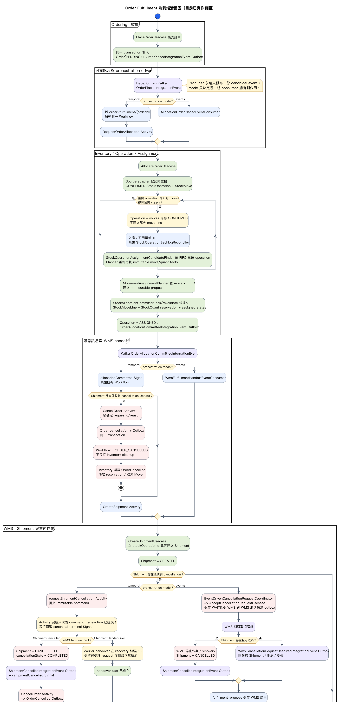

# Order fulfillment：Event-driven 與 Temporal 混合架構

## 結論

`OrderFulfillmentWorkflow` 只協調跨服務、需要等待或已明確定義期限政策的 checkpoint；
Ordering、Inventory、WMS 仍由各自的 application use case 與 domain model 擁有業務細節。

目前的 happy path 已在 `events` 與 `temporal` 兩種 orchestration mode 中完整串起：
`OrderPlaced -> StockOperation ASSIGNED -> Shipment -> Handover -> StockOperation DONE -> Order FULFILLED`。這裡的
「完整」是指本專案目前的 runtime 範圍；Wave、Pick、Pack、Stage 與 Handover 仍由可設定
processing delay 的 scheduler 模擬（預設 10 秒；E2E 使用 0 秒／30 秒建立不同觀察窗口），尚未串接
真實 WMS、設備或人工操作 API。

所有 producer 都只發布一份 canonical Integration Event。`events`／`temporal` 不在 producer 分流；
`archone.fulfillment.orchestration-mode` 只控制哪一組 consumer／Activity driver 擁有後續副作用。



```text
Order accepted
  -> Request stock-operation assignment Activity
  -> wait StockOperationAssigned / CancellationRequestInput
  -> Create shipment Activity (returns shipmentId)
  -> wait ShipmentHandedOverToCarrierInput / CancellationRequestInput
  -> Complete outbound movements Activity
  -> Record order fulfilled Activity
  -> FULFILLMENT_COMPLETED

External overdue detector / user cancellation
  -> POST /orders/{orderId}/cancellation-requests
     -> events: EventDrivenFulfillmentCancellationCoordinator
          -> no Shipment: CancelOrderUsecase
          -> Shipment exists: CancelShipmentUsecase accepts command
               -> ShipmentCancelledIntegrationEvent -> Ordering consumer -> CancelOrderUsecase
               -> handover already committed: REJECTED; use Return flow
     -> temporal: requestCancellation Update on the existing Workflow
          -> no Shipment can exist: CancelOrder Activity
          -> Shipment exists: requestShipmentCancellation Activity acknowledges command
               -> ShipmentCancelled Signal: CancelOrder Activity with actual cancelledAt
               -> ShipmentHandedOver Signal: normal fulfillment wins and continues
  -> OrderCancelledIntegrationEvent asynchronously releases Inventory reservation
```

## 如何閱讀 `WorkflowImpl`：主線與子方法分層

`execute()` 刻意只保留跨 bounded context 的業務順序；private method 數量不等於 Temporal
step 數量。Activity／Timer、Signal／Update 與 Workflow completion 會留下 History event；
`Workflow.await` 是 deterministic durable wait point，但不會自己額外寫一筆 event。`require...`、
correlation predicate 與一般狀態轉換只是同一個 Workflow Task 內的 deterministic code。

建議依下列順序閱讀，而不是從檔案第一行一路追到底：

| 視圖 | 回答的問題 | 主要方法 |
| --- | --- | --- |
| 端到端活動圖 | 從收單到完成履約，各 bounded context 與 driver 怎麼串接？ | Ordering、Inventory、WMS、Kafka、Temporal／event adapters |
| execute 主流程 | 跨系統履約依什麼順序發生？ | `execute`、`enterPhase`、Activity calls、`finish` |
| 跨系統循序 | command、Activity return 與晚到 fact 由誰送出？ | Workflow、Inventory／Ordering Activity workers、WMS worker、event adapter |
| 取消子流程 | Shipment 建立前後取消有何差異？哪一個 WMS 終態事實勝出？ | `requestCancellation`、`requestShipmentCancellation`、`cancelOrderInOrdering` |
| 方法責任圖 | 每個 public/private method 屬於哪一種 concern？ | 全部 Workflow boundary methods 與 helpers |

### 1. execute 主流程


### 2. 跨系統循序


### 3. 取消協調子流程


### 4. 方法責任分層


方法可分成四類：

- `execute`、`requestShipmentCancellation`、`cancelOrderInOrdering` 是 orchestration；決定下一個跨系統 checkpoint。
- Signal／Update methods 是外部訊息入口；只接受、correlate 或保存會影響主線的事實與命令。
- checkpoint 的 `require...` 與 correlation methods 是 contract guard；不創造新的業務分支，避免錯誤或不相干訊息污染 state。
- `WorkflowProgress.enter`、`WorkflowProgress.update` 與 `state` 是可觀測性與 query projection；不擁有 Order／Shipment 業務狀態。

重要 private methods 的實際影響如下：

| Method | 單一責任 | 是否形成 durable checkpoint |
| --- | --- | --- |
| `requestShipmentCancellation` | 提交 WMS cancellation command，不宣稱實體作業已完成 | `CancelShipment` Activity 只確認 transaction 已提交 |
| `cancelOrderInOrdering` | 在 WMS 已安全後，以同一 request 與實際 `cancelledAt` 提交 Ordering cancellation | 其中的 `CancelOrder` Activity 會 |
| `ShipmentState` | 將 `CreateShipment` 回傳的權威 `shipmentId` 與 `ShipmentCancelled`／`ShipmentHandedOver` terminal fact 放在同一個 correlation state；Signal 可早於 Activity response 抵達 | 不會；已知身分後不相干 Signal 被安全忽略，早到但身分矛盾或互斥 terminal fact 形成 invariant failure |
| checkpoint 的 `require...` | 檢查程式或跨邊界 contract 不可能矛盾 | 正常時不會；違反時以 `ApplicationFailure` 結束 execution |
| `WorkflowProgress.enter`／`update` 與 `finish` | 建立 Query 可見的 progress 與 terminal result | 前兩者不會；`finish` 隨 Workflow return 寫入 completion |

因此真正需要優先理解的不是每個小 method，而是三個決策點：是否已有 assigned operation、是否已收到
correlated Shipment terminal fact、該 terminal 是 `CANCELLED` 或 `HANDED_OVER`。其餘方法應能
明確歸屬於這三個決策的資料保護或狀態呈現；若未來出現無法歸類的 helper，才是 Workflow 可能再次吸收
過多 bounded-context 細節的警訊。

## Driver 分工

| 情境 | 使用方式 | 原因 |
| --- | --- | --- |
| 同一 bounded context 內的狀態推進 | application use case + domain event | 不讓 Workflow 接管 Pick／Pack／Stage 等內部細節 |
| Activity 呼叫後即可得到穩定結果 | Activity return value | 例如建立 Shipment 後取得穩定 `shipmentId` |
| 人員、設備或外部系統稍後才產生事實 | Integration Event -> existing Workflow Signal | Workflow 必須 durable wait，例如承運商交接 |
| command 已提交但物理終態可能稍後才成立 | void Activity acknowledgement + Integration Event -> Signal | cancellation 不把 `CANCELLING` 偽裝成同步終態 |
| 逾期後的業務政策是取消 | 外部排程／政策 entrypoint -> existing Workflow 的 `requestCancellation` Update | 由 Workflow 依 checkpoint 協調 WMS 與 Ordering，不直接 cancel Temporal execution；execution 尚未建立時由 adapter retry／告警 |
| Kafka-only 與 Temporal 比較期 | 兩種 entrypoint 共用同一 use case | 不複製 domain/application 邏輯；正式環境只能選一個 command driver |

### WMS cancellation 為何不是 Async Activity Completion

目前 `requestShipmentCancellation` 是短 Activity：WMS transaction 接受或重播 immutable command 後，
Activity 就完成。它不宣稱 Shipment 已取消，也不持有 Temporal task token。實際終態只能由 WMS 的
canonical `ShipmentCancelledIntegrationEvent` 或 `ShipmentHandedOverIntegrationEvent` 經 adapter Signal
回報，因此 Events 與 Temporal mode 共享同一組業務事實：

```text
requestShipmentCancellation Activity
  -> WMS command transaction committed
  -> Activity completed
  -> Workflow waits
       -> ShipmentCancelled Signal: cancellation wins
       -> ShipmentHandedOver Signal: normal fulfillment wins
```

這個邊界也涵蓋 Activity 尚未回傳時 terminal fact 已先抵達的競爭：Signal 可以先寫入 `ShipmentState`；
Activity 回傳後再以權威 `shipmentId` 完成 correlation。若兩者身分矛盾，Workflow 明確形成 invariant
failure，避免永遠等待；若 correlated handover 已成立，後到的
`requestCancellation` Update 直接回 `REJECTED`，不保存新 request，也不再送 WMS cancellation command。

只有未來同時滿足以下條件，才改用 Async Activity Completion：Temporal 成為唯一協調者；WMS
completion 是該 command 的單一 request/reply 結果；callback adapter 能可靠保存 task token；其他 consumer
不再需要獨立 canonical terminal event。現在引入它只會增加 token persistence 與 Temporal-specific callback
耦合，並不能消除 handover／cancellation 的業務競爭。

### 六個 Activity 的冪等契約

Temporal retry 可能在 use case transaction 已提交、Activity response 遺失後重送相同 input。冪等由各 bounded
context 的 domain/application persistence 保證，不由 Workflow 在記憶體去重：

| Activity | Durable identity／immutable fact | 相同 input 重播 |
| --- | --- | --- |
| `RequestOrderAllocation` | `ORDER/orderId/PRIMARY` source unit | 不重建 operation/moves；已指派時不再 reserve 或重發 assignment fact |
| `CompleteOutboundMovements` | operation/moves 的 `DONE` 狀態 | 不再扣 on-hand／reserved，也不重發 completion |
| `CreateWmsShipment` | `stockOperationId` + assigned-move snapshot | 回傳原 `shipmentId`；不同 snapshot 為 non-retryable conflict |
| `CancelWmsShipment` | shipment + request ID + requestedAt + reason | 相同 request 為 already accepted／rejected，不重發 terminal event |
| `RecordOrderFulfillment` | order + shipment ID + fulfilledAt | 相同 fact 為 no-op；不同 fact 為 non-retryable conflict |
| `CancelOrder` | order + request ID + cancelledAt + reason | 相同 request 回 `ALREADY_CANCELLED`，不重發 `OrderCancelled` |

`CompleteOutboundMovements` 可以保證 Temporal 的相同 input retry 安全，但 Inventory 目前沒有持久化首次
`shipmentId/completedAt` correlation；execution 已是 `DONE` 後，無法再辨識同一 operation 搭配不同
shipment/time 的錯誤呼叫。這不影響 Temporal replay；若未來要把該 use case 當成更廣泛的公開 command
contract，需先擴充 persistence model 才能做到完整 immutable conflict detection。

Kafka、Outbox、Debezium 仍負責發布與傳遞業務事實。它們不是 Activity command 的預設繞路：
Temporal Activity 應直接呼叫目標服務內完整且可冪等的 use case。

本 Workflow 採單一 command driver：Temporal profile 下，配貨只能由
`RequestOrderAllocation` Activity 觸發。Picking-assignment result adapter 不得使用 result event
`signalWithStart` 建立 Workflow；找不到既有 execution 代表啟動順序 invariant 被破壞，應 retry
或告警。Kafka-only profile 可沿用原 consumer，但不得同時啟用 Temporal command driver。

## Temporal client initiation policy

每張已可靠成立的 Order，由
`OrderPlacedIntegrationEvent` 的 Temporal starter 使用普通非同步 start 建立流程：

```text
PlaceOrder transaction
  -> Order + OrderPlaced Outbox commit
  -> Debezium / Kafka
  -> Temporal starter
  -> WorkflowClient.start(execute, OrderFulfillmentInput(orderId, orderReceivedAt))
```

Workflow ID 固定為 `order-fulfillment/{orderId}`，task queue 為
`order-fulfillment-workflows`。目前 starter 對重複啟動擷取 `WorkflowExecutionAlreadyStarted` 並安全忽略；
尚未在 production `WorkflowOptions` 明確設定 `USE_EXISTING` 與 `REJECT_DUPLICATE`。若要把「closed
execution 絕不重用」定為部署契約，應在後續 hardening 明確加上，不依賴 SDK／server 預設值。

永久的 Order business identity 仍由 Ordering database 擁有。未來若同一 Order 允許新的履約
attempt，必須把 attempt ID 放入 Workflow ID，不能直接重用同一條 Order workflow。

### Update-With-Start 尚未採用

目前取消入口只對 existing Workflow 呼叫一般 Update。若 `OrderPlaced` starter 尚未建立 execution，
adapter 應 retry／告警；若取消命令不能依賴呼叫端重試，先把命令可靠寫入 DB／Outbox，再由背景
adapter 投遞。一次 HTTP RPC 成功與否不能成為取消命令唯一的 durable storage。

只有未來出現明確的「取消必須立即同步受理」SLA，而且取消 client 能可靠取得完整、權威的
`OrderFulfillmentInput`，才重新評估 Update-With-Start。本階段不為尚未選定的 client initiation policy 保留
production contract 或專用測試。

`StockOperationAssignedInput`、`ShipmentCancelledInput` 與 `ShipmentHandedOverToCarrierInput` 是由既有 Integration Event
轉入 Workflow 的 business facts，只能 Signal existing Workflow。
它們不得使用 Signal-With-Start 取得建立流程的權限；找不到 execution 時由 adapter retry／告警。

`stockOperationAssigned` 必須由本 Workflow 的 `RequestOrderAllocation` Activity 所觸發，因此因果順序固定為
`REQUESTED -> RequestOrderAllocation -> stockOperationAssigned`。由於 workflow 尚未發布，不保留
pre-release `pickingAssigned` signal。若 fact 在 checkpoint 尚未開始前
抵達，代表 driver 互斥或 adapter routing invariant 被破壞，應由 adapter retry／告警，而不是在每個
Workflow handler 建立通用 early-message buffer。

## Activity ownership 與 task queue

| Contract | Owner / worker | Task queue | 工作 |
| --- | --- | --- | --- |
| `InventoryAllocationActivities` | `inventory-context` 的 `TemporalInventoryAllocationActivitiesAdapter` | `order-promising-activities` | 要求配貨 |
| `InventoryMovementActivities` | `inventory-context` 的 `TemporalInventoryMovementActivitiesAdapter` | `order-promising-activities` | 完成 outbound movements |
| `OrderActivities` | `ordering-context` 的 `TemporalOrderActivitiesAdapter` | `order-promising-activities` | 將 Order 記為 fulfilled／cancelled |
| `ShipmentActivities` | `wms-context` 的 `TemporalShipmentActivitiesAdapter` | `wms-activities` | 冪等建立 Shipment；提交 cancellation command，終態另由 canonical event 回報 |

所有 interfaces 與 transport DTOs 位於 `orchestration-temporal-contract`；
`OrderFulfillmentWorkflowImpl` 留在 `orchestration-temporal-runtime`。Activity adapters 由各 bounded
context 擁有，`deployments:monolith` 只負責建立 client／workers 並註冊 adapters。

目前 Ordering 與 Inventory 都部署在 monolith，所以兩個 contracts 共用 `order-promising-activities`
task queue。未來拆成不同服務時，要透過
Workflow versioning 切換 task queue，不能直接改掉進行中 execution 的命令屬性。

### Event-driven 與 Temporal 共用 WMS use case

兩種 driver 都委派同一個 `CreateShipmentUsecase`，但 entrypoint 對輸出的使用不同：

```text
OrderAllocationCommittedIntegrationEvent v1 (stock-operation/move identity)
  -> event driver: WMS consumer -> CreateShipmentUsecase -> ignore CreateShipmentResult
  -> temporal driver: Workflow Signal -> CreateShipment Activity -> CreateShipmentUsecase
                                         -> map CreateShipmentResult to ReleaseToWarehouseActivityResult
```

`CreateShipmentUsecase` 回傳 application-layer `CreateShipmentResult(shipmentId)`，不再把 domain
`Shipment` aggregate 暴露給 adapter。Event consumer 沒有同步 caller，故可忽略結果；Temporal
Activity adapter 則使用相同結果回覆 Workflow。兩條入口必須由 profile／driver 設定互斥，不能在
同一環境同時對同一 operation 下命令；`wms_shipments.stock_operation_id` unique constraint 只是最後安全網。

### 現階段共用的模擬 WMS runtime

本專案目前不串接真實 WMS，所以 dev、stage、prod 都由 `SimulatedWarehouseOperationsScheduler`
扮演倉庫操作 actor。它每秒從資料庫找出已超過設定 processing delay 且仍為 `CREATED` 的 Shipment，
再由 `SimulateWarehouseOperationsUsecase` 在單一 transaction 內依序執行 synthetic Wave／Work、完整
Pick、Pack、Stage 與 carrier handover。預設 delay 是 10 秒；E2E 依案例使用 0 秒或 30 秒。

這不是 `Thread.sleep(10s)`：等待依據保存在 Shipment 狀態與時間，runtime 重啟後仍能補跑；多個
instances 掃到同一 Shipment 時，由 transaction 與 optimistic version 保證只有一方提交。等待期間若
Shipment 已取消，重新載入後不再是 `CREATED`，模擬 use case 會安全略過。


未來接真實 WMS 時，外部 WMS／操作 API 取代這個 scheduler；其發布
`ShipmentHandedOverIntegrationEvent` 之後的 Outbox、Kafka、Inventory 出庫完成及 Ordering fulfillment
線路維持不變。

## 為何 stock-operation assignment 仍用 Signal

現有 `AllocateOrderUsecase` 可以從既有 operation/moves 重建 assignment result，但 Activity contract 目前仍是
void，canonical assignment fact 同時也是 Events mode 與其他 subscribers 的跨邊界輸入。因此本階段維持：

```text
requestAllocation() returns void
OrderAllocationCommitted v1 -> stockOperationAssigned Signal
```

若未來希望 Activity 直接回傳 `StockOperationAssignedInput`，必須連同 Events/Temporal command ownership 與
Workflow history versioning 一起變更；不能只在其中一條 driver 捷徑同步讀 Inventory。

### Workflow checkpoint 不鏡像 Order 狀態

Ordering 的 `OrderStatus` 是業務真相；Workflow 只保存是否具備進入 WMS 的條件：

```text
NOT_REQUESTED -> REQUESTED -> COMMITTED
```

等待補貨的 confirmed `StockOperation`、`StockMove` 與 queue position 仍由 Inventory domain model
與 read model 呈現；它們不會改變跨服務協調路徑，因此不送進 Workflow，也不發布第二種
backorder result event。只有 assignment 真正完成時，adapter 才將帶完整 snapshot 的 V1 fact 映射為
`stockOperationAssigned` Signal。Workflow 因而不維護第二套 `CONFIRMED／ASSIGNED` Inventory 狀態機。

目前沒有「配貨等待超過 N 小時就失敗或告警」的真實業務政策，所以 Workflow
不設 assignment deadline，也不產生 `ALLOCATION_TIMED_OUT`。等待時間先透過 Query、
Search Attributes 與 Grafana 觀測；未來只在業務明確定義硬期限或分級介入政策後加入 timer。

### 逾期不在 Workflow 裡轉成 deadline outcome

`dispatchBy` 仍是 WMS wave planning、排序與逾期查詢需要的業務資料，但
`OrderFulfillmentWorkflow` 不再為它建 timer，也不產生
`DISPATCH_DEADLINE_EXCEEDED`。外部排程或營運政策若決定逾期必須取消，走既有的業務主線：

```text
overdue detector
  -> requestCancellation(requestId, orderId, reason) Update
  -> Workflow accepts command and resumes at a safe checkpoint
     -> no Shipment can exist: CancelOrder Activity
     -> Shipment exists: requestShipmentCancellation Activity
          -> command transaction committed
          -> wait ShipmentCancelled / ShipmentHandedOver terminal fact
               -> ShipmentCancelled: CancelOrder Activity with actual cancelledAt
               -> ShipmentHandedOver: normal fulfillment wins; retain the request as an audit fact
  -> CancelOrder Activity returns after Order + Outbox transaction commits
  -> OrderCancelledIntegrationEvent -> CancelSourceStockMovementsUsecase and other consumers
```

WMS 的 `CancelShipmentUsecase` 只回傳 command 結果：`ACCEPTED`、`ALREADY_ACCEPTED` 或 `REJECTED`。
`CREATED／WAVE_PLANNED／RELEASED` 可在同一 transaction 完成取消；已開始實體作業則進入
`ShipmentStatus.CANCELLING`／`ShipmentCancellationState.REQUESTED`，由 WMS recovery backlog 完成後才進入
`CANCELLED／COMPLETED`。兩種路徑都只在終態成立後發布 `ShipmentCancelledIntegrationEvent`。

Temporal Activity 使用 void return，只確認 cancellation command transaction 已提交。Workflow 隨後等待
`ShipmentCancelledInput` 或 `ShipmentHandedOverToCarrierInput`；Events mode 則由
`OrderingShipmentCancellationEventConsumer` 消費同一個 `ShipmentCancelledIntegrationEvent`。因此
`cancellationRequestedAt` 始終是原始請求時間，而 Order 與 Shipment 的 `cancelledAt` 是真正完成時間。
`ShipmentCancelledInput` 同時保留 `cancellationRequestId`，Signal handler 必須先與 Update 記錄的 request
完成 correlation，才可寫入 `ShipmentState` 的 terminal fact。
Workflow Query snapshot 以 `shipmentTerminalStatus` 與 `shipmentTerminalAt` 明確呈現同一個結果；前者在終態前為
`null`，終態後只能是 `CANCELLED` 或 `HANDED_OVER`。

Temporal profile 的唯一取消 command 是 `requestCancellation`。Workflow 先完成 WMS safe branch，
再呼叫 `CancelOrder` Activity；Activity 成功返回就表示 Order 與 Outbox transaction 已提交，
不需要等待自己的 Kafka event 才結束。`OrderCancelledIntegrationEvent` 仍供
`CancelSourceStockMovementsUsecase` 等既有 consumer 使用，但不再 Signal 回同一個 Workflow。

取消入口的 ownership 固定如下：外部 API、人工操作或逾期政策只能提交 cancellation request；不得
先呼叫 `CancelOrderUsecase`，也不得自行發布 `OrderCancelledIntegrationEvent`。若入口採事件傳遞，
事件語意必須是 `OrderCancellationRequested`，由 adapter 映射為 existing Workflow 的
`requestCancellation` Update。`OrderCancelledIntegrationEvent` 只可能是 Workflow 安全協調完成後的
輸出事實。

Temporal 與 Kafka-only driver 可以共用 use case，但必須以 profile 互斥。Temporal profile 不允許
其他入口直接呼叫 `CancelOrderUsecase`；若發生繞過，視為設定／一致性事故，由監控或獨立
reconciliation use case 處理，不放進每張訂單的正常 Workflow 分支。

`Outcome.ORDER_CANCELLED` 的邊界刻意只保證：WMS 已安全停止／復原（若 Shipment 存在），且
Ordering cancellation transaction／Outbox 已提交。由 `OrderCancelledIntegrationEvent` 觸發的
`CancelSourceStockMovementsUsecase` 可能仍在非同步執行，因此此 outcome 不宣稱所有 Stock movement 已完成釋放。

有 Shipment 時不可先提交 `Order.cancel()` 再問 WMS 能否取消：若 carrier handover transaction 已先提交，
WMS command 會回 `REJECTED`，但 Order 已是 `CANCELLED`，會產生無法自癒的跨邊界不一致。因此 Shipment
階段的取消必須等 WMS 的 cancellation terminal fact；handover 若勝出，後續是 Return flow，不是 cancellation compensation。

## 下達倉庫出庫需求與 terminal Signal

Java Activity 方法使用 `releaseToWarehouse`，input／result 為 `ReleaseToWarehouseActivityInput`／
`ReleaseToWarehouseActivityResult`。此處的 release 表示上游下達倉庫需求，不是 WMS 的 Wave Release。
WMS 內部繼續使用 `CreateShipmentUsecase`；Activity 返回只代表需求建單已提交。
Temporal Activity type 保留 `CreateWmsShipment`，Activity payload 欄位不變。
Query phase 以 `WAREHOUSE_EXECUTION` 統一表示下達倉庫需求與等待倉內結果，並在呼叫 Activity 前進入；
確認交接後才進入 `INVENTORY_FINALIZATION`。
配貨狀態使用 `NOT_REQUESTED -> REQUESTED -> COMMITTED`。`REQUESTED` 表示 Workflow 已發起請求，
不保證 Activity 已成功返回，也不代表取消結束後仍在等待。這些 enum 名稱是公開 Query contract，
使用舊名稱的呼叫端需同步更新。

`CreateShipmentUsecase` 已以 `stockOperationId` 作 business idempotency key：第一次建立，重試時讀回
既有 Shipment。因此 Activity 能可靠回傳 `ReleaseToWarehouseActivityResult(shipmentId)`。這個結果只表示建單
transaction 已提交，不代表 Pick／Pack／Stage 或 carrier handover 已完成。

目前 WMS 沒有「建單接單／拒單」這個真實 domain policy。保留 `wmsFulfillmentResponded`、
`WMS_REJECTED`、`WMS_RESPONSE_TIMED_OUT` 只會把 Activity 技術失敗偽裝成業務狀態，故移除。
但 cancellation 與 handover 是稍後可能由人員、設備或 recovery 產生的互斥物理事實，因此分別保留
`ShipmentCancelledInput` 與 `ShipmentHandedOverToCarrierInput`，而不是重新引入模糊的 response Signal。

## 一致性與失敗語意

- Activity 的技術錯誤直接拋出，由 Temporal Activity retry 與 workflow failure 呈現。
- Update validator 的輸入錯誤使用 `IllegalArgumentException` 拒絕該次 Update，不應終止既有 Workflow。
- Workflow 主線中的 invariant／跨邊界 contract violation 使用 non-retryable `ApplicationFailure`；一般 `IllegalStateException` 預設只會讓相同 Workflow Task 失敗並持續重試，直到程式修正或 Workflow Execution Timeout。
- `CancelShipmentStatus.ACCEPTED／ALREADY_ACCEPTED／REJECTED` 等 command 結果使用 typed result，不用例外控制流程。
- Activity implementation 必須呼叫完整 transaction-boundary use case，不直接操作 repository。
- `CreateShipment`、`CancelShipment`、`CancelOrder`、`CompleteOutboundMovements`、`RecordOrderFulfillment` 都必須可冪等。
- `ShipmentHandedOverIntegrationEvent` 進入 Temporal 後轉成 `ShipmentHandedOverToCarrierInput`；這是物理世界稍後發生的事實，因此保留 Signal。
- `CancelShipment` Activity 只確認 command 已提交；`ShipmentCancelled`／`ShipmentHandedOver` canonical event 轉成具體 terminal Signal。
- `requestCancellation` 是 Temporal profile 唯一取消 command，使用 Update；`OrderCancelledIntegrationEvent` 不回送同一個 Workflow。
- `requestCancellation` 以 Update validator 在寫入 History 前拒絕不屬於此 Order 的請求；已 handover 等業務結果仍由 handler 回傳明確 ACK。
- Update-With-Start 尚未採用；正常建立權威是 `OrderPlaced` -> ordinary start，取消只 Update existing Workflow。
- `ORDER_CANCELLED` 不等待 Stock 的 event-driven movement release；若未來要求 end-to-end cleanup，再新增明確完成 fact，不以名稱暗示已完成。
- `CancellationState` 只收納 replay 所需欄位，不封裝另一套 aggregate/state-machine API；流程轉換留在具名方法。
- `OrderFulfillmentCancellationState` 只記錄 `NONE／REQUESTED／ORDER_CANCELLED`；正常履約與取消是由
  Shipment terminal fact 決定的兩條路線，不另建 Workflow `REJECTED` 路線。nullable request／timestamp 只表示
  payload 尚未產生，並集中由 correlation 或 `require...` invariant 檢查處理。
- Order 只有在 outbound movements 已完成後才進入 `FULFILLED`。
- `FULFILLED` 是離倉後終態；取消必須由 domain model 拒絕，不能靠呼叫端自行檢查。
- 目前流程明確限制一張 Order 對一個 primary operation、一個 Shipment；支援拆單前必須先引入 fulfillment attempt／多 Shipment completion policy。

## Roadmap / tasks

### Gate A：契約與 Workflow 主線

- [x] 依 worker ownership 拆分 Activity contract 與 task queue。
- [x] WMS Activity 直接回傳非 null 的 `ReleaseToWarehouseActivityResult`；Workflow 以 `ShipmentState`
      一併保存權威 `shipmentId` 與 correlated terminal fact。
- [x] 移除虛構的 WMS response Signal、timeout 與 rejection outcome。
- [x] 移除 allocation／dispatch deadline outcome 與告警 Activity；逾期政策改走正常取消入口。
- [x] 加入 `requestCancellation` Update 與 WMS／Order cancellation Activities。
- [x] WMS cancellation Activity 改為 command acknowledgement；Workflow 等待 `ShipmentCancelled`／`ShipmentHandedOver` terminal fact。
- [x] 移除正常主線的外部 Order cancellation／reconciliation 分支；Temporal profile 強制單一取消 driver。
- [x] Workflow 在庫存完成後呼叫 Ordering fulfillment Activity。
- [x] Workflow 測試覆蓋 happy path、長期等待、無 Shipment 取消、建單期間取消，以及 cancellation／handover terminal race。
- [x] 明確固定 stock-operation assignment 的因果順序；不為違反 driver invariant 的 early fact 建立通用 buffer。
- [x] 為 cancellation Update 加入 validator，並測試錯誤 Order 不會寫入 Workflow History。

### Gate B：Ordering 終態

- [x] 新增 `OrderStatus.FULFILLED` 與 `fulfilledAt`。
- [x] 新增冪等的 `RecordOrderFulfillmentUsecase`。
- [x] `Order.cancel()` 明確拒絕 fulfilled order。
- [x] 新增 Flyway migration 與 mapper／domain／use case 測試。

### Gate C：Activity adapters

- [x] 新增 outbound-only 的 `CompleteOutboundMovementsUsecase`。
- [x] 將 Workflow／Activity interfaces 抽到 `orchestration-temporal-contract`，Workflow implementation 留在 runtime。
- [x] 將混合 Inventory／Ordering 的 Activity implementation 拆成 context-owned Temporal adapters。
- [x] `TemporalShipmentActivitiesAdapter` 位於 `wms-context` 的 Shipment capability，委派 `CreateShipmentUsecase`、`CancelShipmentUsecase`；取消 Activity 不回傳物理終態。
- [x] `CreateShipmentUsecase` 以 transaction 包住 repository、domain event／Outbox，並在 Activity
      boundary 強制 non-null receipt；資料庫對 `stock_operation_id` 建立 unique constraint。
- [ ] 接通逾期／人工取消 entrypoint；只呼叫 existing Workflow Update，找不到 execution 時 retry／告警，不直接 cancel Temporal execution。
- [x] Activity adapters 將 `CancelWmsShipment`、`CancelOrder` 委派給對應 use case，並將 immutable request conflict 映射為 non-retryable failure。
- [x] WMS 內部以 `CANCELLING` backlog 模擬 recovery completion，完成後發布 canonical `ShipmentCancelledIntegrationEvent`。
- [x] Workflow、Inventory Allocation／Movement、Order、Shipment Activities 由 monolith 組裝並 poll 對應 task queue。

### Gate D：runtime 與雙 driver 比較

- [x] 建立 Temporal client/worker runtime、namespace 與 task queues。
- [x] `OrderPlaced` starter 使用固定 workflow ID ordinary async start；重複啟動以 `WorkflowExecutionAlreadyStarted` 安全忽略。
- [ ] production `WorkflowOptions` 明確設定 running/closed execution 的 conflict 與 reuse policy。
- [ ] 取消 client 使用 requestId 作穩定 Update ID；若命令不能依賴 caller retry，先落 DB／Outbox 再由背景 adapter 投遞。
- [x] Kafka command consumer 與 Temporal Activity driver 以 `archone.fulfillment.orchestration-mode` 互斥。
- [x] `events` 與 `temporal` 兩種 driver 都已通過端到端 happy-path 測試。

### Gate E：演進條件（延後）

- [ ] 若要讓 assignment 改由 Activity return，需先設計 driver ownership、contract 與 Workflow history versioning。
- [ ] 只有出現立即取消 SLA 且 client 能取得權威 `OrderFulfillmentInput` 時，才評估 Update-With-Start。
- [ ] 真實 WMS rejection／reroute policy 出現後，引入 fulfillment attempt model。
- [ ] 支援一張 Order 多 Shipment 時，以「全部 Shipment 已離倉」決定 `FULFILLED`。
- [ ] 依 event history 大小決定是否使用 Continue-As-New。

## 本階段驗證

- `cd backend && ./gradlew :orchestration-temporal-runtime:check`
- `cd backend && ./gradlew :deployments:monolith:test`
- `cd backend && ./gradlew :deployments:monolith:sit`（包含 PostgreSQL／Flyway／JPA）
- `cd backend && ./gradlew test`
- `npm run typecheck` 與 `npm test -- --run`（`frontend`）
