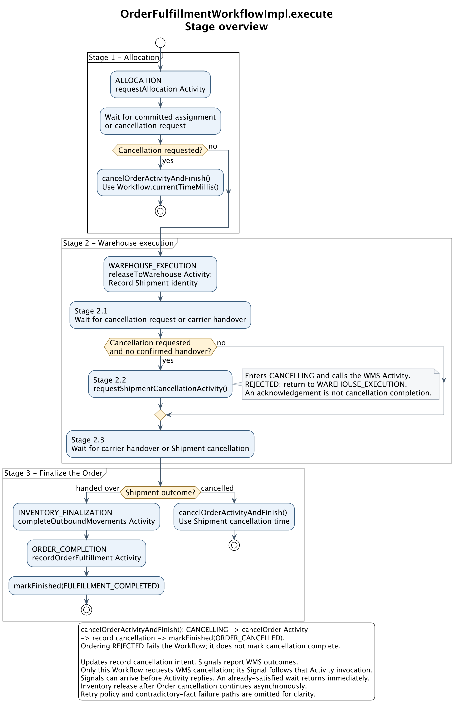
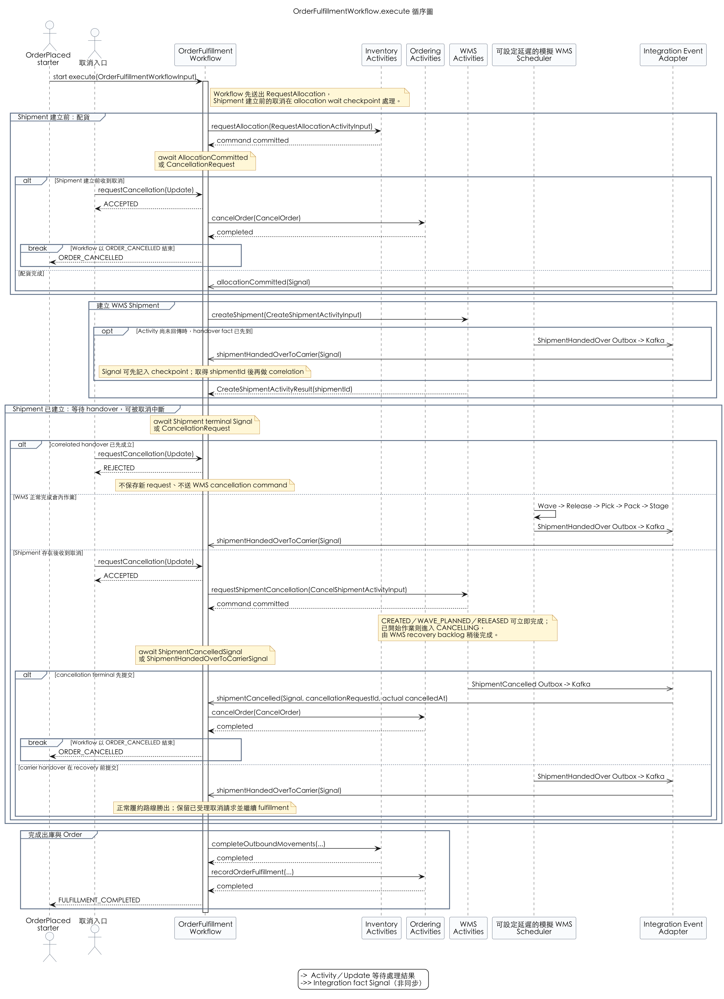
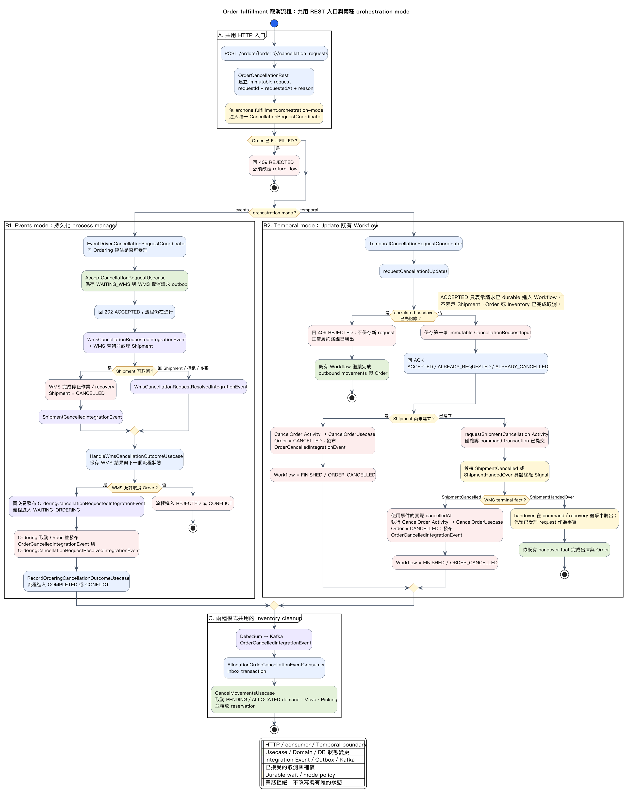
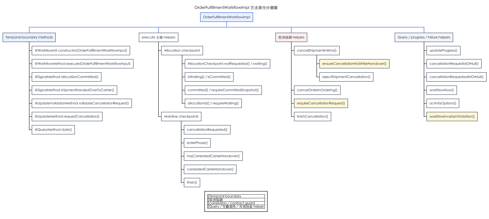
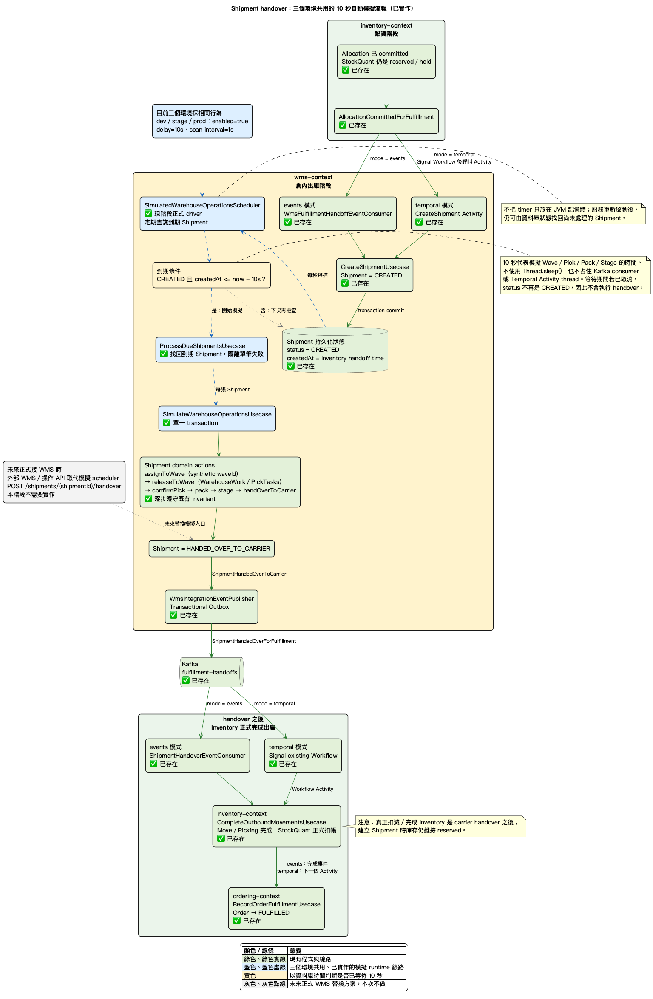

# Order fulfillment：Event-driven 與 Temporal 混合架構

## 結論

`OrderFulfillmentProcessWorkflow` 只協調跨服務、需要等待或已明確定義期限政策的 checkpoint；
Ordering、Stock、WMS 仍由各自的 application use case 與 domain model 擁有業務細節。

```text
Order accepted
  -> Request allocation Activity
  -> wait AllocationCommitted / CancellationRequest
  -> Create shipment Activity (returns shipmentId)
  -> wait ShipmentHandedOverToCarrier / CancellationRequest
  -> Complete outbound movements Activity
  -> Record order fulfilled Activity
  -> FULFILLMENT_COMPLETED

External overdue detector / user cancellation
  -> requestCancellation Update on the existing Workflow
     -> no Shipment can exist: CancelOrder Activity
     -> Shipment exists: CancelShipment Activity returns a decision
          -> CANCELLED: CancelOrder Activity
          -> REJECTED_AFTER_HANDOVER: reject cancellation and continue fulfillment
          -> PENDING: wait ShipmentCancellationResolved, then apply the final result
  -> ORDER_CANCELLED only after the safe branch completes
```

## 如何閱讀 `WorkflowImpl`：主線與子方法分層

`execute()` 刻意只保留跨 bounded context 的業務順序；private method 數量不等於 Temporal
step 數量。Activity／Timer、Signal／Update 與 Workflow completion 會留下 History event；
`Workflow.await` 是 deterministic durable wait point，但不會自己額外寫一筆 event。`require...`、
correlation predicate 與一般狀態轉換只是同一個 Workflow Task 內的 deterministic code。

建議依下列順序閱讀，而不是從檔案第一行一路追到底：

| 視圖 | 回答的問題 | 主要方法 |
| --- | --- | --- |
| execute 主流程 | 跨系統履約依什麼順序發生？ | `execute`、`enterPhase`、Activity calls、`finish` |
| 跨系統循序 | command、Activity return 與晚到 fact 由誰送出？ | Workflow、Order Promising worker、WMS worker、event adapter |
| 取消子流程 | Shipment 建立前後取消有何差異？WMS `PENDING` 如何結束？ | `requestCancellation`、`coordinateShipmentCancellation`、`awaitFinalShipmentCancellationResolution`、`cancelOrder` |
| 方法責任圖 | 每個 public/private method 屬於哪一種 concern？ | 全部 Workflow boundary methods 與 helpers |

### 1. execute 主流程



### 2. 跨系統循序



### 3. 取消協調子流程



### 4. 方法責任分層



方法可分成四類：

- `execute`、`cancelOrderBeforeShipmentCreation`、`coordinateShipmentCancellation` 是 orchestration；決定下一個跨系統 checkpoint。
- Signal／Update methods 是外部訊息入口；只接受、correlate 或保存會影響主線的事實與命令。
- `require...` 與 `accepts...` 是 contract guard；不創造新的業務分支，避免錯誤或不相干訊息污染 state。
- `enterPhase`、`updateProgress`、`state` 是可觀測性與 query projection；不擁有 Order／Shipment 業務狀態。

重要 private methods 的實際影響如下：

| Method | 單一責任 | 是否形成 durable checkpoint |
| --- | --- | --- |
| `cancelOrderBeforeShipmentCreation` | 組合「切換取消 phase → 取消 Order → 結束」 | 本身不會；其中的 `CancelOrder` Activity 與 Workflow completion 會 |
| `coordinateShipmentCancellation` | 要求 WMS 判斷 Shipment 是否還能安全取消 | `CancelShipment` Activity 會；若回 `PENDING`，後續 `Workflow.await` 也會 |
| `awaitFinalShipmentCancellationResolution` | 只處理 WMS immediate decision 為 `PENDING` 的等待 | 會等待 `ShipmentCancellationResolved` Signal |
| `rejectShipmentCancellation` | 記錄取消太晚，讓主線回到 handover 等待 | 不會，只更新 replay state |
| `cancelOrder` | 在 WMS 已安全後提交 Ordering cancellation | 其中的 `CancelOrder` Activity 會 |
| `matching...`／`accepts...` | 對 order、shipment、request 做 correlation | 不會；不相干 Signal 被安全忽略 |
| `require...` | 檢查程式或跨邊界 contract 不可能矛盾 | 正常時不會；違反時以 `ApplicationFailure` 結束 execution |
| `enterPhase`／`updateProgress`／`finish` | 建立 Query 可見的 progress 與 terminal result | 前兩者不會；`finish` 隨 Workflow return 寫入 completion |

因此真正需要優先理解的不是每個小 method，而是三個決策點：是否已有 committed allocation、是否已有
matching carrier handover、WMS 對取消回覆 `CANCELLED／PENDING／REJECTED_AFTER_HANDOVER`。其餘方法應能
明確歸屬於這三個決策的資料保護或狀態呈現；若未來出現無法歸類的 helper，才是 Workflow 可能再次吸收
過多 bounded-context 細節的警訊。

## Driver 分工

| 情境 | 使用方式 | 原因 |
| --- | --- | --- |
| 同一 bounded context 內的狀態推進 | application use case + domain event | 不讓 Workflow 接管 Pick／Pack／Stage 等內部細節 |
| Activity 呼叫後即可得到穩定結果 | Activity return value | 避免製造一個其實不存在的非同步回覆事件 |
| 人員、設備或外部系統稍後才產生事實 | Integration Event -> existing Workflow Signal | Workflow 必須 durable wait，例如承運商交接 |
| 逾期後的業務政策是取消 | 外部排程／政策 entrypoint -> existing Workflow 的 `requestCancellation` Update | 由 Workflow 依 checkpoint 協調 WMS 與 Ordering，不直接 cancel Temporal execution；execution 尚未建立時由 adapter retry／告警 |
| Kafka-only 與 Temporal 比較期 | 兩種 entrypoint 共用同一 use case | 不複製 domain/application 邏輯；正式環境只能選一個 command driver |

Kafka、Outbox、Debezium 仍負責發布與傳遞業務事實。它們不是 Activity command 的預設繞路：
Temporal Activity 應直接呼叫目標服務內完整且可冪等的 use case。

本 Workflow 採單一 command driver：Temporal profile 下，配貨只能由
`RequestOrderAllocation` Activity 觸發。Allocation result adapter 不得使用 result event
`signalWithStart` 建立 Workflow；找不到既有 execution 代表啟動順序 invariant 被破壞，應 retry
或告警。Kafka-only profile 可沿用原 consumer，但不得同時啟用 Temporal command driver。

## Temporal client initiation policy

每張已可靠成立的 Order，由
`OrderPlacedIntegrationEvent` 的 Temporal starter 使用普通非同步 start 建立流程：

```text
PlaceOrder transaction
  -> Order + OrderPlaced Outbox commit
  -> Debezium / Kafka
  -> Temporal starter
  -> WorkflowClient.start(execute, StartInput(orderId, orderReceivedAt))
```

Workflow ID 固定為 `order-fulfillment/{orderId}`。正式 client options 必須同時指定：

- running execution conflict：`USE_EXISTING`，讓 at-least-once starter 可安全重送；
- closed execution reuse：`REJECT_DUPLICATE`，避免已完成或已取消的 Order 又建立第二條履約流程；
- task queue：`order-fulfillment-workflows`。

`REJECT_DUPLICATE` 只在 Temporal namespace retention 仍保有 closed execution 時有效；永久的
Order business identity 仍由 Ordering database 擁有。未來若同一 Order 允許新的履約 attempt，
必須把 attempt ID 放入 Workflow ID，不能放寬成重用同一條 Order workflow。

### Update-With-Start 尚未採用

目前取消入口只對 existing Workflow 呼叫一般 Update。若 `OrderPlaced` starter 尚未建立 execution，
adapter 應 retry／告警；若取消命令不能依賴呼叫端重試，先把命令可靠寫入 DB／Outbox，再由背景
adapter 投遞。一次 HTTP RPC 成功與否不能成為取消命令唯一的 durable storage。

只有未來出現明確的「取消必須立即同步受理」SLA，而且取消 client 能可靠取得完整、權威的
`StartInput`，才重新評估 Update-With-Start。本階段不為尚未選定的 client initiation policy 保留
production contract 或專用測試。

`AllocationCommitted`、`ShipmentHandedOverToCarrier` 與只在取消為 `PENDING` 時出現的
`ShipmentCancellationResolved` 都是既有流程的 business facts，只能 Signal existing Workflow。
它們不得使用 Signal-With-Start 取得建立流程的權限；找不到 execution 時由 adapter retry／告警。

`AllocationCommitted` 必須由本 Workflow 的 `RequestAllocation` Activity 所觸發，因此因果順序固定為
`WAITING_FOR_COMMITMENT -> RequestAllocation -> AllocationCommitted`。若 fact 在 checkpoint 尚未開始前
抵達，代表 driver 互斥或 adapter routing invariant 被破壞，應由 adapter retry／告警，而不是在每個
Workflow handler 建立通用 early-message buffer。

## Activity ownership 與 task queue

| Contract | Owner / worker | Task queue | 工作 |
| --- | --- | --- | --- |
| `OrderPromisingActivities` | order-promising deployable | `order-promising-activities` | 要求配貨、完成 outbound movements、將 Order 記為 fulfilled／cancelled |
| `WmsActivities` | `deployments:monolith`；未來拆分時由 `deployments:wms` 接手 | `wms-activities` | 冪等建立 Shipment；回傳立即取消決策，必要時由 WMS 內部繼續停止／putback |

目前 Ordering 與 Stock 雖是不同 package/bounded context，但部署在同一個
`order-promising` process，因此共用一個 task queue。未來若拆成不同服務，再拆 Activity
contract/task queue；Workflow 的業務順序不需改寫。

### Event-driven 與 Temporal 共用 WMS use case

兩種 driver 都委派同一個 `CreateShipmentUsecase`，但 entrypoint 對輸出的使用不同：

```text
AllocationCommittedForFulfillmentIntegrationEvent
  -> event driver: WMS consumer -> CreateShipmentUsecase -> ignore CreateShipmentResult
  -> temporal driver: Workflow Signal -> CreateShipment Activity -> CreateShipmentUsecase
                                         -> map CreateShipmentResult to ShipmentCreationReceipt
```

`CreateShipmentUsecase` 回傳 application-layer `CreateShipmentResult(shipmentId)`，不再把 domain
`Shipment` aggregate 暴露給 adapter。Event consumer 沒有同步 caller，故可忽略結果；Temporal
Activity adapter 則使用相同結果回覆 Workflow。兩條入口必須由 profile／driver 設定互斥，不能在
同一環境同時對同一 allocation 下命令；`allocation_id` unique constraint 只是最後安全網。

### 現階段共用的模擬 WMS runtime

本專案目前不串接真實 WMS，所以 dev、stage、prod 都由 `SimulatedWarehouseOperationsScheduler`
扮演倉庫操作 actor。它每秒從資料庫找出 `createdAt <= now - 10s` 且仍為 `CREATED` 的 Shipment，
再由 `SimulateWarehouseOperationsUsecase` 在單一 transaction 內依序執行 synthetic Wave／Work、完整
Pick、Pack、Stage 與 carrier handover。

這不是 `Thread.sleep(10s)`：等待依據保存在 Shipment 狀態與時間，runtime 重啟後仍能補跑；多個
instances 掃到同一 Shipment 時，由 transaction 與 optimistic version 保證只有一方提交。等待期間若
Shipment 已取消，重新載入後不再是 `CREATED`，模擬 use case 會安全略過。



未來接真實 WMS 時，外部 WMS／操作 API 取代這個 scheduler；`ShipmentHandedOverToCarrier` 之後的
Outbox、Kafka、Inventory 出庫完成及 Ordering fulfillment 線路維持不變。

## 為何 allocation 暫時仍用 Signal

現有 `AllocateOrderUsecase` 在成功提交後重跑，無法從同一個 command 穩定重建完整 allocation
snapshot；若 Activity response 遺失後 retry，單靠 return value 可能得到 no-op，而不是原結果。
因此本階段維持：

```text
requestAllocation() returns void
AllocationCommitted -> allocationCommitted Signal
```

等 allocation context 增加可依 business key 讀回的 durable attempt/result receipt，再把它改成
直接回傳 `AllocationAttemptResult`。這不是 Temporal 的限制，而是 use case 尚未提供 Activity
retry 時可穩定重建的 result。

### Workflow checkpoint 不鏡像 Order 狀態

Ordering 的 `OrderStatus` 是業務真相；Workflow 只保存是否具備進入 WMS 的條件：

```text
NOT_REQUESTED -> WAITING_FOR_COMMITMENT -> COMMITTED
```

`BACKORDERED`、等待補貨的 StockMove 與相關時間仍由 Order／Stock domain model、read model 與
integration event 呈現；它們不會改變跨服務協調路徑，因此不送進 Workflow。只有配貨真正完成時，
adapter 才將帶完整 snapshot 的 committed fact 映射為 `allocationCommitted` Signal。Workflow
因而不維護第二套 `PENDING／BACKORDERED／ALLOCATED` 訂單狀態機。

目前沒有「配貨等待超過 N 小時就失敗或告警」的真實業務政策，所以 Workflow
不設 allocation deadline，也不產生 `ALLOCATION_TIMED_OUT`。等待時間先透過 Query、
Search Attributes 與 Grafana 觀測；未來只在業務明確定義硬期限或分級介入政策後加入 timer。

### 逾期不在 Workflow 裡轉成 deadline outcome

`dispatchBy` 仍是 WMS wave planning、排序與逾期查詢需要的業務資料，但
`OrderFulfillmentProcessWorkflow` 不再為它建 timer，也不產生
`DISPATCH_DEADLINE_EXCEEDED`。外部排程或營運政策若決定逾期必須取消，走既有的業務主線：

```text
overdue detector
  -> requestCancellation(requestId, orderId, reason) Update
  -> Workflow accepts command and resumes at a safe checkpoint
     -> no Shipment can exist: CancelOrder Activity
     -> Shipment exists: CancelShipment Activity
          -> CANCELLED: CancelOrder Activity
          -> REJECTED_AFTER_HANDOVER: do not cancel Order; continue fulfillment
          -> PENDING: wait WMS final ShipmentCancellationResolved fact
               -> CANCELLED: CancelOrder Activity
               -> REJECTED_AFTER_HANDOVER: do not cancel Order; continue fulfillment
  -> CancelOrder Activity returns after Order + Outbox transaction commits
  -> OrderCancelledIntegrationEvent -> CancelMovementsUsecase and other consumers
```

WMS 的 `CancelShipmentUsecase` 已能立即回傳 `CANCELLED`、`ALREADY_CANCELLED`、
`PUTBACK_REQUIRED` 或 `REJECTED_AFTER_HANDOVER`。Activity adapter 將前兩者映射為 `CANCELLED`、
`PUTBACK_REQUIRED` 映射為跨邊界的 `PENDING`，其餘映射為 `REJECTED_AFTER_HANDOVER`。只有
`PENDING` 需要 Workflow durable wait；停止 Pick／Pack／Stage 與實體 putback 仍是 WMS 內部狀態。

目前 WMS 尚缺少「putback 完成後把 Shipment 從 `CANCELLING` 推進為 `CANCELLED`」的 application
use case。此能力完成後才發布最終 `ShipmentCancelled` fact，adapter 再映射為
`shipmentCancellationResolved` Signal；父 Workflow 不編排每個 putback 步驟。

Temporal profile 的唯一取消 command 是 `requestCancellation`。Workflow 先完成 WMS safe branch，
再呼叫 `CancelOrder` Activity；Activity 成功返回就表示 Order 與 Outbox transaction 已提交，
不需要等待自己的 Kafka event 才結束。`OrderCancelledIntegrationEvent` 仍供
`CancelMovementsUsecase` 等既有 consumer 使用，但不再 Signal 回同一個 Workflow。

取消入口的 ownership 固定如下：外部 API、人工操作或逾期政策只能提交 cancellation request；不得
先呼叫 `CancelOrderUsecase`，也不得自行發布 `OrderCancelledIntegrationEvent`。若入口採事件傳遞，
事件語意必須是 `OrderCancellationRequested`，由 adapter 映射為 existing Workflow 的
`requestCancellation` Update。`OrderCancelledIntegrationEvent` 只可能是 Workflow 安全協調完成後的
輸出事實。

Temporal 與 Kafka-only driver 可以共用 use case，但必須以 profile 互斥。Temporal profile 不允許
其他入口直接呼叫 `CancelOrderUsecase`；若發生繞過，視為設定／一致性事故，由監控或獨立
reconciliation use case 處理，不放進每張訂單的正常 Workflow 分支。

`Outcome.ORDER_CANCELLED` 的邊界刻意只保證：WMS 已安全停止／復原（若 Shipment 存在），且
Ordering cancellation transaction／Outbox 已提交。由 `OrderCancelledIntegrationEvent` 觸發的
`CancelMovementsUsecase` 可能仍在非同步執行，因此此 outcome 不宣稱所有 Stock movement 已完成釋放。

有 Shipment 時不可先提交 `Order.cancel()` 再問 WMS 能否取消：若貨已交接，WMS
會回 `REJECTED_AFTER_HANDOVER`，但 Order 已是 `CANCELLED`，會產生無法自癒的跨邊界不一致。
因此 Shipment 階段的逾期取消必須先由 WMS 根據實體進度接受、要求 putback 或拒絕。

## 為何 WMS 不再有 response Signal

`CreateShipmentUsecase` 已以 `allocationId` 作 business idempotency key：第一次建立，重試時讀回
既有 Shipment。因此 Activity 能可靠回傳 `ShipmentCreationReceipt(shipmentId)`。Receipt 只表示建單
transaction 已提交，不代表 Pick／Pack／Stage 或 carrier handover 已完成。

目前 WMS 也沒有「接單／拒單」這個真實 domain policy。保留 `wmsFulfillmentResponded`、
`WMS_REJECTED`、`WMS_RESPONSE_TIMED_OUT` 只會把 Activity 技術失敗偽裝成業務狀態，故移除。
日後若 WMS 真的出現容量拒單或改派倉庫政策，再以真實的 attempt/result model 加回。

## 一致性與失敗語意

- Activity 的技術錯誤直接拋出，由 Temporal Activity retry 與 workflow failure 呈現。
- Update validator 的輸入錯誤使用 `IllegalArgumentException` 拒絕該次 Update，不應終止既有 Workflow。
- Workflow 主線中的 invariant／跨邊界 contract violation 使用 non-retryable `ApplicationFailure`；一般 `IllegalStateException` 預設只會讓相同 Workflow Task 失敗並持續重試，直到程式修正或 Workflow Execution Timeout。
- `CANCELLED／PENDING／REJECTED_AFTER_HANDOVER` 等正常業務結果使用 typed result，不用例外控制流程。
- Activity implementation 必須呼叫完整 transaction-boundary use case，不直接操作 repository。
- `CreateShipment`、`CancelShipment`、`CancelOrder`、`CompleteOutboundMovements`、`RecordOrderFulfillment` 都必須可冪等。
- `ShipmentHandedOverToCarrier` 是物理世界稍後發生的事實，保留 Signal。
- `CancelShipment` Activity 先回 `CANCELLED／PENDING／REJECTED_AFTER_HANDOVER`；只有 `PENDING` 才等待 `ShipmentCancellationResolved`。
- `ShipmentCancellationResolved` 是 WMS 完成內部停止／putback 後的最終事實，Workflow 不保存中間復原狀態。
- `requestCancellation` 是 Temporal profile 唯一取消 command，使用 Update；`OrderCancelledIntegrationEvent` 不回送同一個 Workflow。
- `requestCancellation` 以 Update validator 在寫入 History 前拒絕不屬於此 Order 的請求；已 handover 等業務結果仍由 handler 回傳明確 ACK。
- Update-With-Start 尚未採用；正常建立權威是 `OrderPlaced` -> ordinary start，取消只 Update existing Workflow。
- `ORDER_CANCELLED` 不等待 Stock 的 event-driven movement release；若未來要求 end-to-end cleanup，再新增明確完成 fact，不以名稱暗示已完成。
- `CancellationContext` 只收納 replay 所需欄位，不封裝另一套 aggregate/state-machine API；流程轉換留在具名方法。
- `CancellationState` 是取消流程的唯一控制狀態；nullable request／resolution／timestamp 只表示 payload 尚未產生，並集中由 correlation 或 `require...` invariant 檢查處理。
- Order 只有在 outbound movements 已完成後才進入 `FULFILLED`。
- `FULFILLED` 是離倉後終態；取消必須由 domain model 拒絕，不能靠呼叫端自行檢查。
- 目前流程明確限制一張 Order 對一個 committed allocation、一個 Shipment；支援拆單前必須先引入 fulfillment attempt／多 Shipment completion policy。

## Roadmap / tasks

### Gate A：契約與 Workflow 主線

- [x] 依 worker ownership 拆分 Activity contract 與 task queue。
- [x] WMS Activity 直接回傳非 null 的 `ShipmentCreationReceipt`；Workflow 只保存 `shipmentId`。
- [x] 移除虛構的 WMS response Signal、timeout 與 rejection outcome。
- [x] 移除 allocation／dispatch deadline outcome 與告警 Activity；逾期政策改走正常取消入口。
- [x] 加入 `requestCancellation` Update 與 WMS／Order cancellation Activities。
- [x] WMS Activity 先回立即取消決策，Workflow 只在 `PENDING` 時等待最終結果；putback 留在 WMS 內部。
- [x] 移除正常主線的外部 Order cancellation／reconciliation 分支；Temporal profile 強制單一取消 driver。
- [x] Workflow 在庫存完成後呼叫 Ordering fulfillment Activity。
- [x] Workflow 測試覆蓋 happy path、長期等待、無 Shipment 取消、建單期間取消，以及 WMS `CANCELLED／PENDING／REJECTED_AFTER_HANDOVER`。
- [x] 明確固定 allocation 的因果順序；不為違反 driver invariant 的 early fact 建立通用 buffer。
- [x] 為 cancellation Update 加入 validator，並測試錯誤 Order 不會寫入 Workflow History。

### Gate B：Ordering 終態

- [x] 新增 `OrderStatus.FULFILLED` 與 `fulfilledAt`。
- [x] 新增冪等的 `RecordOrderFulfillmentUsecase`。
- [x] `Order.cancel()` 明確拒絕 fulfilled order。
- [x] 新增 Flyway migration 與 mapper／domain／use case 測試。

### Gate C：Activity adapters（後續）

- [ ] 新增正式、outbound-only 的 `CompleteOutboundMovementsUsecase`；不可重用目前只接受 inbound 的 `InboundReceiptCompleter`。
- [ ] `order-promising` Activity adapter 委派 allocation、outbound stock、ordering use cases。
- [ ] WMS Activity adapter 委派 `CreateShipmentUsecase` 並回傳既有或新建 Shipment ID；目前由 `deployments:monolith` 組裝，獨立部署時再移交薄 `deployments:wms`。
- [ ] `CreateWmsShipment` adapter 以 transaction 包住 repository、domain event／Outbox，並在 Activity
      boundary 強制 non-null receipt；資料庫對 `allocation_id` 建立 unique constraint。
- [ ] 接通逾期／人工取消 entrypoint；只呼叫 existing Workflow Update，找不到 execution 時 retry／告警，不直接 cancel Temporal execution。
- [ ] Activity adapter 將 `CancelWmsShipment` 委派給 `CancelShipmentUsecase`，把 domain outcome 映射成 Workflow decision；將 `CancelOrder` 委派給 `CancelOrderUsecase`。
- [ ] WMS 內部補上 `PUTBACK_REQUIRED` recovery completion use case；完成後發布最終 fact，adapter 映射為 `shipmentCancellationResolved` Signal。
- [ ] 驗證每個 worker 僅 poll 自己的 task queue。

### Gate D：runtime 與雙 driver 比較（後續）

- [ ] 建立 Temporal client/worker runtime、namespace、task queue 與 observability 設定。
- [ ] `OrderPlaced` starter 使用 ordinary async start，並設定 `USE_EXISTING` + `REJECT_DUPLICATE`；result adapter 僅 Signal 既有 execution，找不到時 retry／告警。
- [ ] 取消 client 使用 requestId 作穩定 Update ID；若命令不能依賴 caller retry，先落 DB／Outbox 再由背景 adapter 投遞。
- [ ] Kafka command consumer 與 Temporal Activity driver 加互斥設定；不能在同一環境重複下命令。
- [ ] 兩種 driver 跑相同 acceptance tests，確認共用 use case 的結果一致。

### Gate E：演進條件（延後）

- [ ] allocation 有 durable result receipt 後，評估由 Signal 改成 Activity return。
- [ ] 只有出現立即取消 SLA 且 client 能取得權威 `StartInput` 時，才評估 Update-With-Start。
- [ ] 真實 WMS rejection／reroute policy 出現後，引入 fulfillment attempt model。
- [ ] 支援一張 Order 多 Shipment 時，以「全部 Shipment 已離倉」決定 `FULFILLED`。
- [ ] 依 event history 大小決定是否使用 Continue-As-New。

## 本階段驗證

- `cd backend && ./gradlew :fulfillment-workflow:check`
- `cd backend && ./gradlew :deployments:monolith:test`
- `cd backend && ./gradlew :deployments:monolith:sit`（包含 PostgreSQL／Flyway／JPA）
- `cd backend && ./gradlew test`
- `npm run typecheck` 與 `npm test -- --run`（`frontend`）
