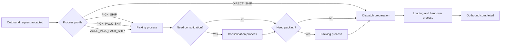
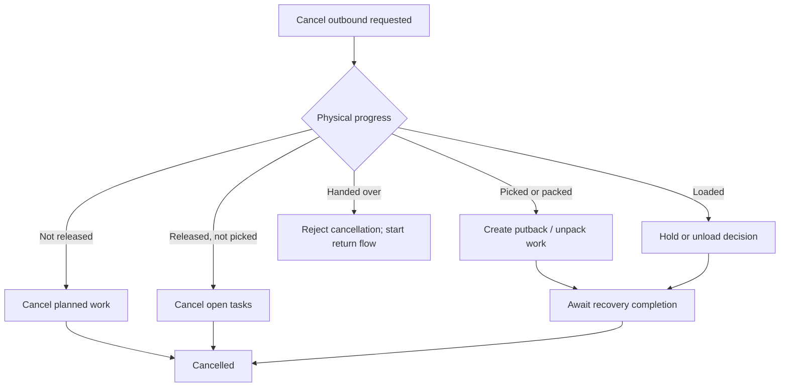
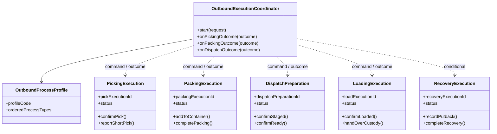

# WMS 業務流程切分與 Workflow 邊界建議

> 狀態：WMS 設計建議；目前不含 workflow engine implementation
> 範圍：WMS 內部 process architecture，以及 WMS 與 Temporal／WES／WCS／TMS 的邊界
> 目的：回答「Pick、Pack、Stage 是否應各自形成流程，以及業界 WMS 還能切出哪些流程」

## 1. 結論先行

目前最值得調整的不是建立更多技術 Workflow 類別或 private method，而是改變建模層級：

1. `Pick`、`Pack`、`Stage` 不只是 `Shipment.status` 的三次賦值；在具有不同工作站、人員、設備、SLA 或例外處理的倉庫裡，它們各自是可獨立演進的 **WMS business process**。
2. 這些 business process **不等於三個 Temporal Child Workflow**。預設先以 WMS application process／aggregate／task lifecycle 實作；只有真正需要跨系統 durable wait 時才使用 Temporal。
3. 一個較薄的 `OutboundExecutionCoordinator` 依倉庫設定的 process profile 串接流程結果，但不接收每筆 scan、PickTask 或設備訊號。
4. 未來若真的建立跨 bounded context coordinator，它只需要知道：WMS 是否接受 execution、是否 ready、是否需要重配、是否完成 custody handover、取消結果為何；目前不預先建立該 Workflow contract。
5. 不同倉庫可以使用不同流程。Odoo 官方即提供一段式、二段式與三段式出庫；三段式才是 `Pick → Pack → Ship`，因此不應把固定三段硬編碼成所有 facility 的唯一流程。[Odoo inbound and outbound flows](https://www.odoo.com/documentation/19.0/applications/inventory_and_mrp/inventory/shipping_receiving/daily_operations.html)、[Odoo three-step delivery](https://www.odoo.com/documentation/17.0/applications/inventory_and_mrp/inventory/shipping_receiving/daily_operations/delivery_three_steps.html)

建議的核心形狀：

```text
未來的跨系統 coordinator             // 條件成立後才建立
  → SubmitOutboundExecution
  → Await DispatchReadiness
  → Await CustodyHandover

WMS OutboundExecutionCoordinator     // WMS 內部，依 process profile 編排
  → PickingProcess
  → [ConsolidationProcess]
  → [PackingProcess]
  → DispatchPreparationProcess
  → LoadingAndHandoverProcess
```

## 2. 先區分四種不同概念

| 概念 | 定義 | 例子 | 預設實作 |
|---|---|---|---|
| Usecase | 一個同步 command／transaction boundary | `ConfirmPickUsecase`、`CloseContainerUsecase` | Application service + Aggregate |
| Business process | 多次 command 才完成、有自己的 key、狀態與 outcome | `PickingProcess`、`PutawayProcess` | Process aggregate／application coordinator |
| Worker task | 一位人員或一台設備可領取、執行、完成的工作 | PickTask、PackTask、MoveTask | WMS task lifecycle／WES |
| Temporal Workflow | 跨 transaction／跨服務、需要 durable wait、retry、timer 或補償的 coordinator | 未來具名的跨系統流程 | Temporal（目前未採用） |

常見錯誤是：

- 把每個 Usecase 都包成 Activity。
- 把每個 Worker task 都變成 Signal。
- 把 `ShipmentStatus` 當成整個倉庫的流程引擎。
- 因為步驟有先後，就把所有步驟塞進一個 Temporal Workflow。
- 反過來因為 class 太大，就把每一步機械式拆成 Child Workflow。

「是不是流程」應由 business lifecycle 判斷，而不是由程式行數判斷。

## 3. 業界資料反映的流程邊界

幾個主流產品的模型雖然名稱不同，但可看出相似邊界：

- SAP EWM 的 outbound delivery order 涵蓋 picking、取消 picking、loading、取消 loading、調整 picked quantity 與 goods issue，顯示 outbound document 是上層監控單位，而 picking／loading 各自具有業務行為。[SAP Outbound Delivery Order](https://help.sap.com/docs/SAP_S4HANA_ON-PREMISE/9832125c23154a179bfa1784cdc9577a/60cbcb53ad377114e10000000a174cb4.html)
- Microsoft Dynamics 365 將 release、wave、warehouse work、packing 與 shipment confirmation 分開；packing 甚至有自己的 work order type，且支援 partial shipment。[Microsoft outbound load handling](https://learn.microsoft.com/en-us/dynamics365/supply-chain/warehousing/outbound-load-handling)、[Microsoft packing work](https://learn.microsoft.com/en-us/dynamics365/supply-chain/warehousing/packing-work)
- Microsoft 將 replenishment 分成 wave demand、min/max、load demand 與 immediate replenishment；它服務多個 outbound demand，不只是某一張 Shipment 的子步驟。[Microsoft replenishment overview](https://learn.microsoft.com/en-us/dynamics365/supply-chain/warehousing/replenishment)
- Odoo 依倉庫規模與控制需求選擇一、二或三段式，並另有 batch、cluster、wave picking；這表示「出庫流程」與「揀貨執行策略」是兩個不同維度。[Odoo inbound and outbound flows](https://www.odoo.com/documentation/19.0/applications/inventory_and_mrp/inventory/shipping_receiving/daily_operations.html)、[Odoo cluster picking](https://www.odoo.com/documentation/17.0/applications/inventory_and_mrp/inventory/shipping_receiving/picking_methods/cluster.html)
- Microsoft 的 WMS overview 另外列出 returns、quality、cycle counting、cross-docking、manual movement、wave、packing 與 cluster picking，支持把 WMS 視為多個 process family，而不是只有一條 outbound 狀態鏈。[Microsoft Warehouse management overview](https://learn.microsoft.com/en-us/dynamics365/supply-chain/warehousing/warehouse-management-overview)

因此業界常態不是「一個超大 Workflow」，而是：

```text
上層 warehouse request / outbound execution
  + 多個可配置 process
  + 每個 process 底下的 worker tasks
  + 必要時才有跨系統 orchestration
```

## 4. 何時值得切成獨立 business process

一組動作符合越多條件，就越值得形成獨立 process：

| 判斷問題 | 適合獨立 process 的訊號 |
|---|---|
| 是否有穩定 business key？ | `pickExecutionId`、`packingExecutionId`、`countSessionId` |
| 是否可被獨立開始、暫停、取消或重開？ | Pack 可重開、Pick 可 short、Count 可 recount |
| 是否由不同角色／工作站／設備負責？ | Picker、Packing station、Dock operator |
| 是否有自己的 invariant？ | 完整揀貨量、container 封箱規則、stage capacity |
| 是否有明確 terminal outcome？ | `FULLY_PICKED`、`PARTIALLY_PICKED`、`PACKED`、`REJECTED` |
| 是否有獨立 SLA／優先序？ | Urgent pick、carrier cut-off、quality inspection deadline |
| 是否可能服務多個 Shipment？ | Wave、Replenishment、Cycle count batch |
| 是否可能獨立失敗或需要人工介入？ | Short pick、label failure、inventory discrepancy |

不值得切 process 的情況：

- 一次 transaction 就能完成。
- 只是計算策略，例如 location selection、carton recommendation。
- 是高頻 scanner interaction。
- 只是 Aggregate 內部 method。
- 只是為了讓 `WorkflowImpl` 行數變少。

## 5. 建議的 WMS process families

| Process family | 主要 business key | 正常終點 | 建議 owner／實作 |
|---|---|---|---|
| Outbound intake／execution | `outboundExecutionId` | Ready、Partial、Rejected、Cancelled | WMS application coordinator |
| Release／Wave planning | `waveId` 或 `releaseBatchId` | Work released／failed | WMS／WES coordinator |
| Picking | `pickExecutionId` | Fully picked／partial／reallocation required | WMS process + tasks |
| Consolidation／Sortation | `consolidationId` | All units consolidated | WMS／WES；設備由 WCS |
| Packing | `packingExecutionId` | Containers closed／packing rejected | WMS process + station tasks |
| Dispatch preparation／Staging | `dispatchPreparationId` | Ready for load／blocked | WMS process |
| Loading／Custody handover | `handoverId` 或 `loadExecutionId` | Handed over／rejected | WMS，整合 YMS／TMS |
| Cancellation／Recovery／Putback | `recoveryExecutionId` | Cancelled／continues／manual | WMS recovery process |
| Inbound receiving | `receiptExecutionId` | Received／discrepancy／rejected | WMS process |
| Quality／Disposition | `inspectionCaseId` | Released／quarantined／rejected | WMS／QMS process |
| Putaway | `putawayExecutionId` | Stock placed／blocked | WMS process + tasks |
| Replenishment | `replenishmentExecutionId` | Pick face replenished／failed | WMS／WES shared coordinator |
| Internal transfer | `transferExecutionId` | Destination received／cancelled | WMS process |
| Cycle count／Stocktake | `countSessionId` | Accepted／recount／adjustment required | WMS inventory-control process |
| Return receiving／Disposition | `returnExecutionId` | Restock／repair／scrap／return-to-vendor | WMS + Returns／ERP |
| Cross-dock／Flow-through | `crossDockExecutionId` | Inbound unit assigned outbound／fallback putaway | WMS cross-process coordinator |
| Value-added service | `vasExecutionId` | Completed／rejected | WMS／manufacturing-like process |

這些是 process family，不代表必須建立相同數量的 module、microservice 或 Temporal Workflow。

## 6. Outbound：建議怎麼拆

### 6.1 上層只保存 route，不保存現場細節

WMS 內可以有一個很薄的 `OutboundExecutionCoordinator`：



Coordinator 只需要知道：

- 採用哪個 process profile。
- 現在應啟動哪個 process。
- 前一個 process 回傳哪個 terminal outcome。
- 是否需要跨 context escalation。

它不應知道：

- 每次掃了哪個 barcode。
- PickTask 分配給誰。
- cartonization 如何計算。
- staging location 如何選。
- conveyor／robot 如何路由。

### 6.2 不同 facility 可選不同 process profile

| Profile | 流程 | 適用情境 |
|---|---|---|
| `DIRECT_SHIP` | Dispatch／Ship | 小倉、整箱、已有預包裝庫存 |
| `PICK_SHIP` | Pick → Dispatch | 不需要獨立 packing station |
| `PICK_PACK_SHIP` | Pick → Pack → Dispatch | 一般電商或多人分站作業 |
| `ZONE_PICK_PACK_SHIP` | Multi-zone Pick → Consolidate → Pack → Dispatch | 大型倉、多 zone／tote |
| `WAVE_AUTOMATED` | Wave → WES/WCS execution → Consolidate／Pack → Dispatch | 自動化倉 |
| `CROSS_DOCK` | Receive → Cross-dock → Dispatch | 不進儲位的 flow-through |

Process profile 是 routing policy，不應變成一個包含所有可能狀態的超大 enum。

## 7. Outbound 各流程的建議 contract

### 7.1 PickingProcess

`PickingProcess` 管「一次揀貨 execution 是否完成」，而不是管理整張 Order。

```text
PLANNED
  → RELEASED
  → IN_PROGRESS
      ├─ BLOCKED_FOR_REPLENISHMENT
      ├─ RESOLVING_SHORT_PICK
      └─ IN_PROGRESS
  → COMPLETED | PARTIALLY_COMPLETED | CANCELLED
```

| 類型 | 建議名稱 |
|---|---|
| Commands | `ReleasePicking`、`AssignPickTask`、`ConfirmPick`、`ReportShortPick`、`ResumePicking`、`CancelPicking` |
| Events | `PickingReleased`、`PickTaskCompleted`、`ShortPickDetected`、`PickingCompleted`、`PickingPartiallyCompleted`、`PickingCancelled` |
| Terminal outcomes | `FULLY_PICKED`、`PARTIALLY_PICKED`、`REALLOCATION_REQUIRED`、`CANCELLED` |

注意：

- Scanner 每次確認仍是同步 Usecase。
- `PickTaskCompleted` 通常只進 WMS event/read model，不直接 Signal Temporal。
- Picking strategy 可為 discrete、batch、cluster、zone、wave；strategy 與 process lifecycle 應分離。
- Replenishment 是共享流程，Picking 只保存 dependency／block reason。

### 7.2 ConsolidationProcess

只有多 zone、多 tote、sorter 或多段 picking 才需要。

```text
WAITING_FOR_UNITS
  → CONSOLIDATING
  → COMPLETED | MISSING_UNIT | CANCELLED
```

| 類型 | 建議名稱 |
|---|---|
| Commands | `RegisterArrivedUnit`、`ConfirmConsolidation`、`ReportMissingUnit` |
| Events | `UnitArrivedForConsolidation`、`ConsolidationCompleted`、`ConsolidationBlocked` |
| Terminal outcomes | `CONSOLIDATED`、`MISSING_UNIT`、`MANUAL_REVIEW_REQUIRED` |

Sorter routing、chute sensor、jam recovery 屬 WCS；WMS 只接收業務結果。

### 7.3 PackingProcess

Packing 不應只是 `Shipment.pack()`，因為實務可能涉及 container、重量、材積、標籤、partial shipment、repack 與危品規則。Microsoft 也把 packing 建模成獨立 work order type。[Microsoft packing work](https://learn.microsoft.com/en-us/dynamics365/supply-chain/warehousing/packing-work)

```text
WAITING_FOR_ITEMS
  → PACKING
  → VALIDATING
  → COMPLETED | PARTIALLY_COMPLETED | BLOCKED | CANCELLED
```

| 類型 | 建議名稱 |
|---|---|
| Commands | `OpenPackingExecution`、`AddItemToContainer`、`CloseContainer`、`ReopenContainer`、`CompletePacking` |
| Events | `PackingStarted`、`ContainerClosed`、`PackingCompleted`、`PackingBlocked` |
| Terminal outcomes | `PACKED`、`PARTIALLY_PACKED`、`LABEL_REQUIRED`、`COMPLIANCE_REVIEW_REQUIRED` |

Carrier label API 的 retry 可以是 job／Activity；只有涉及長時間人工審核或外部合規時，才考慮獨立 Temporal flow。

### 7.4 DispatchPreparationProcess

Stage 是這個流程中的一個主要動作，但流程目的不是「把 status 改成 STAGED」，而是確認出庫 execution 已具備交接條件。

```text
WAITING_FOR_PACKAGES
  → ASSIGNING_STAGE_LOCATION
  → STAGING
  → READY_FOR_LOAD | BLOCKED | CANCELLED
```

| 類型 | 建議名稱 |
|---|---|
| Commands | `AssignStagingLocation`、`ConfirmPackageStaged`、`ConfirmDispatchReadiness` |
| Events | `StagingStarted`、`PackageStaged`、`OutboundReadyForDispatch`、`DispatchPreparationBlocked` |
| Terminal outcomes | `READY_FOR_DISPATCH`、`CAPACITY_BLOCKED`、`TRANSPORT_CONTEXT_REQUIRED` |

這個 process 才應聚合 Pick／Pack 的結果，並發布跨 context 的 `OutboundReadyForDispatch`；Temporal 不需要看到所有中間事件。

### 7.5 LoadingAndHandoverProcess

WMS 負責倉內實體 loading 與 custody handover；carrier selection、route、in-transit 與 delivery 屬 TMS。SAP 的 outbound delivery order 同時涵蓋 loading 與 goods issue，但這不代表 WMS 擁有後續運輸生命週期。[SAP Outbound Delivery Order](https://help.sap.com/docs/SAP_S4HANA_ON-PREMISE/9832125c23154a179bfa1784cdc9577a/60cbcb53ad377114e10000000a174cb4.html)

```text
WAITING_FOR_VEHICLE_OR_DOCK
  → LOADING
  → VERIFYING_HANDOVER
  → HANDED_OVER | REJECTED | CANCELLED
```

| 類型 | 建議名稱 |
|---|---|
| Commands | `AssignDockDoor`、`ConfirmPackageLoaded`、`CompleteLoading`、`ConfirmCustodyHandover` |
| Events | `LoadingStarted`、`LoadingCompleted`、`CustodyHandedOver` |
| Terminal outcomes | `HANDED_OVER`、`VEHICLE_REJECTED`、`MANUAL_INTERVENTION_REQUIRED` |

若等待車輛、dock appointment 或外部 TMS/YMS acknowledgement 可能跨小時／天，這一段才是合理的 Temporal 子流程候選。

### 7.6 Cancellation／RecoveryProcess

取消不是每個 process 都散落一套旗標；WMS 可以有一個具名 recovery process，依實體狀態決定需要哪些補償。



| 類型 | 建議名稱 |
|---|---|
| Commands | `RequestOutboundCancellation`、`CancelOpenWork`、`CreatePutbackWork`、`ConfirmRecoveryCompleted` |
| Events | `OutboundCancellationAccepted`、`PutbackRequired`、`OutboundCancelled`、`OutboundCancellationRejected` |
| Terminal outcomes | `CANCELLED`、`OUTBOUND_CONTINUES`、`HANDED_OVER`、`MANUAL_INTERVENTION_REQUIRED` |

Putback 有獨立 task、多人或長 SLA 時，才建立 `PutbackProcess`；簡單未揀貨取消仍可在一次 transaction 完成。

## 8. Inbound：建議切出的流程

### 8.1 ReceivingProcess

```text
Expected receipt／ASN
  → Arrival／unload
  → Scan and receive HU／LPN／items
  → Quantity and damage reconciliation
  → RECEIVED | PARTIALLY_RECEIVED | REJECTED
```

Commands／events：

- `RegisterInboundExecution`
- `ConfirmArrival`
- `ReceiveHandlingUnit`
- `ReportReceivingDiscrepancy`
- `ReceivingCompleted`
- `ReceivingPartiallyCompleted`

### 8.2 QualityAndDispositionProcess

品質流程具有自己的 inspection case、sample、pass/fail、quarantine 與 disposition。Microsoft 的 receiving quality check 在失敗時會把貨導向替代 location 並建立 quality order，說明它不只是 Inbound status 的一個 boolean。[Microsoft quality check](https://learn.microsoft.com/en-us/dynamics365/supply-chain/warehousing/quality-check)

```text
INSPECTION_REQUIRED
  → INSPECTING
  → RELEASED | QUARANTINED | REJECTED | REWORK_REQUIRED
```

### 8.3 PutawayProcess

```text
READY_FOR_PUTAWAY
  → DESTINATION_PLANNED
  → MOVING
  → COMPLETED | BLOCKED | PARTIALLY_COMPLETED
```

Putaway rule／location selection 是策略；Putaway execution 才是 process。每個掃描與搬運仍是 Usecase／task，不應逐筆進 Temporal。

### 8.4 CrossDockProcess

Cross-dock 橫跨 inbound 與 outbound，適合以獨立 process key 管理。Oracle 描述的 cross-dock 會在 receiving 時直接 allocation 到 outbound order，而不先 putaway。[Oracle Receiving and Cross Dock](https://docs.oracle.com/en/cloud/saas/warehouse-management/25d/owmim/xdock-parameter.html)

```text
Inbound unit received
  → Match outbound demand
  → Allocate cross-dock lane
  → Dispatch preparation
  → fallback Putaway when no match
```

它不應被硬塞成 `InboundWorkflow` 或 `OutboundWorkflow` 的固定 child。

## 9. Inventory control：建議切出的流程

### 9.1 ReplenishmentProcess

Replenishment 往往同時服務多張 Shipment、Wave 或 Load，因此 business key 應是 `replenishmentExecutionId`，而不是 `shipmentId`。

```text
Demand／Min-Max trigger
  → Source selection
  → Replenishment work released
  → Move confirmed
  → Pick face available | failed
```

Microsoft 官方列出的 wave demand、min/max、load demand 與 immediate replenishment，也反映它是獨立 policy + execution family。[Microsoft replenishment overview](https://learn.microsoft.com/en-us/dynamics365/supply-chain/warehousing/replenishment)

### 9.2 InternalTransferProcess

適用於 bin transfer、HU relocation、warehouse-to-warehouse transfer。單一 bin move 可是 Usecase；跨 facility、有 transit custody 或 destination receipt 時才形成長流程。

### 9.3 CycleCountProcess

```text
Count plan／spot count
  → Freeze or soft-reserve scope
  → Count
  → [Recount]
  → Accept | Adjustment required
```

Cycle count 可有 guided、blind、spot、threshold 與 plan 等模式，且 discrepancy 可能需要 approval；因此 count session 是合理的獨立 process key。[Microsoft cycle counting scenarios](https://learn.microsoft.com/en-us/dynamics365/supply-chain/warehousing/cycle-counting-scenarios)

### 9.4 InventoryDiscrepancyProcess

不要讓 `CycleCountProcess` 直接任意調整庫存。差異超過門檻時建立 `inventoryDiscrepancyCaseId`：

```text
Discrepancy detected
  → Recount／evidence
  → Approve adjustment | Reject | Investigate
  → Inventory fact committed
```

### 9.5 Hold／Quarantine／ReleaseProcess

涉及 lot、expiry、damage、recall 或 quality hold。簡單狀態切換可以是 Usecase；需要跨批次搜尋、審核與分批 release 時才升級為 process。

## 10. Returns／Reverse logistics

Return 不應當成「Outbound cancellation 的反向步驟」。貨物完成 handover 後，應進入新的 return execution。

```text
RMA／blind return intake
  → Receive returned item
  → Inspect and identify condition
  → Disposition
      ├─ Restock
      ├─ Repair／Rework
      ├─ Scrap
      ├─ Return to vendor
      └─ Return to customer
```

Microsoft 的 return disposition 明確區分 restock、repair、scrap、replacement 與 return-to-customer，支持將 disposition 建模成獨立流程結果，而不是一個 `returned=true`。[Microsoft return reason and disposition codes](https://learn.microsoft.com/en-us/dynamics365/supply-chain/sales-marketing/disposition-and-return-reason-codes)、[Microsoft returned-item disposition](https://learn.microsoft.com/en-us/dynamics365/supply-chain/sales-marketing/specify-how-to-dispose-of-returned-items)

建議 process：

- `ReturnIntakeProcess`
- `ReturnInspectionProcess`
- `ReturnDispositionProcess`
- `RepairOrReworkProcess`（若 WMS 負責）
- `VendorReturnProcess`

## 11. Value-added services

以下情境通常不應硬塞進 Packing：

- Kitting／de-kitting
- Labeling／relabeling
- Gift wrapping
- Light assembly
- Personalization
- Compliance inspection
- Repack／unit conversion

建議使用 `ValueAddedServiceExecution`：

```text
PLANNED → MATERIAL_READY → EXECUTING → INSPECTING → COMPLETED／REJECTED
```

簡單貼標仍可是一個 Pack Usecase；只有具獨立 BOM、工作指令、材料消耗、QC 或 SLA 時才形成 process。

## 12. 何時才重新評估 Temporal

| Process | 目前使用 Temporal？ | 判斷 |
|---|:---:|---|
| 跨系統 Outbound coordinator | 否 | 目前只有 WMS 內部 owner；等 Fulfillment／WMS／TMS 成為獨立系統且出現 durable wait 才建立 |
| WMS `OutboundExecutionCoordinator` | 否 | 先用 WMS process state + committed events；不需要為串接而串接 |
| `PickingProcess` | 否 | Scanner／task 高頻；WMS 是唯一 owner |
| `PackingProcess` | 否 | 多數由 packing station 同步驅動 |
| `DispatchPreparationProcess` | 否 | WMS operational process；只對外發布 readiness |
| `LoadingAndHandoverProcess` | 條件式 | 若需等待 YMS／TMS／車輛／dock appointment，可用 Temporal |
| `CancellationRecoveryProcess` | 條件式 | Putback／unload 跨小時、多人或外部系統時有價值 |
| `WaveProcess` | 通常否 | 一對多 Shipment、常由 WMS／WES scheduler 管理 |
| `ReplenishmentProcess` | 條件式 | 跨 AS/RS、人工、長 SLA 或共享依賴時可考慮獨立 Workflow |
| `InboundReceivingProcess` | 通常否 | 現場 scanner flow；接收完成後發 aggregate event |
| `QualityInspectionProcess` | 條件式 | 外部 QMS／人工審核／長 timer 時適合 |
| `PutawayProcess` | 通常否 | WMS／WES task lifecycle；只等待 aggregate completion |
| `CycleCountProcess` | 條件式 | 大型 count campaign、recount、approval 時適合 |
| `ReturnDispositionProcess` | 否／條件式 | 只有真的跨客服、財務、Repair、ERP 且等待時間長時才重新評估 |
| `CrossDockProcess` | 條件式 | 跨 inbound/outbound 且需等待 demand／vehicle 時適合 |

判斷 Temporal 的最低門檻：

1. 有穩定 business key。
2. 至少一個跨 transaction 的 durable wait。
3. 至少一個外部系統／人工／timer dependency。
4. 有明確 retry、cancellation 或 compensation policy。
5. Workflow history 不會被高頻 task／scan 無界灌入。

若只符合「步驟很多」，仍不足以使用 Temporal。

## 13. 建議的 package 形狀

先在同一個 `wms` module 做垂直流程邊界，不急著拆 microservice：

```text
wms
├─ outbound
│  ├─ execution
│  ├─ picking
│  ├─ consolidation
│  ├─ packing
│  ├─ dispatch
│  └─ recovery
├─ inbound
│  ├─ receiving
│  ├─ inspection
│  └─ putaway
├─ inventory
│  ├─ replenishment
│  ├─ transfer
│  ├─ counting
│  └─ discrepancy
├─ returns
│  ├─ intake
│  ├─ inspection
│  └─ disposition
├─ crossdock
└─ vas
```

每個 process package 再依需要包含：

```text
picking
├─ application
│  ├─ command
│  ├─ usecase
│  └─ process
└─ domain
   ├─ model
   ├─ event
   └─ repository
```

不是每個 package 都要立即建立完整六角架構；只有出現實際 behavior 才新增類別。

## 14. 建議 class relationship



這不是要求 Coordinator 直接持有所有 aggregate；實際上應透過 Usecase／Repository／committed event 互動。圖只表達流程依賴方向。

## 15. 對目前專案的映射

| 現行類別／概念 | 建議歸屬 | 短期處理 |
|---|---|---|
| `CreateShipmentUsecase` | Outbound execution intake | 保留，逐步改用 `outboundExecutionId` 語意 |
| `PlanWaveUsecase`／`Wave` | Release planning | 已以獨立 `waveId`、cutoff、priority 與容量策略建立，不作 Shipment child |
| `ReleaseWaveUsecase`／`WarehouseWork` | Picking work generation | Wave Release 時才建立一張 Shipment 一個 Work 與逐 line PickTask |
| `CompleteWaveUsecase` | Wave picking completion | 所有 assignment 的 picking work 完成或取消後關閉 Wave，不等待 Pack／Stage |
| `ConfirmPickUsecase`／`PickTask` | PickingProcess | 先抽 package 與 typed picking outcome |
| `PackShipmentUsecase` | PackingProcess | 從單一 status transition 長成 container／pack lifecycle 時再拆 aggregate |
| `StageShipmentUsecase` | DispatchPreparationProcess | 以 readiness invariant 為終點，不只 `STAGED` |
| `HandOverShipmentUsecase` | LoadingAndHandoverProcess | 保留 WMS custody boundary |
| `CancelShipmentUsecase` | CancellationRecoveryProcess 入口 | 依 physical progress 建立 recovery plan |
| `Shipment` Aggregate | Shipment／outbound document | 不再承擔所有 process 內部狀態；保存必要 summary／invariant |
| 已移除的 workflow prototypes | 技術實驗 | 不作為現行 contract；由穩定的 WMS commands／events 重新長出未來整合邊界 |
| 未來跨系統 coordinator | 尚未建立 | 只有符合 ADR 採用門檻後，才以真正業務流程命名並建立 |

目前不需要立刻拆資料表或 module。建議先抽出：

1. Process identity。
2. Process-specific status。
3. Commands／events／typed outcomes。
4. Package ownership。
5. 最後才決定是否需要獨立 persistence 或 Temporal Workflow。

## 16. 建議落地順序

| Gate | 工作 | 驗收條件 |
|---|---|---|
| P1 | 定義 `OutboundProcessProfile` 與 process routing | 不再假設所有 facility 固定 Pick／Pack／Stage |
| P2 | 抽出 `PickingExecution` lifecycle | Short pick／partial／reallocation 有 typed outcome |
| P3 | 抽出 `PackingExecution` lifecycle | Container／partial／blocked 不再只是 Shipment status |
| P4 | 抽出 `DispatchPreparation` | 唯一對外 readiness event 從此流程發布 |
| P5 | 建立 `RecoveryExecution` | Cancellation／Putback 不散落各流程旗標 |
| P6 | 建立薄的 `OutboundExecutionCoordinator` | 只串 process outcome，不接 scanner／task event |
| P7 | 發布粗粒度 WMS boundary events | 對外 contract 不鏡像 WMS process state；目前不建立 Temporal contract |
| P8 | 依營運需求擴充 Inbound／Replenishment／Count／Returns | 不預先建立無 behavior 空殼 |

## 17. 最終判斷

### 建議採用

- Pick、Pack、Dispatch Preparation 各自形成 WMS business process。
- 由 process profile 決定哪些流程存在及其順序。
- WMS 內使用 process aggregate／application coordinator 串接。
- Temporal 只協調跨 context 或真正長時間依賴。
- Wave、Replenishment 等一對多流程使用自己的 business key，不當作 Shipment child。
- Cancellation 在有實體補償時形成 RecoveryProcess；handover 後改走 ReturnProcess。

### 不建議採用

- 把 Pick、Pack、Stage、每個 exception 全塞進單一技術 Workflow implementation。
- 為每個 PickTask 或 scan 建 Signal／Activity。
- 固定所有 facility 都必須走三段式。
- 看到多步驟就建立 Temporal Child Workflow。
- 建立通用 `processNextStep()`／`switch(status)` 來模擬所有 WMS 流程。

核心原則是：

> WMS business process 應以自己的 identity、invariant 與 outcome 被理解；Temporal Workflow 則只負責那些跨越 process owner、需要 durable coordination 的部分。

## 18. 延伸閱讀

- [WMS／WES／WCS／TMS 動作與 Workflow 邊界 Review](./wms-wes-wcs-tms-workflow-boundary-review.md)
- [Temporal 採用決策](./temporal-adoption-decision.md)
